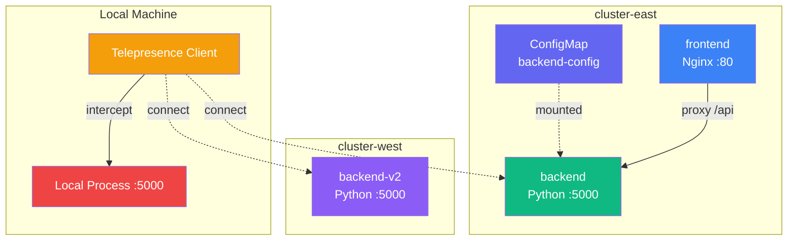

---

# Telepresence Interactive Labs

---

## What will we learn?

- How to set up two isolated kind clusters with distinct network CIDRs
- Creating and using global intercepts to redirect cluster traffic locally
- Mounting cluster ConfigMaps and Secrets to your local filesystem
- Resolving Kubernetes DNS from your local terminal via Telepresence
- Diagnosing and fixing common Telepresence connectivity issues
- Switching between multiple cluster contexts safely

---

## Lab Environment

Our hands-on labs use **two local kind clusters** with isolated networking to avoid routing conflicts:

| Component | Details |
|-----------|---------|
| **cluster-east** | Pod CIDR: `10.10.0.0/16` · Service CIDR: `10.110.0.0/16` |
| **cluster-west** | Pod CIDR: `10.11.0.0/16` · Service CIDR: `10.111.0.0/16` |
| **Telepresence** | OSS v2 (no login required, no Ambassador Cloud) |

!!! info "Why Two Clusters?"
    Using distinct CIDRs prevents the #1 cause of Telepresence failures on local machines: **overlapping Docker routes**. This setup forces you to practice context switching - a critical skill for real-world multi-cluster environments.

---

## Architecture



---

## Labs Overview

<div class="grid cards" markdown>

-   :fontawesome-solid-route:{ .lg .middle } __Lab 1: Global Intercept__

    ---

    - Redirect all backend traffic to a local process
    - Test with `curl` from inside the cluster network
    - Zero container rebuilds

    [:octicons-arrow-right-24: Start Lab 1](lab1-global-intercept.md)

-   :fontawesome-solid-hard-drive:{ .lg .middle } __Lab 2: Volume Mounting__

    ---

    - Mount cluster ConfigMaps locally
    - Read cluster config from your IDE
    - Develop with real configuration

    [:octicons-arrow-right-24: Start Lab 2](lab2-volume-mounting.md)

-   :fontawesome-solid-network-wired:{ .lg .middle } __Lab 3: Outbound Connectivity__

    ---

    - Resolve `*.svc.cluster.local` from your terminal
    - Test cross-cluster isolation
    - Understand Telepresence DNS

    [:octicons-arrow-right-24: Start Lab 3](lab3-outbound-connectivity.md)

-   :fontawesome-solid-wrench:{ .lg .middle } __Lab 4: Troubleshooting__

    ---

    - Use `telepresence status` and `gather-logs`
    - Diagnose DNS, intercept, and port issues
    - Nuclear reset when all else fails

    [:octicons-arrow-right-24: Start Lab 4](lab4-troubleshooting.md)

</div>

---

## Quick Start

### Option A: Interactive Web Terminal

```bash
# Build and run the web-based lab environment
cd Labs/28-Telepresence/docker
docker compose up --build

# Open http://localhost:3000 in your browser
```

The web terminal includes a split-pane UI with lab instructions on the left and a full terminal on the right.

### Option B: Run Locally

```bash
cd Labs/28-Telepresence

# Create both kind clusters and deploy sample apps
./docker/entrypoint.sh  # or use setup-clusters.sh inside container
```

---

## Useful Aliases

The lab container comes pre-configured with these shortcuts:

| Alias | Expands To | Description |
|-------|-----------|-------------|
| `kge` | `kubectl config use-context kind-cluster-east` | Switch to cluster-east |
| `kgw` | `kubectl config use-context kind-cluster-west` | Switch to cluster-west |
| `tpc` | `telepresence connect` | Connect to current cluster |
| `tps` | `telepresence status` | Check connection status |
| `tpq` | `telepresence quit` | Disconnect from cluster |
| `tpl` | `telepresence list -n telepresence-lab` | List interceptable services |

!!! warning "One Cluster at a Time"
    Telepresence creates a daemon on your host machine. If you try to connect to both clusters simultaneously, the second connection kicks the first one off. Always `tpq` before switching contexts.

---

## Directory Structure

```
28-Telepresence/
├── README.md                         # Main lab documentation
├── EXAMPLES.md                       # Practical examples
├── QUICKREF.md                       # Quick reference card
├── TROUBLESHOOTING.md                # Detailed troubleshooting
├── setup.sh                          # Single-cluster setup
├── cleanup.sh                        # Resource cleanup
├── quickstart.sh                     # Quick start script
├── test.sh                           # Basic test script
├── test-all.sh                       # Full test suite
├── docker/
│   ├── Dockerfile                    # Container with all tools
│   ├── docker-compose.yml            # One-command lab setup
│   ├── server.js                     # xterm.js WebSocket server
│   ├── package.json                  # Node.js dependencies
│   ├── entrypoint.sh                 # Container initialization
│   └── public/
│       └── index.html                # Interactive split-pane UI
├── labs/
│   ├── index.md                      # This page
│   ├── lab1-global-intercept.md      # Lab 1
│   ├── lab2-volume-mounting.md       # Lab 2
│   ├── lab3-outbound-connectivity.md # Lab 3
│   └── lab4-troubleshooting.md       # Lab 4
└── resources/
    ├── 01-namespace.yaml
    ├── 02-dataservice.yaml
    ├── 03-backend.yaml
    ├── 04-frontend.yaml
    ├── backend-app/
    ├── dataservice-app/
    └── frontend-app/
```
