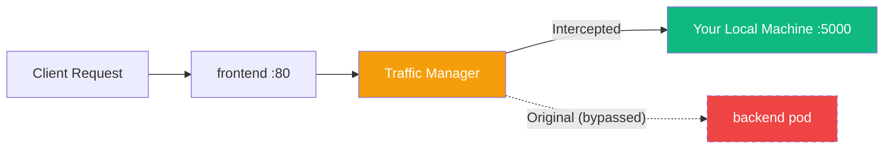

---

# Lab 1: The Global Intercept

---

## What will we learn?

- How to connect Telepresence to a kind cluster
- Creating a global intercept that routes all traffic to your local machine
- Testing intercepted traffic with `curl`
- Properly cleaning up intercepts

---

## Introduction

- A **Global Intercept** redirects **100% of the traffic** destined for a service to your local machine
- This is the simplest type of intercept - ideal for solo development
- No container rebuilds needed: edit locally, test instantly



!!! warning "Use with Caution"
    Global intercepts affect **all users** of the service. Only use in development environments or when you have exclusive cluster access.

---

## Prerequisites

- Both kind clusters created and running (`./setup-clusters.sh`)
- Telepresence CLI installed
- No other Telepresence connections active (`telepresence quit`)

---

## Step 01 - Connect to cluster-east

```bash
# Switch kubectl context
kubectl config use-context kind-cluster-east

# Connect Telepresence to the cluster
telepresence connect

# Verify connection
telepresence status
```

!!! success "Expected Output"
    ```
    Root Daemon: Running
    User Daemon: Running
    ...
    Cluster context: kind-cluster-east
    ```

---

## Step 02 - List Available Services

```bash
# See what can be intercepted
telepresence list -n telepresence-lab
```

You should see `backend` and `frontend` listed as interceptable workloads.

---

## Step 03 - Start a Local Backend Process

Before creating the intercept, start a local server that will handle the redirected traffic:

=== "Python"

    ```python
    # Save as local_backend.py
    from http.server import HTTPServer, BaseHTTPRequestHandler
    import json

    class Handler(BaseHTTPRequestHandler):
        def do_GET(self):
            self.send_response(200)
            self.send_header('Content-Type', 'application/json')
            self.end_headers()
            response = {
                "source": "LOCAL MACHINE",
                "service": "backend",
                "message": "Hello from your laptop!",
                "path": self.path
            }
            self.wfile.write(json.dumps(response, indent=2).encode())

    print("Local backend running on :5000")
    HTTPServer(('0.0.0.0', 5000), Handler).serve_forever()
    ```

    ```bash
    python3 local_backend.py
    ```

=== "Netcat (Quick)"

    ```bash
    while true; do
      echo -e "HTTP/1.1 200 OK\r\nContent-Type: text/plain\r\n\r\nHello from LOCAL!" \
        | nc -l -p 5000
    done
    ```

=== "Node.js"

    ```javascript
    // Save as local_backend.js
    const http = require('http');
    http.createServer((req, res) => {
      res.writeHead(200, { 'Content-Type': 'application/json' });
      res.end(JSON.stringify({
        source: 'LOCAL MACHINE',
        service: 'backend',
        path: req.url
      }, null, 2));
    }).listen(5000, () => console.log('Local backend on :5000'));
    ```

    ```bash
    node local_backend.js
    ```

!!! tip "Keep this running"
    Open a **second terminal** for the next steps. The local server must be running before you create the intercept.

---

## Step 04 - Create the Intercept

```bash
# Intercept backend service, route port 5000 to local 5000
telepresence intercept backend \
  --port 5000 \
  --namespace telepresence-lab
```

!!! success "Intercept Created"
    ```
    backend: intercepted
      Intercept name: backend-telepresence-lab
      State         : ACTIVE
      Workload kind : Deployment
      Destination   : 127.0.0.1:5000
      Intercepting  : all TCP connections
    ```

---

## Step 05 - Verify the Intercept

```bash
# Call the frontend (which proxies to backend internally)
curl http://frontend.telepresence-lab.svc.cluster.local/api

# Or call the backend directly
curl http://backend.telepresence-lab.svc.cluster.local:5000/

# Check intercept status
telepresence list -n telepresence-lab
```

The response should come from your **LOCAL** process (e.g., `"source": "LOCAL MACHINE"`) instead of the cluster's backend pod.

---

## Step 06 - Make Live Changes

!!! example "Try This"
    1. Edit your local `local_backend.py` - change the message
    2. Save the file
    3. `curl` again
    4. See your changes immediately - no rebuild, no redeploy!

---

## Step 07 - Cleanup

```bash
# Leave the intercept
telepresence leave backend-telepresence-lab

# Verify intercept is removed
telepresence list -n telepresence-lab

# Disconnect
telepresence quit
```

---

## Validation Checklist

!!! success "Completion Criteria"
    - [x] `telepresence status` shows "Connected" to kind-cluster-east
    - [x] `telepresence list` shows backend as "intercepted"
    - [x] `curl` response comes from local machine, not the cluster pod
    - [x] Live code changes are reflected without container rebuilds
    - [x] Cleanup completes without errors
