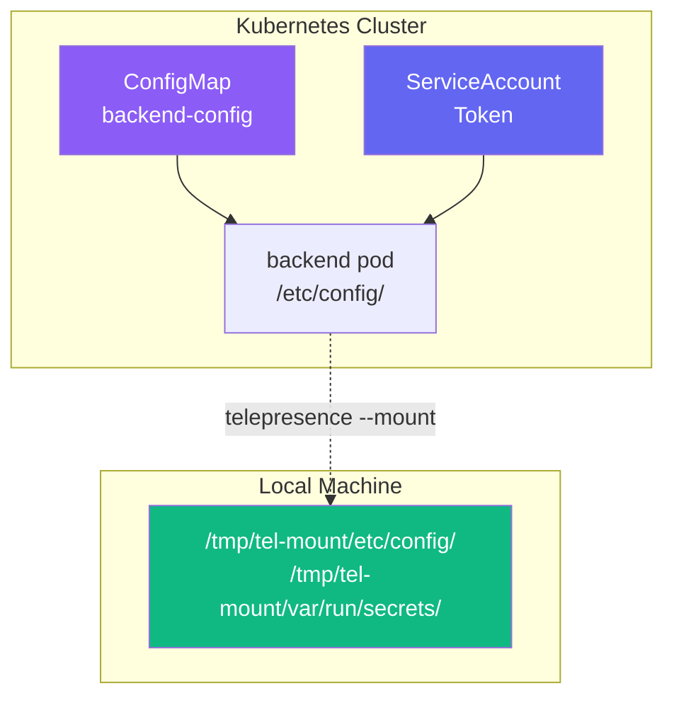

---

# Lab 2: Volume Mounting

---

## What will we learn?

- How Telepresence mirrors a pod's filesystem to your local machine
- Mounting ConfigMaps and Secrets locally during an intercept
- Using the `TELEPRESENCE_ROOT` environment variable
- Developing locally with real cluster configuration

---

## Introduction

- When you intercept a service with `--mount`, Telepresence mirrors the pod's entire filesystem to a local directory
- This includes **ConfigMaps**, **Secrets**, **Service Account tokens**, and any other mounted volumes
- Your local application can read the same config files the pod would see in the cluster



---

## Prerequisites

- cluster-east running with apps deployed
- Lab 1 completed (familiar with intercept workflow)

---

## Step 01 - Examine the ConfigMap

```bash
kubectl config use-context kind-cluster-east

# View the ConfigMap that the backend pod uses
kubectl get configmap backend-config -n telepresence-lab -o yaml
```

!!! info "ConfigMap Contents"
    The `backend-config` ConfigMap contains:

    - `app.conf` - application settings (environment, log level, database host, cache TTL)
    - `features.json` - feature flags (`feature_x`, `feature_y`, `max_retries`)

---

## Step 02 - Connect and Intercept with Mount

```bash
telepresence connect

# Create intercept with explicit mount path
telepresence intercept backend \
  --port 5000 \
  --namespace telepresence-lab \
  --mount /tmp/tel-mount
```

??? question "What does --mount do?"
    The `--mount` flag tells Telepresence to mirror the pod's filesystem to the specified local directory. The directory structure matches exactly what the pod sees:

    - `/etc/config/` → `/tmp/tel-mount/etc/config/`
    - `/var/run/secrets/` → `/tmp/tel-mount/var/run/secrets/`

    Use `--mount=true` to auto-mount to a temporary directory (path printed in output).

---

## Step 03 - Explore the Mounted Volumes

```bash
# List the mount root
ls -la /tmp/tel-mount/

# Find all mounted files
find /tmp/tel-mount -type f 2>/dev/null | head -20

# Read the ConfigMap files
cat /tmp/tel-mount/etc/config/app.conf
cat /tmp/tel-mount/etc/config/features.json
```

!!! success "Expected: app.conf"
    ```ini
    environment=development
    log_level=debug
    database_host=datastore.telepresence-lab.svc.cluster.local
    cache_ttl=300
    ```

---

## Step 04 - Use Cluster Config in Local Development

Create a local backend that reads the cluster's actual configuration:

```python
# local_backend_with_config.py
from http.server import HTTPServer, BaseHTTPRequestHandler
import json, os

# Telepresence sets this env var to the mount root
MOUNT_ROOT = os.environ.get('TELEPRESENCE_ROOT', '/tmp/tel-mount')

# Read the cluster's ConfigMap - same files the pod would see
with open(f'{MOUNT_ROOT}/etc/config/app.conf') as f:
    config_text = f.read()

with open(f'{MOUNT_ROOT}/etc/config/features.json') as f:
    features = json.load(f)

class Handler(BaseHTTPRequestHandler):
    def do_GET(self):
        self.send_response(200)
        self.send_header('Content-Type', 'application/json')
        self.end_headers()
        response = {
            "source": "LOCAL with cluster config",
            "config": config_text.strip(),
            "features": features,
        }
        self.wfile.write(json.dumps(response, indent=2).encode())

print(f"Running with cluster config from {MOUNT_ROOT}")
HTTPServer(('0.0.0.0', 5000), Handler).serve_forever()
```

```bash
python3 local_backend_with_config.py
```

---

## Step 05 - Verify

```bash
curl http://backend.telepresence-lab.svc.cluster.local:5000/
```

The response should include the cluster's ConfigMap values, served from your local machine.

---

## Step 06 - Cleanup

```bash
telepresence leave backend-telepresence-lab
telepresence quit
```

---

## Key Environment Variables

| Variable | Description |
|----------|-------------|
| `TELEPRESENCE_ROOT` | Path to the mounted pod filesystem |
| `TELEPRESENCE_MOUNTS` | Colon-separated list of mount points |

---

## Validation Checklist

!!! success "Completion Criteria"
    - [x] ConfigMap is visible under `/tmp/tel-mount/etc/config/`
    - [x] `app.conf` contains expected values (environment, log_level, etc.)
    - [x] `features.json` parses correctly as valid JSON
    - [x] Local app reads and serves cluster config in API response
    - [x] `TELEPRESENCE_ROOT` env var is set correctly
