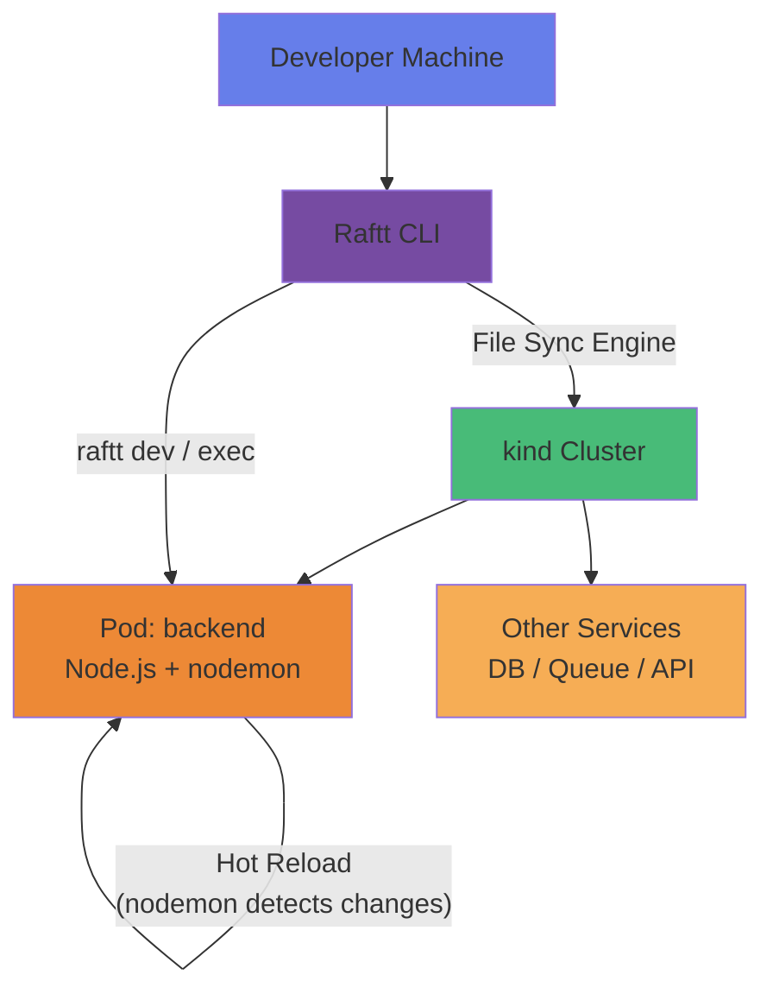
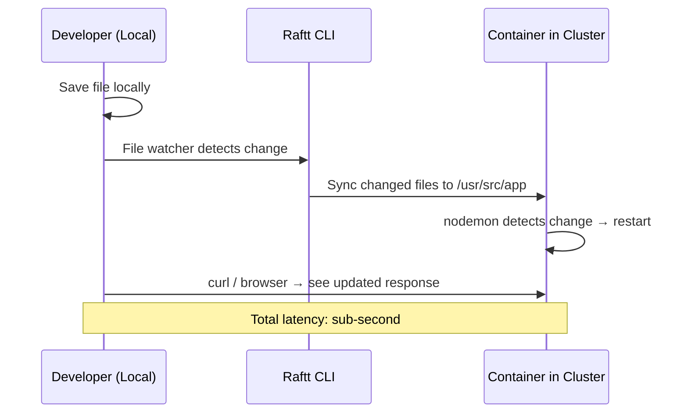
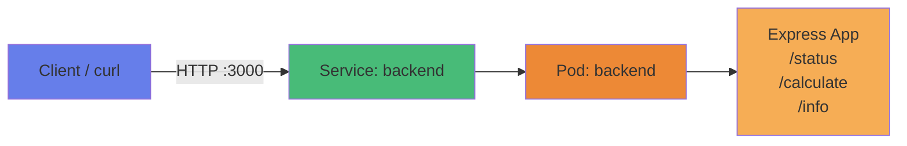
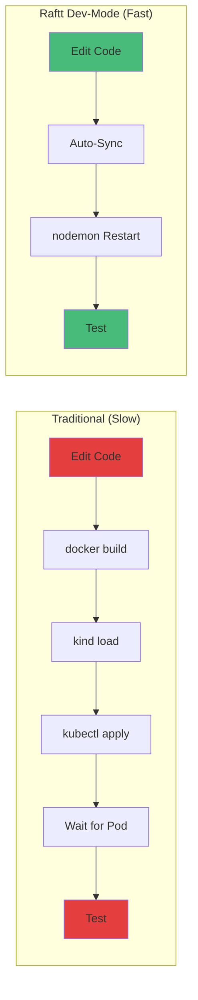

---

# Raftt - Cloud-Native Dev Mode for Kubernetes

Raftt is a developer experience tool that brings **your code to the cluster** - unlike tools that bring traffic to your machine. It provides instant file synchronization, live reloading, and remote debugging inside a real Kubernetes environment, giving you a `localhost`-like experience without leaving the cluster.

---

## What will we learn?

- What Raftt is and how it differs from Telepresence and Skaffold
- How to install and configure the Raftt CLI
- Creating a `.raftt` environment definition for a Node.js application
- Deploying an entire dev environment with `raftt up`
- Live code sync - editing locally, updating instantly in the cluster
- Remote debugging a Node.js app with VS Code and `--inspect`
- Managing environment variables without redeploying Pods
- Troubleshooting sync conflicts and binary compatibility issues
- Cleaning up Raftt state and cluster resources

---

## Official Documentation & References

| Resource | Link |
|----------|------|
| Raftt Official Docs | [raftt.io/docs](https://raftt.io/docs) |
| Raftt CLI Reference | [raftt.io/docs/cli](https://raftt.io/docs/cli) |
| Raftt Configuration | [raftt.io/docs/configuration](https://raftt.io/docs/configuration) |
| kind Quick Start | [kind.sigs.k8s.io/docs/user/quick-start](https://kind.sigs.k8s.io/docs/user/quick-start/) |
| Node.js Debugging Guide | [nodejs.org/en/docs/guides/debugging-getting-started](https://nodejs.org/en/docs/guides/debugging-getting-started/) |

---

## Introduction

### What is Raftt?

- Raftt is a **Dev-Mode** tool for Kubernetes that synchronizes your local source code into running containers inside the cluster
- Instead of rebuilding Docker images on every change, Raftt uses a **high-performance file sync engine** to push changes instantly
- Your application runs in the cluster with full access to other services, ConfigMaps, Secrets, and networking - but reloads as fast as if it were running on `localhost`

!!! info "Raftt vs. Other Tools"
    **Telepresence** intercepts cluster traffic and routes it to your local machine (traffic comes to you).
    **Skaffold** rebuilds and redeploys images on each change (build-push-deploy loop).
    **Raftt** syncs your code into the cluster container directly - no rebuild, no traffic rerouting. Your code runs *in* the cluster.

### Architecture Overview



### How Dev-Mode Sync Works



### Terminology

| Term | Description |
|------|-------------|
| **Dev-Mode** | The state where Raftt actively syncs local code into a running cluster container |
| **`.raftt` file** | The configuration file (or `raftt.yaml`) that defines environment mappings, sync paths, and dev settings |
| **`raftt up`** | Command to deploy the full environment and enter Dev-Mode |
| **`raftt dev`** | Command to open a shell or attach a debugger to a running container |
| **Sync Engine** | Raftt's file synchronization component - watches local files and pushes deltas to the cluster |
| **Image Syncing** | Raftt can sync pre-built images or build them in-cluster, avoiding local `docker build` |

---

## Key Features

<div class="grid cards" markdown>

-   :fontawesome-solid-bolt:{ .lg .middle } __Instant Code Sync__

    ---

    - Save a file locally → container updates in sub-second
    - No `docker build`, no `kubectl apply`
    - Hot-reload with `nodemon` or any file watcher

-   :fontawesome-solid-server:{ .lg .middle } __Real Cluster Environment__

    ---

    - Code runs inside the cluster, not on localhost
    - Full access to Services, ConfigMaps, Secrets
    - Identical networking and DNS as production

-   :fontawesome-solid-bug:{ .lg .middle } __Remote Debugging__

    ---

    - Attach VS Code debugger to the container process
    - Node.js `--inspect` on port 9229
    - Set breakpoints in local code, hit them in the cluster

-   :fontawesome-solid-key:{ .lg .middle } __Live Env Var Updates__

    ---

    - Change environment variables without redeploying
    - Raftt injects updated values into the running container
    - No Pod restart required

-   :fontawesome-solid-code-branch:{ .lg .middle } __Environment as Code__

    ---

    - `.raftt` file defines the full dev environment
    - Version-controlled, shareable across the team
    - Reproducible setups for every developer

-   :fontawesome-solid-layer-group:{ .lg .middle } __Multi-Service Stacks__

    ---

    - Deploy entire application stacks with one command
    - Mix synced services with standard cluster deployments
    - Develop one service while others run normally

</div>

---

## Prerequisites

!!! warning "Required Setup"
    - **Docker** installed and running
    - **kind** installed (`brew install kind` or see [kind docs](https://kind.sigs.k8s.io/docs/user/quick-start/))
    - **kubectl** configured and working
    - **Node.js 20+** installed locally (for running/debugging the app)
    - macOS or Linux environment
    - Code editor (VS Code recommended for debugging)

### System Requirements

| Requirement | Specification |
|-------------|---------------|
| **OS** | macOS or Linux (Windows via WSL2) |
| **Memory** | At least 4GB RAM available for kind |
| **Disk** | 2GB free space |
| **Docker** | Docker Desktop or Docker Engine running |
| **Node.js** | v20 or higher (match the container base image) |

---

## Installation

### Step 01 - Create the kind Cluster

Use the provided setup script or create the cluster manually:

```bash
# Navigate to lab directory
cd Labs/38-Raftt

# Run the setup script (creates cluster + deploys app)
./setup.sh
```

??? question "What does setup.sh do?"
    - Creates a `kind` cluster named `raftt-lab` with port mappings
    - Builds and loads the backend Docker image into kind
    - Deploys the namespace, deployment, and service
    - Waits for the Pod to be ready
    - Displays access information

**Or manually:**

```bash
# Create the kind cluster
kind create cluster --name raftt-lab --config resources/kind-config.yaml

# Verify cluster
kubectl cluster-info --context kind-raftt-lab
```

### Step 02 - Install the Raftt CLI

=== " macOS (Homebrew)"

    ```bash
    brew install raftt/tap/raftt

    # Verify installation
    raftt version
    ```

=== "🐧 Linux"

    ```bash
    curl -fsSL https://get.raftt.io | sh

    # Verify installation
    raftt version
    ```

### Step 03 - Deploy the Application (Without Raftt)

Before using Raftt, let's deploy the app the traditional way to see what we're working with:

```bash
# Build the Docker image
docker build -t raftt-lab-backend:latest ./app

# Load the image into kind
kind load docker-image raftt-lab-backend:latest --name raftt-lab

# Deploy to the cluster
kubectl apply -f resources/01-namespace.yaml
kubectl apply -f resources/02-deployment.yaml
kubectl apply -f resources/03-service.yaml

# Wait for ready
kubectl wait --for=condition=ready pod -l app=backend -n raftt-lab --timeout=120s

# Test the app
kubectl port-forward -n raftt-lab svc/backend 3000:3000 &
curl http://localhost:3000/status
```

!!! success "Expected Output"
    ```json
    {
      "service": "raftt-lab-backend",
      "status": "healthy",
      "uptime": 12.345,
      "memory": {
        "rss": "45 MB",
        "heapUsed": "12 MB"
      }
    }
    ```

---

## The Application

Our backend is a **Node.js Express** application with three endpoints:

| Endpoint | Method | Description |
|----------|--------|-------------|
| `/status` | GET | Returns health status and memory usage |
| `/calculate` | POST | Performs arithmetic - **contains a deliberate bug** |
| `/info` | GET | Returns environment and version info |

!!! bug "The Hidden Bug"
    The `/calculate` endpoint has a **division-by-zero** bug that you'll discover and fix using Raftt's Dev-Mode in Module 3. Don't peek at the source code yet!

### Application Architecture



---

## Module 1: The "Up" Command

!!! note "Goal"
    Use `raftt up` to deploy the environment and enter Dev-Mode with live code sync.

### Step 01 - Understand the `.raftt` Configuration

The `.raftt` file is the **brain** of Raftt. It maps your local source code to the container:

```bash
# View the Raftt configuration
cat raftt.yaml
```

```yaml
# raftt.yaml - Raftt Dev-Mode Configuration
version: "1"

# Environment name
name: raftt-lab

# Kubernetes context to use
context: kind-raftt-lab

# Namespace for the dev environment
namespace: raftt-lab

# Services to manage
services:
  backend:
    # Which deployment to target
    deployment: backend

    # Map local source → container path
    sync:
      - local: ./app
        remote: /usr/src/app
        exclude:
          - node_modules
          - .git

    # Override the container command for development
    command: ["npx", "nodemon", "--legacy-watch", "server.js"]

    # Ports to expose
    ports:
      - local: 3000
        remote: 3000
      - local: 9229
        remote: 9229

    # Environment variable overrides for dev
    env:
      NODE_ENV: development
      LOG_LEVEL: debug
```

!!! info "Key Configuration Details"
    - **`sync.local`** maps `./app` (your CWD) to `/usr/src/app` in the container
    - **`exclude`** prevents syncing `node_modules` - the container has its own Linux-compatible modules
    - **`command`** overrides the production `CMD` with `nodemon` for hot-reloading
    - **`--legacy-watch`** is required inside kind (filesystem events don't propagate to the container; polling is needed)
    - **Port 9229** is reserved for Node.js remote debugging

### Step 02 - Launch Dev-Mode

```bash
# Start the Raftt environment
raftt up
```

??? question "What happens under the hood?"
    1. Raftt reads `raftt.yaml` and connects to the `kind-raftt-lab` cluster
    2. It patches the `backend` Deployment to:
        - Mount a sync volume at `/usr/src/app`
        - Override the container command with `nodemon`
        - Add debug port 9229
    3. The **Sync Engine** starts watching `./app` for file changes
    4. Raftt sets up port forwarding for ports 3000 and 9229
    5. You are now in Dev-Mode - edits sync instantly

!!! success "Expected Output"
    ```
    ✔ Connected to cluster kind-raftt-lab
    ✔ Namespace raftt-lab ready
    ✔ Deployment backend patched for dev-mode
    ✔ File sync started: ./app → /usr/src/app
    ✔ Port forwarding: localhost:3000 → backend:3000
    ✔ Port forwarding: localhost:9229 → backend:9229

    🚀 Dev-Mode active - edit locally, changes sync instantly
    ```

### Step 03 - Verify Dev-Mode

```bash
# Test the running application
curl http://localhost:3000/status

# Check the info endpoint (should show NODE_ENV=development)
curl http://localhost:3000/info
```

---

## Module 2: Live Code Sync

!!! note "Goal"
    Make a code change locally and verify it appears instantly in the cluster - without rebuilding the Docker image.

### Step 01 - Make a Visible Change

Edit the `/status` endpoint to add a custom field:

```bash
# Open the app source in your editor
code app/server.js
```

Find the `/status` endpoint and add a `lab` field:

```javascript
// In app/server.js - modify the /status handler
app.get('/status', (req, res) => {
  const memUsage = process.memoryUsage();
  res.json({
    service: 'raftt-lab-backend',
    lab: 'Raftt Dev-Mode Lab 38',     // ← ADD THIS LINE
    status: 'healthy',
    uptime: process.uptime(),
    memory: {
      rss: `${Math.round(memUsage.rss / 1024 / 1024)} MB`,
      heapUsed: `${Math.round(memUsage.heapUsed / 1024 / 1024)} MB`,
    },
  });
});
```

### Step 02 - Watch the Sync

As soon as you save the file, watch the Raftt output:

```
[sync] app/server.js → /usr/src/app/server.js (0.02s)
[nodemon] restarting due to changes...
[nodemon] starting `node server.js`
Server listening on port 3000
```

### Step 03 - Verify the Change

```bash
# Hit the endpoint - the new field should appear instantly
curl http://localhost:3000/status | jq .
```

!!! success "Expected Output"
    ```json
    {
      "service": "raftt-lab-backend",
      "lab": "Raftt Dev-Mode Lab 38",
      "status": "healthy",
      "uptime": 2.456,
      "memory": {
        "rss": "45 MB",
        "heapUsed": "12 MB"
      }
    }
    ```

!!! tip "No Docker Build!"
    Notice that you **did not** run `docker build`, `kind load`, or `kubectl apply`. The file was synced directly into the running container, and `nodemon` restarted the process automatically.

---

## Module 3: Remote Debugging

!!! note "Goal"
    Find and fix the deliberate bug in `/calculate` using VS Code's remote debugger attached to the container.

### Step 01 - Trigger the Bug

```bash
# This should work
curl -X POST http://localhost:3000/calculate \
  -H "Content-Type: application/json" \
  -d '{"a": 10, "b": 2, "operation": "divide"}'

# This will trigger the bug
curl -X POST http://localhost:3000/calculate \
  -H "Content-Type: application/json" \
  -d '{"a": 10, "b": 0, "operation": "divide"}'
```

!!! failure "Expected Error"
    ```json
    {
      "error": "Internal Server Error",
      "message": "Cannot divide by zero... or can we?"
    }
    ```

    The bug: the `/calculate` endpoint does not properly guard against division by zero - it crashes the calculation and returns a 500 error.

### Step 02 - Enable the Node.js Inspector

The Raftt config already exposes port 9229. Now start the process with `--inspect`:

```bash
# Use raftt dev to override the command with inspect enabled
raftt dev backend --command "node --inspect=0.0.0.0:9229 server.js"
```

Or update the `raftt.yaml` command to include the inspect flag:

```yaml
services:
  backend:
    command: ["node", "--inspect=0.0.0.0:9229", "server.js"]
```

Then re-sync:

```bash
raftt up
```

!!! success "Expected Output"
    ```
    Debugger listening on ws://0.0.0.0:9229/...
    For help, see: https://nodejs.org/en/docs/inspector
    ```

### Step 03 - Attach VS Code Debugger

Create or update `.vscode/launch.json`:

```json
{
  "version": "0.2.0",
  "configurations": [
    {
      "name": "Attach to Raftt (kind)",
      "type": "node",
      "request": "attach",
      "address": "127.0.0.1",
      "port": 9229,
      "localRoot": "${workspaceFolder}/app",
      "remoteRoot": "/usr/src/app",
      "restart": true,
      "skipFiles": ["<node_internals>/**"]
    }
  ]
}
```

1. Open VS Code
2. Go to **Run and Debug** (Ctrl+Shift+D / Cmd+Shift+D)
3. Select **"Attach to Raftt (kind)"**
4. Click the green play button

### Step 04 - Set a Breakpoint and Debug

1. Open `app/server.js` in VS Code
2. Set a breakpoint on the line inside the `/calculate` POST handler
3. Trigger the bug again:

```bash
curl -X POST http://localhost:3000/calculate \
  -H "Content-Type: application/json" \
  -d '{"a": 10, "b": 0, "operation": "divide"}'
```

4. VS Code will pause at the breakpoint - inspect variables `a`, `b`, and `operation`
5. Step through the code to see where the division-by-zero occurs

### Step 05 - Fix the Bug

Add a guard clause in `app/server.js`:

```javascript
// In the /calculate POST handler, add this check before the division:
if (operation === 'divide' && b === 0) {
  return res.status(400).json({
    error: 'Bad Request',
    message: 'Division by zero is not allowed',
  });
}
```

Save the file - Raftt syncs it instantly. Test again:

```bash
curl -X POST http://localhost:3000/calculate \
  -H "Content-Type: application/json" \
  -d '{"a": 10, "b": 0, "operation": "divide"}'
```

!!! success "Fixed Output"
    ```json
    {
      "error": "Bad Request",
      "message": "Division by zero is not allowed"
    }
    ```

---

## Module 4: Environment Variables

!!! note "Goal"
    Update environment variables via Raftt without redeploying the Pod.

### Step 01 - Check Current Environment

```bash
curl http://localhost:3000/info | jq .
```

```json
{
  "version": "1.0.0",
  "nodeEnv": "development",
  "logLevel": "debug"
}
```

### Step 02 - Update Environment Variables

Edit `raftt.yaml` to add or modify environment variables:

```yaml
services:
  backend:
    env:
      NODE_ENV: development
      LOG_LEVEL: verbose          # ← Changed from "debug"
      FEATURE_FLAG_V2: "true"     # ← New variable
```

Apply the changes:

```bash
# Raftt detects config changes and updates the environment
raftt up
```

### Step 03 - Verify the Update

```bash
curl http://localhost:3000/info | jq .
```

!!! success "Expected Output"
    ```json
    {
      "version": "1.0.0",
      "nodeEnv": "development",
      "logLevel": "verbose",
      "featureFlagV2": "true"
    }
    ```

!!! tip "No Pod Restart"
    Raftt injects the updated environment variables into the running container. Depending on the application, the process may need to restart (nodemon handles this), but the Pod itself is not recreated.

---

## Troubleshooting

### Common Issues

??? warning "`node_modules` Architecture Mismatch"
    **Symptom:** `Error: ... was compiled against a different Node.js version` or `invalid ELF header`

    **Cause:** Your local `node_modules` (macOS `darwin/arm64`) were synced to the Linux container (`linux/amd64`), overwriting the container's compatible modules.

    **Fix:** Always exclude `node_modules` in your `.raftt` sync config:
    ```yaml
    sync:
      - local: ./app
        remote: /usr/src/app
        exclude:
          - node_modules
    ```

??? warning "File Sync Not Working / Delayed"
    **Symptom:** Changes don't appear in the container.

    **Cause:** kind uses a virtual filesystem that doesn't support inotify events from the host.

    **Fix:** Use `--legacy-watch` with nodemon (polling mode):
    ```yaml
    command: ["npx", "nodemon", "--legacy-watch", "server.js"]
    ```

??? warning "Port Already in Use"
    **Symptom:** `Error: listen EADDRINUSE: address already in use :::3000`

    **Fix:**
    ```bash
    # Find and kill the process using the port
    lsof -ti:3000 | xargs kill -9

    # Restart raftt
    raftt up
    ```

??? warning "Raftt Cannot Connect to Cluster"
    **Symptom:** `raftt up` fails with a connection error.

    **Fix:**
    ```bash
    # Verify the kind cluster is running
    kind get clusters

    # Ensure kubectl context is correct
    kubectl config use-context kind-raftt-lab

    # Test connectivity
    kubectl cluster-info --context kind-raftt-lab
    ```

??? warning "Sync Conflicts"
    **Symptom:** Local and remote files diverge, causing unexpected behavior.

    **Fix:**
    ```bash
    # Force a full re-sync
    raftt sync --reset

    # Or restart dev-mode entirely
    raftt down && raftt up
    ```

### Best Practices

| Practice | Reason |
|----------|--------|
| Always exclude `node_modules` from sync | Prevents binary architecture conflicts between macOS and Linux |
| Use `--legacy-watch` in kind | Filesystem events don't propagate through kind's virtual FS |
| Match Node.js versions (local ↔ container) | Avoids native addon incompatibilities |
| Use `.raftt` exclude patterns for large dirs | Keeps sync fast - don't sync `dist/`, `.git/`, `coverage/` |
| Commit `raftt.yaml` to version control | Ensures reproducible dev environments for the whole team |

---

## Clean Up

```bash
# Stop Raftt dev-mode
raftt down

# Delete the kind cluster and all state
kind delete cluster --name raftt-lab

# Or use the cleanup script
./cleanup.sh
```

??? question "What does cleanup.sh do?"
    - Runs `raftt down` to stop Dev-Mode
    - Deletes the `raftt-lab` kind cluster
    - Removes any local Raftt state files
    - Kills any lingering port-forward processes

---

## Summary

| Module | What You Learned |
|--------|-----------------|
| **Module 1** | `raftt up` deploys and enters Dev-Mode - patches deployments, starts sync engine, sets up port forwarding |
| **Module 2** | Live code sync - edit locally, container updates in sub-second with no rebuild |
| **Module 3** | Remote debugging - attach VS Code to Node.js `--inspect` inside the cluster |
| **Module 4** | Environment variable updates - change env vars via `raftt.yaml` without redeploying |

### Raftt vs. Traditional Development Loop



!!! tip "Key Takeaway"
    Raftt eliminates the **build-push-deploy** inner loop. Your development experience feels like localhost, but your code runs in a real Kubernetes cluster with real services, networking, and configurations.
