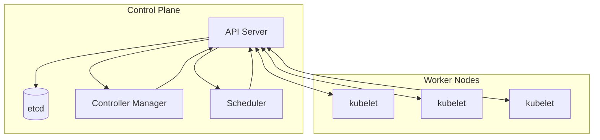
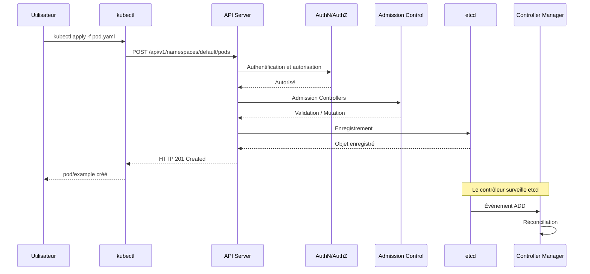
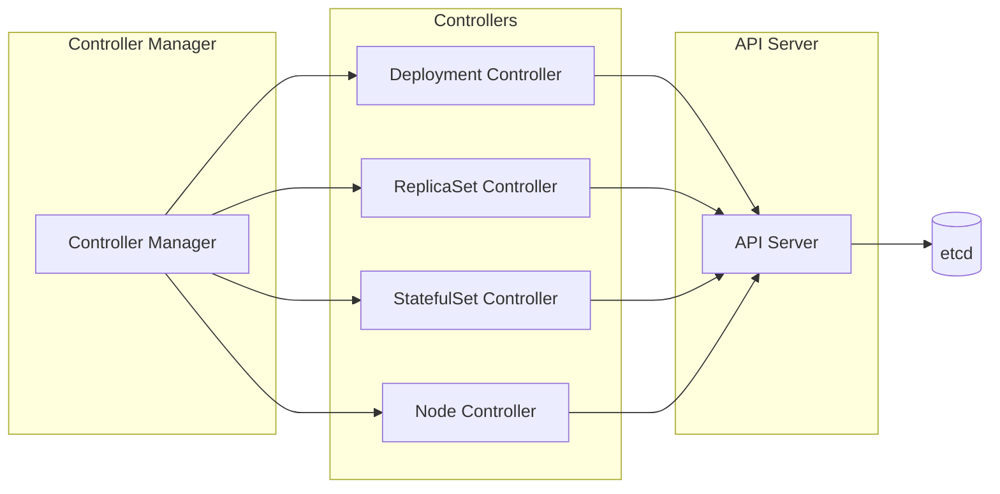

# Leçon 1.1 — Comprendre le Control Plane Kubernetes

**Navigation :** [← Présentation du module](../README.md) | [Leçon suivante : API Machinery →](02-api-machinery.md)

---

# Introduction

Avant de développer un **Operator Kubernetes**, il est indispensable de comprendre le fonctionnement interne de Kubernetes lui-même. En effet, un Operator n'est pas un composant isolé ajouté au cluster ; il s'intègre directement au cœur de son architecture et s'appuie sur les mêmes mécanismes que ceux utilisés par les contrôleurs natifs de Kubernetes.

Tout au long de cette formation, nous allons apprendre à concevoir des Operators capables d'automatiser le déploiement, la configuration, la supervision et la maintenance d'applications complexes. Cependant, avant d'écrire la moindre ligne de code avec Kubebuilder, nous devons répondre à une question essentielle :

**Comment Kubernetes fonctionne-t-il en interne ?**

La réponse se trouve dans un ensemble de composants appelés collectivement le **Control Plane**.

Le Control Plane représente le cerveau de Kubernetes. Il reçoit les demandes des utilisateurs, les analyse, les valide, les stocke puis orchestre l'ensemble des opérations nécessaires afin que le cluster atteigne l'état demandé.

Lorsqu'un administrateur crée un Deployment, modifie un Service ou supprime un Pod, il ne communique jamais directement avec les machines du cluster. Toutes ces opérations transitent par le Control Plane, qui coordonne ensuite les différents composants chargés d'exécuter ces demandes.

Cette architecture constitue l'une des principales forces de Kubernetes. Elle permet d'automatiser la gestion d'infrastructures parfois composées de plusieurs centaines, voire plusieurs milliers de nœuds, tout en garantissant un fonctionnement cohérent, résilient et évolutif.

Pour un développeur d'Operators, comprendre le Control Plane n'est donc pas une simple culture générale. C'est une compétence fondamentale. Les Operators utilisent exactement les mêmes mécanismes que les contrôleurs natifs de Kubernetes. Ils observent l'état du cluster, détectent les écarts entre la configuration souhaitée et la réalité, puis prennent automatiquement les décisions nécessaires pour corriger ces écarts.

Autrement dit, lorsque vous développerez votre premier Operator avec Kubebuilder, vous reproduirez le comportement des composants internes de Kubernetes. Vous ne ferez pas qu'utiliser Kubernetes : vous étendrez directement son fonctionnement.

Cette première leçon a donc pour objectif de vous donner une vision claire de cette architecture afin que toutes les notions abordées dans les prochains chapitres s'intègrent naturellement dans votre compréhension globale du système.

---

# Objectifs pédagogiques

À l'issue de cette leçon, vous serez capable de :

- comprendre le rôle du Control Plane dans un cluster Kubernetes ;
- expliquer la différence entre l'état souhaité et l'état réel d'une ressource ;
- décrire les responsabilités des principaux composants du Control Plane ;
- comprendre pourquoi Kubernetes adopte une approche déclarative ;
- expliquer le fonctionnement général de la boucle de réconciliation (*Reconciliation Loop*) ;
- préparer les connaissances nécessaires au développement d'Operators avec Kubebuilder.

---

# Théorie — Comprendre le Control Plane

Le **Control Plane Kubernetes** est un ensemble de composants logiciels qui assurent la gestion complète du cluster.

On peut le comparer au système nerveux d'un organisme vivant. Les Worker Nodes exécutent les applications, mais ce sont les composants du Control Plane qui prennent les décisions, surveillent l'état du cluster, coordonnent les opérations et garantissent que tout fonctionne conformément aux attentes.

Dans une infrastructure classique, un administrateur système devait intervenir manuellement pour effectuer de nombreuses tâches : créer des serveurs, redémarrer des services, remplacer des machines défaillantes ou déployer de nouvelles versions d'une application.

Kubernetes automatise entièrement ces opérations grâce à son Control Plane.

Plutôt que d'exécuter directement les actions demandées par l'utilisateur, le Control Plane observe continuellement l'état du cluster et décide lui-même des opérations nécessaires afin de satisfaire les objectifs définis.

Cette différence de philosophie est fondamentale.

L'utilisateur ne pilote plus directement les machines ; il décrit simplement ce qu'il souhaite obtenir.

Le Control Plane devient alors responsable de toutes les décisions techniques permettant d'atteindre cet objectif.

Cette approche est appelée **gestion déclarative** (*Declarative Management*), et constitue l'un des principes fondateurs de Kubernetes.

---

# Le modèle déclaratif de Kubernetes

L'un des concepts les plus importants à comprendre avant de développer des Operators est la notion de **Desired State**, ou **état souhaité**.

Dans Kubernetes, les utilisateurs décrivent le résultat qu'ils souhaitent obtenir.

Par exemple, un fichier YAML peut indiquer que l'application doit toujours disposer de trois réplicas.

```yaml
spec:
  replicas: 3
```

Cette information ne décrit absolument pas la manière dont Kubernetes doit procéder.

Elle indique uniquement le résultat attendu.

Le système décide ensuite automatiquement :

- sur quels nœuds créer les Pods ;
- dans quel ordre les démarrer ;
- comment répartir la charge ;
- comment remplacer un Pod défaillant ;
- comment revenir à trois réplicas si l'un d'eux disparaît.

Cette séparation entre la description du résultat et son exécution constitue l'un des plus grands avantages de Kubernetes.

Elle permet au cluster de prendre lui-même les décisions les plus adaptées en fonction de son état actuel.

---

## Pourquoi Kubernetes privilégie le déclaratif ?

Prenons un exemple simple.

Supposons que vous souhaitiez exécuter trois instances d'un serveur Nginx.

Dans une approche classique, vous devriez exécuter plusieurs commandes successives afin de créer les différents conteneurs.

Vous seriez également responsable de leur surveillance, de leur redémarrage en cas d'échec et de leur remplacement si une machine venait à tomber en panne.

Avec Kubernetes, cette responsabilité est transférée au cluster.

Vous indiquez uniquement :

> *Je souhaite disposer de trois instances de cette application.*

Le Control Plane se charge du reste.

Cette philosophie offre de nombreux avantages :

- une automatisation complète ;
- une meilleure résilience ;
- une réduction des erreurs humaines ;
- une gestion homogène de toutes les applications.

Les Operators s'appuient exactement sur ce même principe.

Lorsqu'un utilisateur crée une ressource personnalisée (*Custom Resource*), il décrit simplement l'état attendu. L'Operator interprète ensuite cette description et réalise automatiquement toutes les actions nécessaires.

---

# Déclaratif ou impératif ?

Pour bien comprendre la philosophie de Kubernetes, il est utile de comparer les deux grandes approches utilisées dans l'administration des infrastructures.

## L'approche impérative

Dans une approche impérative, l'utilisateur décrit précisément chaque étape à effectuer.

Par exemple :

- créer un premier Pod ;
- créer un second Pod ;
- créer un troisième Pod ;
- vérifier leur état ;
- les recréer si nécessaire.

L'ensemble de la logique reste sous la responsabilité de l'administrateur.

Cette méthode fonctionne parfaitement pour des environnements simples, mais devient rapidement difficile à maintenir lorsque les infrastructures grandissent.

---

## L'approche déclarative

Dans une approche déclarative, l'utilisateur ne décrit plus les actions.

Il décrit uniquement le résultat attendu.

Le système devient responsable de toutes les décisions intermédiaires.

Cette philosophie présente plusieurs avantages majeurs.

Tout d'abord, elle simplifie considérablement la gestion des infrastructures. Les fichiers YAML deviennent une description permanente de l'état attendu du système.

Ensuite, elle permet à Kubernetes de corriger automatiquement les écarts observés dans le cluster.

Enfin, elle rend les déploiements reproductibles. Deux clusters recevant les mêmes manifestes Kubernetes convergeront naturellement vers le même état.

C'est précisément cette propriété qui fait de Kubernetes une plateforme particulièrement adaptée aux pratiques GitOps et à l'automatisation des infrastructures modernes.

---

## Comparaison entre les deux approches

| Gestion déclarative | Gestion impérative |
|---------------------|-------------------|
| Décrit le résultat attendu | Décrit les actions à effectuer |
| Kubernetes choisit les opérations | L'administrateur pilote toutes les opérations |
| Basée sur un état souhaité | Basée sur une suite de commandes |
| Corrige automatiquement les écarts | Nécessite des interventions manuelles |
| Idéale pour l'automatisation | Plus adaptée aux opérations ponctuelles |

Dans toute cette formation, nous adopterons systématiquement l'approche déclarative, car elle constitue le fondement des Operators Kubernetes.

---

# La notion d'état souhaité (Desired State)

Le cœur de Kubernetes repose sur une idée extrêmement simple :

> **Le cluster doit toujours chercher à atteindre l'état demandé par l'utilisateur.**

Cette phrase paraît évidente, mais elle est en réalité à l'origine de tout le fonctionnement interne de Kubernetes.

Chaque ressource Kubernetes possède une description contenant les caractéristiques souhaitées de cette ressource.

Par exemple :

- un Deployment indique le nombre de Pods attendus ;
- un StatefulSet décrit l'organisation des instances ;
- un Service définit la manière d'exposer une application.

Toutes ces informations représentent le **Desired State**.

En parallèle, Kubernetes observe continuellement ce qui existe réellement dans le cluster.

C'est ce que l'on appelle le **Current State**, ou **état actuel**.

Le rôle du Control Plane consiste alors à comparer ces deux états.

Si une différence apparaît, il déclenche automatiquement les opérations nécessaires pour supprimer cet écart.

Cette comparaison permanente est au cœur du fonctionnement de tous les contrôleurs Kubernetes.

Dans les prochains chapitres, nous découvrirons que cette logique est exactement celle qu'implémente un Operator développé avec Kubebuilder.


## Control Plane Components

# Leçon 1.1 — Révision du Control Plane Kubernetes

**Navigation :** [← Présentation du module](../README.md) | [Leçon suivante : API Machinery →](02-api-machinery.md)

---

# Introduction

Le **Control Plane Kubernetes** constitue le véritable cerveau du cluster. C'est lui qui orchestre l'ensemble des opérations nécessaires afin que l'état réel du cluster corresponde en permanence à l'état souhaité défini par les utilisateurs.

Pour développer des **Operators Kubernetes**, il est indispensable de comprendre le fonctionnement du Control Plane. En effet, un opérateur n'est rien d'autre qu'un contrôleur personnalisé qui s'intègre directement dans cette architecture et applique les mêmes mécanismes que les composants natifs de Kubernetes.

Cette leçon a pour objectif de vous présenter les composants principaux du Control Plane, leurs responsabilités, ainsi que les interactions qui permettent à Kubernetes d'automatiser la gestion d'un cluster.

---

# Objectifs pédagogiques

À l'issue de cette leçon, vous serez capable de :

- comprendre le rôle du Control Plane Kubernetes ;
- identifier chacun de ses composants ;
- expliquer comment les composants communiquent entre eux ;
- comprendre le fonctionnement du modèle déclaratif de Kubernetes ;
- observer le comportement des contrôleurs dans un cluster réel ;
- préparer les bases nécessaires au développement d'Operators.

---

# Comprendre le Control Plane Kubernetes

Le **Control Plane** est un ensemble de services qui pilotent l'ensemble du cluster Kubernetes.

Sa mission consiste à surveiller en permanence les ressources du cluster et à s'assurer que leur état réel correspond exactement à l'état demandé par les utilisateurs.

Contrairement à de nombreux systèmes d'administration traditionnels, Kubernetes repose sur une **architecture déclarative**. L'utilisateur ne décrit pas les différentes étapes nécessaires pour obtenir un résultat ; il décrit uniquement le résultat attendu.

Le Control Plane se charge ensuite automatiquement d'exécuter toutes les opérations nécessaires pour atteindre cet objectif.

Cette philosophie est au cœur de Kubernetes... et donc également au cœur des Operators.

---

# Les principes fondamentaux

## Le modèle déclaratif

Kubernetes fonctionne selon un **modèle déclaratif (Declarative Model)**.

L'utilisateur décrit l'état souhaité du système à l'aide de fichiers YAML ou via l'API Kubernetes.

Par exemple :

> *Je souhaite disposer de trois réplicas de mon application.*

Il n'est pas nécessaire d'indiquer :

- comment créer les Pods ;
- dans quel ordre les créer ;
- comment surveiller leur état ;
- comment les recréer en cas de panne.

Toutes ces opérations sont entièrement prises en charge par Kubernetes.

---

## Le modèle impératif

À l'inverse, une approche **impérative** consiste à décrire précisément chaque action à effectuer.

Par exemple :

- créer un Pod ;
- créer un deuxième Pod ;
- créer un troisième Pod.

L'utilisateur pilote directement chacune des opérations.

Cette méthode offre davantage de contrôle immédiat mais devient rapidement difficile à maintenir lorsque les infrastructures grandissent.

---

## Déclaratif contre Impératif

| Modèle déclaratif | Modèle impératif |
|-------------------|------------------|
| Décrit le résultat attendu | Décrit chaque étape |
| Kubernetes décide des actions | L'utilisateur décide des actions |
| Recommandé pour Kubernetes | Utilisé principalement pour certaines opérations d'administration |
| Basé sur l'état désiré | Basé sur une suite de commandes |

L'ensemble de Kubernetes — et par conséquent tous les Operators — repose sur ce modèle déclaratif.

---

# La cohérence éventuelle (Eventual Consistency)

Le Control Plane ne modifie pas instantanément l'ensemble du cluster.

Lorsqu'une nouvelle ressource est créée ou modifiée, plusieurs composants doivent intervenir :

- validation ;
- enregistrement ;
- planification ;
- création des Pods ;
- démarrage des conteneurs.

Ces opérations prennent un certain temps.

On parle alors de **cohérence éventuelle (Eventual Consistency)**.

Le cluster converge progressivement vers l'état demandé.

Les contrôleurs travaillent continuellement afin de réduire les écarts entre :

- **l'état souhaité (Desired State)** ;
- **l'état réel (Current State)**.

Cette boucle permanente de correction est appelée **réconciliation (Reconciliation Loop)**.

---

# Séparation des responsabilités

Le Control Plane applique un principe fondamental d'architecture logicielle : la séparation des responsabilités.

Chaque composant possède une mission bien précise.

| Composant | Responsabilité |
|-----------|----------------|
| API Server | Valide et expose l'API Kubernetes |
| etcd | Stocke l'ensemble de l'état du cluster |
| Controller Manager | Réconcilie les ressources |
| Scheduler | Choisit le nœud sur lequel exécuter les Pods |

Cette séparation facilite :

- la maintenance ;
- l'évolutivité ;
- la haute disponibilité ;
- la résilience du cluster.

---

# Les composants du Control Plane

Le schéma suivant illustre l'organisation générale des composants du Control Plane.



Chaque composant coopère avec les autres afin d'assurer le fonctionnement du cluster.

---

# L'API Server

L'**API Server** est le composant central de Kubernetes.

Toutes les communications passent obligatoirement par lui.

Aucun composant n'accède directement à etcd.

Il agit comme un véritable **point d'entrée unique** du cluster.

## Responsabilités

L'API Server est chargé de :

- recevoir toutes les requêtes Kubernetes ;
- valider les objets reçus ;
- authentifier les utilisateurs ;
- vérifier leurs autorisations ;
- appliquer les règles d'admission ;
- enregistrer les objets dans etcd ;
- notifier les contrôleurs lorsqu'une ressource évolue.

Il représente donc le cœur de toutes les interactions Kubernetes.

---

# etcd

**etcd** est la base de données distribuée utilisée par Kubernetes.

Il s'agit d'un magasin **clé-valeur (Key-Value Store)** extrêmement performant et fortement cohérent.

Toutes les informations du cluster y sont enregistrées.

Cela comprend notamment :

- les Pods ;
- les Deployments ;
- les Services ;
- les ConfigMaps ;
- les Secrets ;
- les CRDs ;
- les ressources personnalisées créées par vos futurs Operators.

## Caractéristiques principales

- Source unique de vérité (Single Source of Truth)
- Haute disponibilité
- Cohérence forte
- Réplication distribuée
- Notifications de modification (Watch)

Sans etcd, Kubernetes perdrait toute mémoire de son état.

---

# Le Controller Manager

Le **Controller Manager** exécute l'ensemble des contrôleurs natifs de Kubernetes.

Chaque contrôleur possède une mission spécifique.

Par exemple :

- maintenir le nombre de Pods demandé ;
- créer automatiquement des ReplicaSets ;
- recréer les Pods supprimés ;
- gérer les StatefulSets ;
- surveiller les Nodes.

Chaque contrôleur applique exactement la même logique :

1. observer les ressources ;
2. détecter une différence entre l'état réel et l'état attendu ;
3. effectuer les corrections nécessaires ;
4. mettre à jour le statut des ressources.

C'est précisément cette logique que nous reproduirons lors du développement de nos propres Operators.

---

## Contrôleurs intégrés

Parmi les contrôleurs les plus importants figurent :

- Deployment Controller
- ReplicaSet Controller
- StatefulSet Controller
- DaemonSet Controller
- Job Controller
- Namespace Controller
- Node Controller

---

# Le Scheduler

Le **Scheduler** intervient lorsqu'un nouveau Pod doit être exécuté.

Sa mission consiste à sélectionner le Worker Node le plus approprié.

Pour cela, il analyse notamment :

- les ressources CPU disponibles ;
- la mémoire ;
- les contraintes d'affinité ;
- les taints et tolerations ;
- les Node Selectors ;
- les règles de placement.

Une fois le nœud sélectionné, le Scheduler met simplement à jour le Pod.

Le kubelet du nœud concerné prendra ensuite le relais afin de créer les conteneurs.

---

# Cycle complet d'une requête API

Lorsqu'un administrateur exécute :

```bash
kubectl apply -f pod.yaml
```

plusieurs composants interviennent successivement.



Cette séquence représente le fonctionnement fondamental de Kubernetes.

Toutes les ressources suivent ce même cheminement.

---

# Architecture du Controller Manager

Le Controller Manager héberge simultanément plusieurs contrôleurs.



Chaque contrôleur suit exactement la même logique :

1. surveiller une ressource ;
2. comparer le **Spec** avec l'état réel ;
3. corriger les différences ;
4. mettre à jour le champ **Status**.

Cette boucle de travail permanente est appelée **boucle de réconciliation** (*Reconciliation Loop*).

---

# Travaux pratiques — Explorer le Control Plane

Dans cette partie, nous allons observer directement les composants du Control Plane à l'aide d'un cluster **Kind**.

---

## Étape 1 — Identifier les composants du Control Plane

Afficher les Pods du namespace `kube-system` :

```bash
kubectl get pods -n kube-system
```

Afficher les informations détaillées du serveur API :

```bash
kubectl get pods -n kube-system \
-l component=kube-apiserver \
-o yaml
```

Consulter les journaux du Controller Manager :

```bash
kubectl logs \
-n kube-system \
-l component=kube-controller-manager \
--tail=50
```

---

## Étape 2 — Explorer l'API Server

Afficher les informations générales du cluster :

```bash
kubectl cluster-info
```

Afficher la version de l'API :

```bash
kubectl get --raw /version
```

Lister les groupes d'API disponibles :

```bash
kubectl api-versions
```

---

## Étape 3 — Observer le fonctionnement des contrôleurs

Créer un Deployment :

```bash
kubectl create deployment nginx --image=nginx:latest
```

Observer son évolution :

```bash
kubectl get deployment nginx -w
```

Dans un second terminal :

```bash
kubectl get replicasets -w
```

Afficher ensuite le ReplicaSet créé automatiquement :

```bash
kubectl get replicasets -l app=nginx
```

Vous pourrez constater que le **Deployment Controller** crée automatiquement un ReplicaSet afin de satisfaire l'état désiré.

---

## Étape 4 — Observer le cycle complet d'une requête

Créer un Pod :

```bash
kubectl apply -f - <<EOF
apiVersion: v1
kind: Pod
metadata:
  name: test-pod
spec:
  containers:
  - name: test
    image: nginx:latest
EOF
```

Afficher ensuite les événements du cluster :

```bash
kubectl get events --sort-by='.lastTimestamp'
```

Vous pourrez suivre les différentes étapes :

- validation ;
- stockage ;
- planification ;
- création du Pod ;
- démarrage des conteneurs.

---

# À retenir

À l'issue de cette leçon, retenez les éléments suivants :

- L'API Server constitue le point d'entrée unique de Kubernetes.
- etcd conserve l'intégralité de l'état du cluster.
- Le Controller Manager exécute les contrôleurs responsables de la réconciliation.
- Le Scheduler choisit le Worker Node qui exécutera chaque Pod.
- Tous les composants communiquent via l'API Server.
- Kubernetes repose entièrement sur un modèle déclaratif.

---

# Ce que cela implique pour les Operators

Les Operators Kubernetes utilisent exactement les mêmes mécanismes que les contrôleurs natifs.

Lorsque nous développerons notre propre Operator, celui-ci devra :

- interroger l'API Kubernetes ;
- créer ou modifier des ressources ;
- observer les changements grâce au mécanisme **Watch** ;
- comparer l'état réel avec l'état attendu ;
- déclencher une réconciliation si nécessaire ;
- mettre à jour le champ **Status** des ressources personnalisées.

Autrement dit, un Operator est simplement un contrôleur spécialisé capable d'automatiser la gestion d'une application ou d'une infrastructure.

---

# Travaux pratiques associés

- **Lab 1.1 — Exploration du Control Plane Kubernetes**  
  Mise en pratique des concepts étudiés dans cette leçon.

---

# Conclusion

Vous disposez désormais d'une vision claire de l'architecture du **Control Plane Kubernetes** et du rôle joué par chacun de ses composants.

Cette compréhension constitue une étape essentielle avant d'aborder les mécanismes internes de l'API Kubernetes. Dans la prochaine leçon, nous étudierons en détail **l'API Machinery**, son organisation, ses ressources et les principes qui permettent aux Operators de s'intégrer naturellement à l'écosystème Kubernetes.
