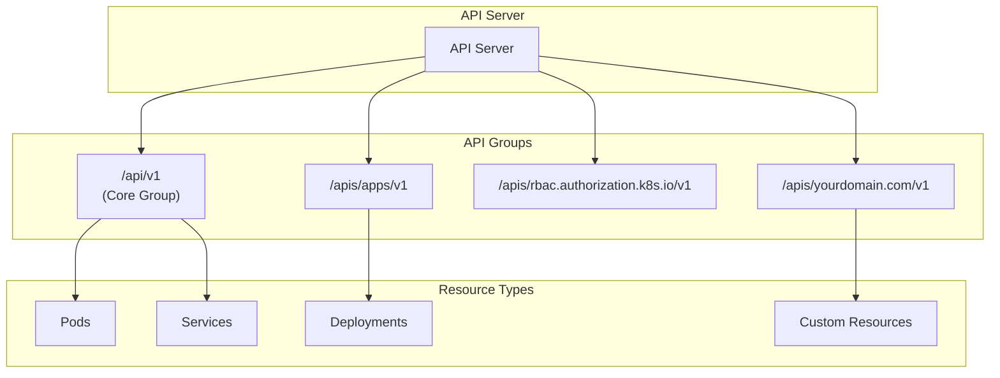
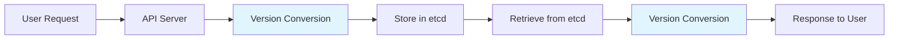
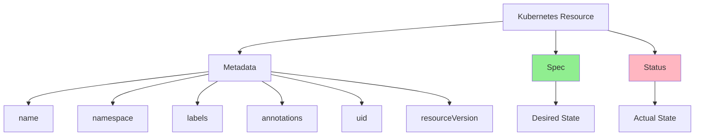
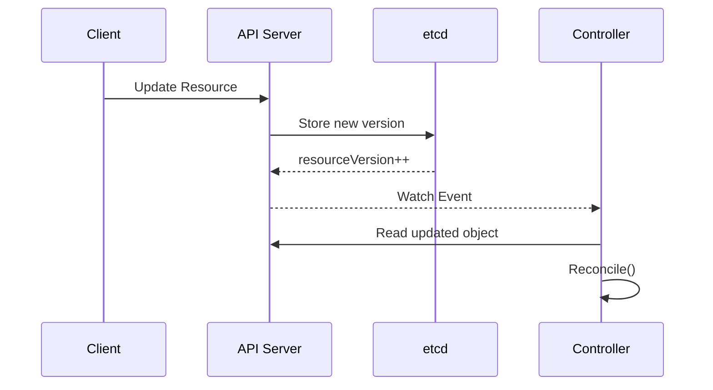

# Leçon 1.2 — Comprendre l'API Machinery de Kubernetes

**Navigation :** [← Leçon précédente : Le Control Plane](01-control-plane.md) | [Présentation du module](../README.md) | [Leçon suivante : Le Controller Pattern →](03-controller-pattern.md)

---

# Introduction

Lors de la précédente leçon, nous avons découvert le fonctionnement interne du **Control Plane Kubernetes** et étudié les différents composants qui collaborent afin de maintenir le cluster dans l'état souhaité. Nous avons vu que l'ensemble des interactions transitent par un composant central : **l'API Server**.

Cependant, une question demeure.

**Comment toutes ces informations sont-elles organisées ?**

Comment Kubernetes est-il capable de comprendre qu'un fichier YAML représente un Pod, un Deployment ou un Service ?

Comment les différents composants du cluster interprètent-ils les ressources créées par les utilisateurs ?

Comment un Operator peut-il créer de nouveaux types de ressources qui s'intègrent naturellement dans Kubernetes ?

Toutes ces questions trouvent leur réponse dans ce que l'on appelle **l'API Machinery**.

L'API Machinery représente l'ensemble des mécanismes qui permettent à Kubernetes de définir, d'exposer, de valider, de stocker et de manipuler toutes les ressources du cluster.

Autrement dit, si le **Control Plane** constitue le cerveau de Kubernetes, alors **l'API Machinery représente le langage que ce cerveau comprend**.

Il s'agit probablement de l'un des concepts les plus importants de toute cette formation.

En effet, un Operator Kubernetes ne fait rien d'autre que manipuler des ressources à travers cette API.

Lorsque nous développerons nos propres Operators avec Kubebuilder, nous créerons de nouvelles ressources personnalisées (Custom Resources), qui devront respecter exactement les mêmes conventions que les ressources natives de Kubernetes.

Notre objectif n'est donc pas seulement d'utiliser l'API Kubernetes.

Nous allons apprendre à l'étendre.

Avant d'en arriver là, il est indispensable de comprendre les règles qui gouvernent cette API.

---

# Pourquoi comprendre l'API Kubernetes ?

À première vue, Kubernetes semble relativement simple à utiliser.

Quelques commandes `kubectl` suffisent pour créer un Pod, déployer une application ou supprimer une ressource.

Par exemple :

```bash
kubectl apply -f deployment.yaml
```

Cette commande paraît extrêmement simple.

Pourtant, derrière cette unique ligne de commande se cache une succession d'opérations complexes.

Le fichier YAML est analysé.

Son contenu est converti en objet JSON.

Une requête HTTP est construite.

Cette requête est envoyée à l'API Server.

L'API Server authentifie l'utilisateur.

Les autorisations sont vérifiées.

Les contrôleurs d'admission examinent la ressource.

L'objet est validé.

Il est converti dans le format interne utilisé par Kubernetes.

Il est ensuite enregistré dans etcd.

Enfin, les différents contrôleurs sont notifiés qu'une nouvelle ressource est disponible.

Toutes ces opérations sont rendues possibles grâce à l'API Machinery.

Sans elle, Kubernetes ne serait qu'un simple orchestrateur incapable de comprendre les objets manipulés par les utilisateurs.

---

# Qu'est-ce que l'API Machinery ?

Le terme **API Machinery** désigne l'ensemble des composants logiciels responsables de la gestion de l'API Kubernetes.

Il ne s'agit pas d'un programme unique mais d'un ensemble de mécanismes travaillant ensemble afin de fournir une interface cohérente, extensible et sécurisée.

Ces mécanismes permettent notamment :

- d'exposer les différentes API Kubernetes ;
- de définir la structure des ressources ;
- de gérer les différentes versions d'une API ;
- de valider les objets créés par les utilisateurs ;
- de convertir automatiquement les ressources entre plusieurs versions ;
- de stocker les données dans etcd ;
- de notifier les contrôleurs lorsqu'une ressource évolue.

Autrement dit, l'API Machinery constitue la fondation sur laquelle repose tout Kubernetes.

Même les composants internes du cluster utilisent ces mécanismes.

Le Scheduler, les Controllers, les kubelets ainsi que les Operators communiquent tous avec Kubernetes en utilisant cette même API.

---

# Une API pensée comme un véritable langage

On peut comparer l'API Kubernetes à une langue commune parlée par tous les composants du cluster.

Chaque ressource possède un vocabulaire précis.

Chaque champ possède une signification.

Chaque opération suit des règles parfaitement définies.

Lorsqu'un utilisateur crée un Deployment, Kubernetes sait immédiatement :

- de quel type de ressource il s'agit ;
- quelle version de cette ressource est utilisée ;
- quelles informations sont obligatoires ;
- quels champs sont facultatifs ;
- quelles validations doivent être effectuées ;
- comment cette ressource doit être stockée.

Cette homogénéité est l'une des grandes forces de Kubernetes.

Elle permet à des milliers de développeurs de créer de nouveaux composants capables de communiquer naturellement avec le cluster.

Les Operators que nous construirons dans cette formation respecteront exactement ces mêmes conventions.

Pour un utilisateur, un Custom Resource développé avec Kubebuilder donnera ainsi l'impression de faire partie intégrante de Kubernetes.

---

# Les principes de conception de l'API Kubernetes

L'API Kubernetes repose sur plusieurs principes fondamentaux.

Ces principes ont été conçus afin de garantir une API cohérente, évolutive et simple à utiliser, même dans des environnements très complexes.

Comprendre ces règles est essentiel avant de créer nos propres ressources personnalisées.

---

# Une API RESTful

L'API Kubernetes est une **API RESTful**.

REST (*Representational State Transfer*) est un style d'architecture utilisé par la majorité des services web modernes.

Il repose sur une idée simple.

Chaque élément manipulé par le système est représenté sous la forme d'une **ressource** accessible grâce à une URL.

Dans Kubernetes, un Pod, un Deployment ou un Service sont tous considérés comme des ressources.

Chaque ressource possède donc sa propre adresse.

Par exemple :

```
/api/v1/namespaces/default/pods
```

désigne la collection des Pods du namespace `default`.

De la même manière :

```
/apis/apps/v1/namespaces/default/deployments
```

désigne l'ensemble des Deployments appartenant au groupe d'API `apps`.

Cette organisation permet à tous les outils compatibles Kubernetes de communiquer de manière uniforme avec le cluster.

---

# Pourquoi Kubernetes utilise REST ?

Le choix d'une architecture REST n'est pas le fruit du hasard.

REST est aujourd'hui l'un des standards les plus largement adoptés pour la conception d'API distribuées.

En s'appuyant sur cette architecture, Kubernetes bénéficie immédiatement de nombreux avantages.

Tout d'abord, les échanges reposent sur le protocole HTTP, déjà utilisé par la quasi-totalité des infrastructures informatiques.

Ensuite, chaque ressource possède une adresse unique, ce qui simplifie considérablement son identification.

Enfin, les opérations disponibles restent identiques quel que soit le type de ressource manipulé.

Cette homogénéité facilite le développement d'outils comme :

- kubectl ;
- Helm ;
- Argo CD ;
- Terraform ;
- Crossplane ;
- Kubebuilder ;
- Operator SDK.

Tous utilisent exactement les mêmes mécanismes de communication.

---

# Les principes REST appliqués à Kubernetes

L'API Kubernetes reprend les principaux concepts de REST tout en les adaptant aux besoins spécifiques d'un orchestrateur de conteneurs.

Parmi ces principes figurent :

## Les ressources

Chaque objet Kubernetes est représenté par une ressource.

Un Pod, un Deployment, un ConfigMap ou un Secret sont tous considérés comme des ressources indépendantes.

Chaque ressource possède :

- un type ;
- une identité ;
- une URL ;
- un état.

Cette approche permet de manipuler toutes les ressources de manière uniforme.

---

## Les méthodes HTTP

Chaque opération réalisée sur une ressource correspond à une méthode HTTP.

Le tableau suivant résume les principales méthodes utilisées.

| Méthode | Utilisation |
|----------|-------------|
| GET | Lire une ressource |
| POST | Créer une ressource |
| PUT | Remplacer une ressource existante |
| PATCH | Modifier partiellement une ressource |
| DELETE | Supprimer une ressource |

Par exemple, lorsqu'un utilisateur exécute :

```bash
kubectl get pods
```

`kubectl` effectue en réalité une requête HTTP **GET** vers l'API Server.

De la même manière, un :

```bash
kubectl apply -f deployment.yaml
```

aboutira généralement à une requête **POST** ou **PATCH**, selon que la ressource existe déjà ou non.

Comprendre cette correspondance sera particulièrement utile lorsque nous manipulerons directement l'API Kubernetes sans passer par `kubectl`.

---

## Une API sans état (Stateless)

L'un des principes fondamentaux de REST est qu'une requête doit être entièrement autonome.

Autrement dit, chaque requête doit contenir toutes les informations nécessaires à son traitement.

L'API Server ne conserve aucune mémoire des requêtes précédentes.

Chaque appel est donc indépendant.

Cette propriété présente plusieurs avantages.

Elle facilite la montée en charge.

Elle améliore la résilience.

Elle permet également de répartir les requêtes entre plusieurs API Servers sans difficulté.

C'est l'une des raisons pour lesquelles Kubernetes peut fonctionner dans des clusters de très grande taille.

---

## Une interface uniforme

L'un des objectifs majeurs de Kubernetes est de proposer une expérience utilisateur cohérente.

Quel que soit le type de ressource manipulé, les mêmes conventions sont utilisées.

Chaque objet possède :

- un `apiVersion` ;
- un `kind` ;
- un `metadata` ;
- un `spec` ;
- un `status`.

Chaque ressource est créée de la même manière.

Chaque ressource est récupérée avec les mêmes commandes.

Chaque ressource est supprimée selon les mêmes principes.

Cette homogénéité réduit fortement la courbe d'apprentissage de Kubernetes.

Une fois les conventions maîtrisées, elles s'appliquent naturellement à l'ensemble des ressources du cluster.

C'est précisément cette cohérence que nous chercherons à reproduire lorsque nous développerons nos propres Custom Resources avec Kubebuilder.

---

# Vers les extensions spécifiques à Kubernetes

Les principes REST constituent une excellente base de travail.

Cependant, Kubernetes va beaucoup plus loin qu'une simple API REST traditionnelle.

Afin de répondre aux besoins d'un orchestrateur moderne, il introduit plusieurs mécanismes spécifiques tels que les **API Groups**, le **versionnement**, les **Subresources**, les mécanismes **Watch** ou encore les **Field Selectors**.

Ces concepts constituent la véritable puissance de l'API Kubernetes et feront l'objet des prochaines sections de cette leçon.

# Architecture REST de l'API Kubernetes

Comme nous l'avons vu dans la première partie de cette leçon, Kubernetes repose sur une API RESTful. Toutefois, cette affirmation ne suffit pas à comprendre la richesse de son fonctionnement.

En réalité, Kubernetes ne se contente pas d'exposer quelques points d'accès HTTP permettant de créer ou de supprimer des ressources. Son API constitue un véritable langage organisé, capable d'évoluer au fil du temps tout en conservant une compatibilité avec les applications existantes.

Cette capacité d'évolution est essentielle.

Kubernetes est aujourd'hui utilisé par des millions de clusters répartis dans le monde entier. Chaque nouvelle version introduit de nouvelles fonctionnalités, améliore certaines ressources et retire progressivement des fonctionnalités devenues obsolètes.

Sans une architecture API soigneusement conçue, chaque nouvelle version casserait la compatibilité des applications existantes.

L'API Machinery a précisément été conçue pour résoudre ce problème.

Elle permet à Kubernetes de faire évoluer son API de manière progressive, sans imposer aux utilisateurs de modifier constamment leurs applications ou leurs manifestes YAML.

Avant de développer nos propres Operators, nous devons donc comprendre comment cette API est organisée.

---

# Les ressources sont représentées par des URL

Dans Kubernetes, absolument tout est une ressource.

Un Pod est une ressource.

Un Deployment est une ressource.

Un Secret est une ressource.

Une ConfigMap est une ressource.

Même les ressources que nous créerons avec Kubebuilder deviendront des ressources Kubernetes à part entière.

Chaque ressource possède donc une adresse unique au sein de l'API.

Cette adresse est représentée sous la forme d'une URL.

Par exemple :

```
/api/v1/namespaces/default/pods/nginx
```

désigne le Pod nommé **nginx** situé dans le namespace **default**.

De la même manière :

```
/apis/apps/v1/namespaces/default/deployments/web
```

désigne le Deployment **web** appartenant au groupe d'API **apps**.

Cette organisation présente un avantage considérable.

Tous les outils compatibles Kubernetes savent immédiatement où trouver une ressource.

Ils n'ont pas besoin de connaître son implémentation interne.

Il leur suffit de construire l'URL correspondant à cette ressource.

Cette uniformité constitue l'un des piliers de l'écosystème Kubernetes.

---

# Une structure cohérente pour toutes les ressources

Toutes les URL Kubernetes suivent une organisation similaire.

Même si les ressources sont très différentes les unes des autres, leur adresse respecte toujours une structure commune.

Prenons quelques exemples.

```
/api/v1/namespaces/default/pods/nginx
```

```
/api/v1/namespaces/default/services/frontend
```

```
/apis/apps/v1/namespaces/default/deployments/backend
```

```
/apis/batch/v1/namespaces/default/jobs/database-backup
```

À première vue, ces URL peuvent sembler complexes.

En réalité, elles sont construites selon une logique très simple.

On retrouve généralement :

- le groupe d'API ;
- la version de l'API ;
- le namespace (si la ressource est namespacée) ;
- le type de ressource ;
- le nom de la ressource.

Une fois cette organisation comprise, il devient très facile de naviguer dans l'ensemble de l'API Kubernetes.

---

# Les groupes d'API (API Groups)

Lorsque Kubernetes est apparu, il ne gérait qu'un nombre relativement limité de ressources.

Toutes ces ressources étaient regroupées dans une API unique.

Avec les années, de nouveaux concepts sont apparus :

- les Deployments ;
- les StatefulSets ;
- les Jobs ;
- les CronJobs ;
- le RBAC ;
- les Ingress ;
- les Horizontal Pod Autoscalers ;
- les ressources réseau ;
- les ressources de stockage.

L'API est rapidement devenue beaucoup trop volumineuse.

Les développeurs de Kubernetes ont donc introduit une notion fondamentale : **les groupes d'API** (*API Groups*).

Le principe est très simple.

Les ressources appartenant au même domaine fonctionnel sont regroupées dans une même famille.

Cette organisation facilite énormément la maintenance du projet.

Elle permet également à plusieurs équipes de développer différentes parties de Kubernetes sans interférer les unes avec les autres.

---

# Le groupe Core

Le groupe historique de Kubernetes est appelé **Core API Group**.

Il est facilement reconnaissable.

Contrairement aux autres groupes, son URL ne commence pas par `/apis`.

Elle utilise simplement :

```
/api/v1
```

Ce groupe contient les ressources fondamentales du cluster.

On y retrouve notamment :

- Pods ;
- Services ;
- ConfigMaps ;
- Secrets ;
- PersistentVolumes ;
- PersistentVolumeClaims ;
- Endpoints ;
- Namespaces.

Ces ressources constituent les briques de base de Kubernetes.

Elles sont utilisées quotidiennement par pratiquement toutes les applications déployées sur un cluster.

---

# Les groupes spécialisés

Les autres ressources sont réparties dans différents groupes spécialisés.

Par exemple :

| Groupe | Contenu |
|----------|---------|
| apps | Deployments, StatefulSets, ReplicaSets, DaemonSets |
| batch | Jobs, CronJobs |
| networking.k8s.io | Ingress, NetworkPolicy |
| rbac.authorization.k8s.io | Roles, ClusterRoles, RoleBindings |
| autoscaling | HorizontalPodAutoscaler |
| storage.k8s.io | StorageClass, CSI Drivers |
| admissionregistration.k8s.io | Webhooks |

Chaque groupe possède ses propres ressources et son propre cycle d'évolution.

Cette organisation permet aux développeurs de faire évoluer indépendamment chaque domaine fonctionnel de Kubernetes.

---

# Pourquoi les API Groups sont-ils importants pour les Operators ?

Cette notion devient particulièrement intéressante lorsque nous développons nos propres ressources.

En effet, nos futurs **Custom Resource Definitions (CRD)** devront également appartenir à un groupe d'API.

Par exemple :

```
apiVersion: database.liora.io/v1
```

ou

```
apiVersion: monitoring.example.com/v1alpha1
```

Le groupe permet d'éviter tout conflit avec les ressources natives de Kubernetes.

Imaginez plusieurs entreprises développant chacune une ressource appelée :

```
Database
```

Sans groupe d'API, il serait impossible de distinguer ces ressources.

Grâce aux API Groups, elles deviennent parfaitement identifiables.

Par exemple :

```
database.liora.io
```

et

```
database.company.com
```

désignent deux ressources totalement différentes.

C'est exactement le même principe que les noms de domaine sur Internet.

---

# Architecture générale de l'API

Le schéma suivant illustre l'organisation générale de l'API Kubernetes.



Ce diagramme met en évidence une idée essentielle.

Toutes les ressources transitent par l'API Server.

Cependant, elles sont ensuite réparties dans différents groupes selon leur nature.

Lorsque nous créerons notre propre Operator, notre CRD apparaîtra exactement au même niveau que les groupes natifs de Kubernetes.

Pour les utilisateurs, elle sera manipulée exactement comme une ressource officielle.

---

# Le versionnement de l'API Kubernetes

Une API moderne doit pouvoir évoluer.

Au fil des années, de nouvelles fonctionnalités apparaissent.

Certaines deviennent obsolètes.

D'autres nécessitent une modification de leur structure.

Sans système de versionnement, chaque évolution casserait la compatibilité des applications existantes.

Kubernetes a donc mis en place un mécanisme particulièrement robuste permettant à plusieurs versions d'une même ressource de coexister.

Cette approche garantit qu'une ancienne application pourra continuer à fonctionner même si une nouvelle version de la ressource est disponible.

---

# Les trois types de versionnement

Il est important de distinguer trois notions différentes.

Beaucoup de débutants les confondent alors qu'elles répondent à des besoins totalement distincts.

## 1. La version de l'API (API Version)

Il s'agit de la version visible dans les manifestes YAML.

Par exemple :

```yaml
apiVersion: apps/v1
```

ou

```yaml
apiVersion: batch/v1
```

Cette version indique à Kubernetes comment interpréter la structure de la ressource.

C'est celle que nous utiliserons quotidiennement avec Kubebuilder.

---

## 2. La Resource Version

Chaque objet Kubernetes possède également un champ appelé :

```
resourceVersion
```

Contrairement à l'API Version, cette valeur change à chaque modification de la ressource.

Elle sert principalement à gérer les accès concurrents.

Nous reviendrons en détail sur ce mécanisme dans une prochaine section.

---

## 3. La version interne des objets

Enfin, Kubernetes possède une représentation interne des ressources.

Quelle que soit la version utilisée par l'utilisateur, l'API Server convertit automatiquement les objets dans un format interne commun avant leur stockage dans etcd.

Cette conversion est totalement transparente.

L'utilisateur n'a donc jamais besoin de s'en préoccuper.

Cette architecture permet à Kubernetes de supporter simultanément plusieurs versions d'une même API.

---

# Le cycle de conversion des versions

Le processus suivant illustre la manière dont Kubernetes gère automatiquement les différentes versions d'une ressource.



Ce diagramme montre que l'API Server joue également un rôle de traducteur.

Lorsqu'une requête est reçue, il convertit automatiquement la ressource dans le format interne utilisé par Kubernetes.

Lorsqu'un client demande ensuite cette même ressource, l'API Server effectue la conversion inverse afin de restituer la version attendue.

Grâce à ce mécanisme, plusieurs versions d'une même API peuvent coexister pendant plusieurs années sans perturber les utilisateurs.

Cette capacité de conversion sera particulièrement importante lorsque nous créerons nos propres CRDs et que nous apprendrons à faire évoluer leurs schémas sans casser la compatibilité des applications existantes.

# Structure d'une ressource Kubernetes

Maintenant que nous avons étudié l'organisation générale de l'API Kubernetes, les groupes d'API ainsi que le mécanisme de versionnement, il est temps de nous intéresser à l'élément le plus important de cette leçon : **la structure des ressources Kubernetes**.

Cette partie est particulièrement importante pour la suite de cette formation.

En effet, toutes les ressources Kubernetes, qu'elles soient natives ou personnalisées, reposent sur exactement le même modèle de données.

Que vous manipuliez :

- un Pod ;
- un Deployment ;
- un Service ;
- un Secret ;
- une ConfigMap ;
- un StatefulSet ;
- ou une Custom Resource créée avec Kubebuilder,

vous retrouverez toujours la même organisation générale.

Cette homogénéité constitue l'une des plus grandes forces de Kubernetes.

Elle permet à tous les outils de comprendre immédiatement une ressource sans avoir besoin de connaître sa nature exacte.

Lorsque nous développerons nos propres Operators, nos ressources devront respecter exactement cette structure afin d'être reconnues comme des ressources Kubernetes à part entière.

Comprendre cette architecture est donc indispensable avant d'aborder les **Custom Resource Definitions (CRD)** dans les prochains chapitres.

---

# Une structure commune à toutes les ressources

Prenons un instant pour observer différents manifestes Kubernetes.

Même si leur objectif est totalement différent, ils possèdent tous une structure similaire.

Un Pod :

```yaml
apiVersion: v1
kind: Pod
metadata:
  name: nginx
spec:
  containers:
  - image: nginx
```

Un Deployment :

```yaml
apiVersion: apps/v1
kind: Deployment
metadata:
  name: web
spec:
  replicas: 3
```

Un Service :

```yaml
apiVersion: v1
kind: Service
metadata:
  name: frontend
spec:
  selector:
    app: nginx
```

À première vue, ces ressources semblent très différentes.

Pourtant, elles commencent toutes par les mêmes champs.

Cette cohérence est volontaire.

Elle permet à Kubernetes d'interpréter immédiatement chaque objet reçu.

Avant même de savoir ce que contient la ressource, l'API Server sait :

- quelle version utiliser ;
- quel type de ressource il doit créer ;
- comment l'identifier ;
- où elle doit être stockée ;
- quelles validations appliquer.

Cette organisation constitue le socle de toute l'API Kubernetes.

---

# Anatomie d'une ressource Kubernetes

Le schéma suivant représente la structure logique d'une ressource Kubernetes.



Même si certaines ressources possèdent des champs supplémentaires, cette organisation générale reste toujours identique.

Chaque partie possède une responsabilité bien définie.

Nous allons maintenant étudier chacune d'elles en détail.

---

# apiVersion

Le premier champ rencontré dans une ressource Kubernetes est toujours :

```yaml
apiVersion:
```

Ce champ indique à Kubernetes **comment interpréter le document**.

Il précise dans quel groupe d'API se trouve la ressource ainsi que la version de cette API.

Par exemple :

```yaml
apiVersion: v1
```

désigne une ressource appartenant au **Core API Group**.

À l'inverse :

```yaml
apiVersion: apps/v1
```

fait référence au groupe **apps**.

Lorsqu'un manifeste est envoyé à l'API Server, celui-ci commence toujours par lire ce champ.

Grâce à cette information, il sait immédiatement :

- quelles règles de validation appliquer ;
- quels champs sont attendus ;
- quelle version interne utiliser ;
- comment convertir la ressource si nécessaire.

Sans ce champ, Kubernetes serait incapable de comprendre la structure du document.

---

# Pourquoi apiVersion est-il indispensable ?

Les API Kubernetes évoluent constamment.

De nouveaux champs apparaissent.

Certains deviennent obsolètes.

D'autres changent de comportement.

Grâce au champ `apiVersion`, Kubernetes peut supporter simultanément plusieurs générations d'une même ressource.

Cette capacité garantit une excellente compatibilité entre les différentes versions du cluster.

C'est également ce mécanisme qui permettra à nos futures CRDs d'évoluer sans casser les applications déjà déployées.

---

# kind

Le second champ est :

```yaml
kind:
```

Alors que `apiVersion` indique **comment** interpréter le document, `kind` indique **ce que représente réellement la ressource**.

Par exemple :

```yaml
kind: Pod
```

ou

```yaml
kind: Deployment
```

ou encore

```yaml
kind: Service
```

Grâce à cette information, Kubernetes sait quel contrôleur devra gérer cette ressource.

Par exemple :

- un Deployment sera surveillé par le Deployment Controller ;
- un StatefulSet sera pris en charge par le StatefulSet Controller ;
- un Job sera géré par le Job Controller.

Plus tard dans cette formation, nous créerons nous-mêmes un nouveau type de ressource.

Nous verrons alors apparaître des déclarations similaires :

```yaml
kind: Database
```

ou

```yaml
kind: RedisCluster
```

Ces ressources seront totalement personnalisées mais respecteront exactement les mêmes conventions que les objets natifs de Kubernetes.

---

# metadata

Le champ `metadata` est présent dans **toutes** les ressources Kubernetes.

On peut le considérer comme la carte d'identité de l'objet.

Il regroupe toutes les informations permettant à Kubernetes de gérer cette ressource indépendamment de son contenu fonctionnel.

Une partie de ces informations est fournie par l'utilisateur.

Une autre est générée automatiquement par Kubernetes.

---

## Le nom de la ressource

Le premier élément est généralement :

```yaml
metadata:
  name: nginx
```

Le nom constitue l'identifiant lisible de la ressource.

Deux ressources de même type ne peuvent pas partager le même nom dans un même namespace.

---

## Le namespace

La plupart des ressources Kubernetes sont isolées à l'intérieur d'un namespace.

Celui-ci apparaît dans les métadonnées.

```yaml
metadata:
  namespace: production
```

Le namespace agit comme une frontière logique.

Deux ressources portant le même nom peuvent donc parfaitement coexister si elles appartiennent à deux namespaces différents.

---

## Les labels

Les labels sont probablement l'un des mécanismes les plus puissants de Kubernetes.

Ils permettent d'associer des informations sous forme de paires **clé/valeur** à une ressource.

Par exemple :

```yaml
labels:
  app: nginx
  environment: production
```

Contrairement au nom, plusieurs ressources peuvent partager exactement les mêmes labels.

Ils servent principalement à :

- sélectionner des Pods ;
- regrouper des ressources ;
- appliquer des politiques réseau ;
- cibler des Deployments ;
- effectuer des recherches.

Les Services utilisent notamment les labels pour déterminer quels Pods doivent recevoir le trafic.

Nous retrouverons très régulièrement ce mécanisme dans les Operators.

---

## Les annotations

Les annotations ressemblent beaucoup aux labels.

Cependant, leur objectif est différent.

Elles permettent d'ajouter des informations destinées aux outils ou aux développeurs.

Par exemple :

- une documentation ;
- une configuration spécifique ;
- une date de déploiement ;
- des informations de supervision.

Contrairement aux labels, elles ne sont généralement pas utilisées pour sélectionner des ressources.

---

## L'UID

Chaque ressource possède également un identifiant unique généré automatiquement.

Il ressemble à ceci :

```
uid: 0b2d3f4e...
```

Même si une ressource est supprimée puis recréée avec le même nom, son UID sera totalement différent.

Cela permet à Kubernetes de distinguer deux objets portant pourtant le même nom.

---

## Le ResourceVersion

Nous avons déjà évoqué ce champ lors de la partie précédente.

Il est présent dans les métadonnées.

```yaml
resourceVersion: "42891"
```

Cette valeur change automatiquement à chaque modification de la ressource.

Elle sera utilisée pour gérer les accès concurrents et éviter les conflits de mise à jour.

Nous reviendrons plus loin sur son fonctionnement détaillé.

---

# spec

Le champ **Spec** est probablement la partie la plus importante d'une ressource Kubernetes.

Il contient **l'état souhaité** (*Desired State*).

Autrement dit, il décrit ce que l'utilisateur souhaite obtenir.

Prenons un Deployment.

```yaml
spec:
  replicas: 3
```

Cette déclaration signifie simplement :

> Je souhaite disposer de trois Pods.

Elle ne dit absolument pas :

- où créer les Pods ;
- dans quel ordre les lancer ;
- sur quel Worker Node les placer ;
- comment les recréer en cas de panne.

Toutes ces décisions seront prises automatiquement par Kubernetes.

Le champ `spec` représente donc une intention.

Il décrit un objectif.

Il ne décrit jamais une suite d'actions.

C'est précisément ce qui fait toute la puissance du modèle déclaratif.

---

# Pourquoi Spec est-il si important ?

Les utilisateurs ne manipulent pratiquement que le champ `spec`.

Ils décrivent :

- le nombre de réplicas ;
- les images Docker ;
- les ressources CPU ;
- les variables d'environnement ;
- les volumes ;
- les ports.

Les contrôleurs Kubernetes se chargent ensuite de transformer cette description en réalité.

Dans un Operator, nous définirons nous aussi notre propre champ `spec`.

Par exemple :

```yaml
spec:
  storage: 100Gi
  replicas: 3
  version: "16"
```

Ces informations représenteront la configuration souhaitée d'une base PostgreSQL.

Notre Operator sera chargé de transformer cette description en ressources Kubernetes.

---

# status

Le champ `status` représente exactement l'inverse de `spec`.

Alors que `spec` décrit ce que l'utilisateur souhaite,

`status` décrit ce qui existe réellement.

Il est généralement rempli automatiquement par Kubernetes ou par un Operator.

Prenons un exemple.

L'utilisateur demande :

```yaml
spec:
  replicas: 3
```

Quelques instants plus tard :

```yaml
status:
  availableReplicas: 3
```

Le champ `status` indique alors que Kubernetes a effectivement réussi à créer les trois Pods demandés.

Si un Pod tombe en panne, ce champ évoluera automatiquement.

Le `status` constitue donc le reflet permanent de l'état réel du cluster.

---

# Spec contre Status

Cette séparation est probablement **le concept le plus important de toute l'API Kubernetes**.

| Spec | Status |
|-------|---------|
| Décrit l'état souhaité | Décrit l'état réel |
| Renseigné par l'utilisateur | Renseigné par Kubernetes ou un Operator |
| Sert de référence pour la réconciliation | Informe sur l'état courant |
| Ne change que lorsque l'utilisateur modifie la configuration | Évolue continuellement au cours de la vie de la ressource |

Toute la logique des contrôleurs Kubernetes repose sur cette comparaison.

Le contrôleur lit le `spec`.

Il observe le `status`.

Il compare les deux.

S'ils diffèrent, il déclenche une réconciliation.

C'est exactement ce que nous implémenterons dans nos futurs Operators.

---

# À retenir

À ce stade de la formation, plusieurs notions doivent être parfaitement assimilées :

- Toutes les ressources Kubernetes possèdent une structure commune.
- `apiVersion` indique la version de l'API utilisée.
- `kind` identifie le type de ressource.
- `metadata` contient les informations d'identification de l'objet.
- `spec` représente toujours l'état souhaité.
- `status` représente toujours l'état réel.
- Toute la philosophie déclarative de Kubernetes repose sur la comparaison permanente entre **Spec** et **Status**.

Dans le prochain chapitre, nous verrons comment les clients Kubernetes découvrent automatiquement les ressources disponibles grâce aux mécanismes **API Discovery**, avant d'étudier les **Subresources** et le rôle fondamental du **resourceVersion** dans la gestion des accès concurrents.

# API Discovery : comment Kubernetes découvre automatiquement les ressources

Jusqu'à présent, nous avons étudié la manière dont les ressources Kubernetes sont organisées et structurées. Nous savons désormais qu'elles sont regroupées par domaines fonctionnels, versionnées et accessibles grâce à une API REST uniforme.

Une question importante demeure cependant.

Comment un client Kubernetes, comme **kubectl**, sait-il quelles ressources existent sur un cluster ?

Comment est-il capable de proposer l'auto-complétion de commandes ?

Comment un IDE peut-il connaître la structure d'une Custom Resource que nous venons juste de créer avec Kubebuilder ?

Comment des outils comme Helm, Argo CD, Terraform ou Lens découvrent-ils automatiquement les nouvelles ressources disponibles ?

La réponse se trouve dans un mécanisme fondamental de Kubernetes : **l'API Discovery**.

Contrairement à de nombreuses API REST classiques qui nécessitent une documentation externe, Kubernetes est capable de décrire lui-même l'ensemble de son API.

Autrement dit, le cluster est capable d'expliquer à n'importe quel client :

- quelles API sont disponibles ;
- quelles versions sont supportées ;
- quels types de ressources existent ;
- quelles opérations sont autorisées ;
- quelles extensions ont été ajoutées.

Cette capacité d'auto-description est l'une des caractéristiques qui rendent Kubernetes aussi extensible.

Lorsqu'une nouvelle CRD est installée dans un cluster, elle devient immédiatement visible par tous les outils compatibles Kubernetes, sans qu'aucune modification ne soit nécessaire.

---

# Une API capable de se décrire elle-même

Dans de nombreux systèmes distribués, les clients doivent connaître à l'avance la liste des ressources disponibles.

Ils utilisent souvent une documentation ou un SDK spécifique.

Kubernetes adopte une approche beaucoup plus moderne.

Chaque API Server expose des points d'accès permettant d'interroger directement son fonctionnement.

Lorsqu'un client se connecte à un cluster pour la première fois, il ne connaît pratiquement rien de celui-ci.

Avant toute chose, il effectue une phase de découverte appelée **Discovery**.

Pendant cette étape, il interroge l'API Server afin d'obtenir la liste complète des ressources disponibles.

Cette découverte est entièrement dynamique.

Deux clusters Kubernetes n'exposent donc pas nécessairement les mêmes API.

Par exemple, un cluster possédant plusieurs Operators installés présentera naturellement davantage de ressources qu'un cluster Kubernetes fraîchement installé.

---

# Les points d'entrée de l'API Discovery

L'API Server expose plusieurs points d'accès spécialisés permettant aux clients de découvrir automatiquement les ressources disponibles.

Les plus importants sont :

```
/api
```

qui présente le groupe principal (*Core API Group*),

et

```
/apis
```

qui référence l'ensemble des groupes d'API additionnels.

Lorsqu'un client interroge ces points d'accès, il reçoit une description détaillée des groupes disponibles ainsi que des différentes versions supportées.

Il peut ensuite poursuivre son exploration afin d'obtenir la liste complète des ressources exposées par chaque groupe.

Cette approche permet à Kubernetes de rester totalement extensible.

Aucun outil n'a besoin d'être recompilé lorsqu'une nouvelle API apparaît.

---

# Exemple de découverte avec kubectl

Heureusement, nous n'avons généralement pas besoin d'interroger directement ces points d'accès.

L'outil `kubectl` fournit plusieurs commandes permettant d'utiliser l'API Discovery.

Par exemple :

```bash
kubectl api-versions
```

Cette commande affiche toutes les versions d'API actuellement disponibles sur le cluster.

Pour obtenir la liste des ressources disponibles, on peut utiliser :

```bash
kubectl api-resources
```

Ces deux commandes sont extrêmement utiles lorsqu'on découvre un nouveau cluster.

Elles permettent notamment de vérifier qu'une CRD a bien été installée.

Après avoir développé notre premier Operator avec Kubebuilder, nous utiliserons très régulièrement ces commandes afin de confirmer que notre nouvelle ressource est bien reconnue par Kubernetes.

---

# Pourquoi cette découverte automatique est-elle importante ?

Imaginons que nous développions un Operator permettant de gérer des bases PostgreSQL.

Une fois notre CRD installée, nous disposerons d'une nouvelle ressource.

Par exemple :

```
Database
```

Sans mécanisme de découverte automatique, chaque outil devrait être modifié afin d'apprendre l'existence de cette nouvelle ressource.

Ce serait extrêmement contraignant.

Grâce à l'API Discovery, il suffit d'installer la CRD.

Quelques secondes plus tard :

- kubectl connaît automatiquement cette nouvelle ressource ;
- Lens l'affiche dans son interface ;
- Argo CD peut la synchroniser ;
- Terraform peut l'utiliser ;
- les IDE proposent l'auto-complétion.

Notre ressource devient alors un véritable citoyen de l'écosystème Kubernetes.

C'est précisément ce qui rend les Operators si puissants.

---

# Les sous-ressources (Subresources)

Toutes les ressources Kubernetes possèdent un ensemble d'informations.

Certaines sont modifiées par les utilisateurs.

D'autres sont mises à jour uniquement par Kubernetes.

Pour éviter les conflits entre ces différents acteurs, Kubernetes introduit la notion de **Subresources**, ou **sous-ressources**.

Une sous-ressource représente une partie spécifique d'un objet Kubernetes pouvant être manipulée indépendamment du reste.

Cette séparation améliore la sécurité, réduit les risques de conflits et facilite le travail des contrôleurs.

---

# Pourquoi séparer une ressource en plusieurs parties ?

Prenons un Deployment.

L'utilisateur modifie principalement :

- le nombre de réplicas ;
- l'image Docker ;
- les variables d'environnement ;
- les ressources CPU.

Ces informations appartiennent au champ **spec**.

Pendant ce temps, le Deployment Controller met régulièrement à jour :

- le nombre de Pods disponibles ;
- les Pods prêts ;
- les conditions de disponibilité.

Ces informations appartiennent au champ **status**.

Si tout le monde modifiait le même objet simultanément, les conflits seraient très fréquents.

Kubernetes évite ce problème grâce aux sous-ressources.

---

# La sous-ressource Status

La sous-ressource la plus connue est :

```
status
```

Lorsqu'un contrôleur souhaite uniquement mettre à jour l'état courant d'une ressource, il ne modifie pas l'objet complet.

Il effectue une mise à jour spécifique du `status`.

Cette séparation présente plusieurs avantages.

Tout d'abord, elle protège la configuration souhaitée contre les modifications accidentelles.

Ensuite, elle permet d'accorder des autorisations différentes.

Par exemple, un utilisateur peut être autorisé à modifier le `spec` sans pouvoir modifier le `status`.

Inversement, un Operator peut mettre à jour le `status` sans être autorisé à modifier le `spec`.

Nous utiliserons très souvent cette fonctionnalité avec Kubebuilder.

La méthode `Status().Update()` du client Kubernetes exploite précisément cette sous-ressource.

---

# La sous-ressource Scale

Une autre sous-ressource importante est :

```
scale
```

Elle permet de modifier uniquement le nombre de réplicas d'une ressource.

Par exemple, lorsqu'un Horizontal Pod Autoscaler augmente automatiquement le nombre de Pods d'un Deployment, il n'a pas besoin de modifier toute la ressource.

Il agit uniquement sur la sous-ressource **scale**.

Cette approche limite considérablement les risques de conflits entre plusieurs contrôleurs.

---

# Les avantages des sous-ressources

Les sous-ressources offrent plusieurs bénéfices.

Elles permettent :

- de limiter les conflits d'écriture ;
- de simplifier les contrôleurs ;
- d'améliorer la sécurité grâce au RBAC ;
- d'isoler les responsabilités ;
- d'améliorer les performances en limitant les données échangées.

Lors du développement d'Operators, nous activerons généralement la sous-ressource `status` afin de respecter les bonnes pratiques de Kubernetes.

---

# resourceVersion : le gardien de la cohérence

Nous avons déjà rencontré le champ :

```yaml
metadata:
  resourceVersion: "123456"
```

À première vue, cette valeur peut sembler anodine.

Pourtant, elle joue un rôle absolument essentiel dans le fonctionnement interne de Kubernetes.

Chaque fois qu'une ressource est créée ou modifiée, Kubernetes lui attribue une nouvelle valeur de **resourceVersion**.

Cette valeur agit comme un numéro de révision.

Elle permet de savoir précisément quelle est la version actuelle de la ressource.

---

# Pourquoi resourceVersion existe-t-il ?

Imaginons deux administrateurs travaillant simultanément sur le même Deployment.

Le premier augmente le nombre de réplicas.

Le second modifie l'image Docker.

Sans mécanisme de protection, la dernière modification enregistrée écraserait complètement la précédente.

Kubernetes évite ce problème grâce au `resourceVersion`.

Lorsqu'un client souhaite mettre à jour une ressource, il envoie également la version qu'il possède.

L'API Server vérifie alors que cette version correspond toujours à celle enregistrée dans etcd.

Si une autre modification est intervenue entre-temps, la mise à jour est refusée.

Le client doit alors relire la ressource avant de réessayer.

Ce mécanisme est appelé **Optimistic Concurrency Control**.

Il permet à Kubernetes de gérer efficacement des milliers de modifications simultanées sans verrouiller les ressources.

---

# resourceVersion et les mécanismes Watch

Le champ `resourceVersion` joue également un rôle essentiel dans les mécanismes de surveillance (*Watch*).

Les contrôleurs Kubernetes ne relisent pas constamment toutes les ressources du cluster.

Ils demandent simplement à être informés des changements intervenant après une version donnée.

Grâce au `resourceVersion`, Kubernetes est capable d'envoyer uniquement les nouveaux événements.

Cette approche réduit considérablement la charge du cluster.

C'est précisément ce mécanisme que nous utiliserons lorsque nous développerons nos propres contrôleurs avec Kubebuilder.

Notre méthode `Reconcile()` sera déclenchée uniquement lorsqu'un événement intéressant sera détecté.

---

# Les Watch : le cœur du modèle événementiel

L'un des concepts les plus importants de Kubernetes est son fonctionnement **orienté événements**.

Les contrôleurs ne parcourent pas continuellement toutes les ressources du cluster.

Ils ouvrent une connexion permanente avec l'API Server.

Chaque fois qu'une ressource est créée, modifiée ou supprimée, un événement est immédiatement envoyé.

Cette approche est extrêmement performante.

Elle évite des milliers de requêtes inutiles.

Elle permet également aux contrôleurs de réagir presque instantanément.

Kubebuilder repose entièrement sur ce principe.

Nos futurs Operators fonctionneront eux aussi grâce à des mécanismes **Watch**.

---

# Cycle complet d'une modification de ressource

Le diagramme suivant illustre le fonctionnement global des mécanismes étudiés dans cette partie.



Ce diagramme résume parfaitement le fonctionnement des contrôleurs Kubernetes.

Une modification entraîne une nouvelle `resourceVersion`.

Cette nouvelle version déclenche un événement.

Le contrôleur reçoit cet événement.

Il relit la ressource.

Enfin, il lance une nouvelle boucle de réconciliation.

C'est exactement ce comportement que nous reproduirons dans tous les Operators développés au cours de cette formation.

---

# À retenir

Cette quatrième partie introduit plusieurs concepts fondamentaux qui seront omniprésents dans la suite du cours :

- L'API Discovery permet aux clients de découvrir automatiquement les ressources disponibles sur un cluster.
- Kubernetes est capable de décrire lui-même son API, ce qui facilite son extensibilité.
- Les sous-ressources (`status`, `scale`, etc.) permettent de séparer les responsabilités et de limiter les conflits.
- Le champ `resourceVersion` protège les ressources contre les mises à jour concurrentes et garantit la cohérence des données.
- Les mécanismes **Watch** permettent aux contrôleurs de réagir aux événements sans interroger continuellement l'API Server.

Ces notions constituent le socle du fonctionnement interne de Kubernetes et seront directement exploitées lorsque nous commencerons à développer des **Custom Resource Definitions (CRD)** et des **Controllers** avec Kubebuilder.

# Travaux pratiques : Explorer l'API Machinery de Kubernetes

Après avoir étudié les fondements théoriques de l'API Kubernetes, il est temps de passer à la pratique.

L'objectif de cette série de laboratoires n'est pas simplement d'exécuter quelques commandes `kubectl`, mais de comprendre concrètement comment les différentes briques de l'API Machinery interagissent entre elles.

Au cours de ces exercices, vous allez découvrir que chacune des commandes exécutées dans `kubectl` correspond en réalité à une requête adressée à l'API Server.

Vous apprendrez également à observer la structure des ressources Kubernetes, à découvrir les groupes d'API disponibles sur votre cluster, à manipuler les objets directement via l'API REST et à comprendre comment Kubernetes suit l'évolution des ressources grâce au champ **resourceVersion**.

Ces laboratoires constituent une excellente préparation aux prochains modules de cette formation. Les Operators développés avec Kubebuilder utiliseront exactement les mêmes mécanismes.

---

# Objectifs des laboratoires

À l'issue de ces exercices, vous serez capable de :

- explorer les différentes API disponibles sur un cluster Kubernetes ;
- comprendre comment `kubectl` communique avec l'API Server ;
- identifier les groupes d'API et leurs versions ;
- examiner la structure complète d'une ressource Kubernetes ;
- observer les métadonnées générées automatiquement ;
- comprendre le rôle du champ `resourceVersion` ;
- analyser le fonctionnement des mécanismes **Watch** ;
- préparer le terrain pour la création de vos propres ressources personnalisées (CRD).

---

# Laboratoire 1 — Découverte des API Kubernetes

Notre premier exercice consiste simplement à découvrir les API disponibles sur le cluster.

Pour cela, utilisez la commande suivante.

```bash
kubectl api-versions
```

Cette commande interroge directement l'API Discovery exposée par l'API Server.

Le résultat obtenu dépend du cluster utilisé.

Sur un cluster Kubernetes fraîchement installé, vous observerez uniquement les groupes d'API natifs.

En revanche, si plusieurs Operators ont déjà été installés, vous constaterez l'apparition de nouveaux groupes correspondant à leurs CRDs.

Prenez quelques minutes pour parcourir cette liste.

Essayez notamment d'identifier :

- le groupe `apps` ;
- le groupe `batch` ;
- le groupe `networking.k8s.io` ;
- le groupe `rbac.authorization.k8s.io`.

Vous remarquerez que chacun possède une ou plusieurs versions.

Cette première exploration permet déjà de constater que Kubernetes est capable de décrire dynamiquement son API.

---

# Laboratoire 2 — Explorer les ressources disponibles

Maintenant que nous connaissons les groupes d'API, intéressons-nous aux ressources qu'ils contiennent.

Exécutez :

```bash
kubectl api-resources
```

Cette commande affiche plusieurs informations importantes :

- le nom des ressources ;
- leur nom abrégé ;
- leur groupe d'API ;
- leur caractère namespacé ou non ;
- leur type.

Prenez le temps d'observer cette sortie.

Vous remarquerez immédiatement que Kubernetes expose plusieurs dizaines de ressources natives.

Essayez de retrouver celles que vous utilisez déjà quotidiennement :

- Pods ;
- Deployments ;
- Services ;
- ConfigMaps ;
- Secrets ;
- StatefulSets.

Dans les prochains modules, lorsque nous installerons notre premier Operator, une nouvelle ligne apparaîtra automatiquement dans cette liste.

Ce sera la preuve que notre CRD est désormais intégrée à Kubernetes.

---

# Laboratoire 3 — Explorer une ressource complète

Nous allons maintenant examiner une ressource réelle.

Commencez par créer un Pod.

```bash
kubectl apply -f - <<EOF
apiVersion: v1
kind: Pod
metadata:
  name: api-demo
spec:
  containers:
  - name: nginx
    image: nginx:latest
EOF
```

Une fois le Pod créé, affichez sa représentation complète.

```bash
kubectl get pod api-demo -o yaml
```

Prenez plusieurs minutes pour observer le résultat.

Vous constaterez que Kubernetes a ajouté de nombreuses informations automatiquement.

Repérez notamment :

- `uid`
- `creationTimestamp`
- `resourceVersion`
- `managedFields`
- `status`

Toutes ces informations n'étaient pas présentes dans votre manifeste initial.

Elles ont été générées automatiquement par l'API Server.

Cela illustre parfaitement la différence entre les données fournies par l'utilisateur et celles maintenues par Kubernetes.

---

# Laboratoire 4 — Observer le champ Status

Toujours sur le même Pod, concentrez-vous sur la section :

```yaml
status:
```

Vous y trouverez notamment :

- la phase du Pod ;
- son adresse IP ;
- les conditions ;
- l'état du conteneur ;
- les dates de démarrage.

Contrairement au champ `spec`, cette section évolue automatiquement au cours de la vie de la ressource.

Essayez maintenant de supprimer le Pod.

```bash
kubectl delete pod api-demo
```

Puis recréez-le.

Observez attentivement le nouveau champ `status`.

Vous constaterez qu'il évolue progressivement.

Le Pod passe successivement par différents états avant d'atteindre l'état **Running**.

Cette observation illustre parfaitement le fonctionnement du modèle déclaratif étudié précédemment.

---

# Laboratoire 5 — Observer le champ resourceVersion

Créons maintenant un Deployment.

```bash
kubectl create deployment nginx --image=nginx:latest
```

Affichez ensuite son contenu.

```bash
kubectl get deployment nginx -o yaml
```

Repérez le champ :

```yaml
resourceVersion:
```

Notez sa valeur.

Modifiez ensuite le nombre de réplicas.

```bash
kubectl scale deployment nginx --replicas=3
```

Affichez de nouveau le Deployment.

```bash
kubectl get deployment nginx -o yaml
```

Vous constaterez immédiatement que la valeur de `resourceVersion` a changé.

Cette simple expérience montre que Kubernetes attribue une nouvelle version à chaque modification d'une ressource.

C'est ce mécanisme qui permet aux contrôleurs de détecter les changements sans devoir comparer l'intégralité des objets.

---

# Laboratoire 6 — Observer les événements Kubernetes

Les événements constituent une excellente manière d'observer le fonctionnement interne du cluster.

Utilisez la commande suivante.

```bash
kubectl get events --sort-by='.lastTimestamp'
```

Vous verrez apparaître différentes étapes :

- création de la ressource ;
- planification par le Scheduler ;
- téléchargement des images ;
- démarrage des conteneurs ;
- changements d'état.

Chaque événement correspond à une action réalisée par un composant du Control Plane.

Ces informations sont particulièrement utiles lors du développement et du débogage d'un Operator.

---

# Laboratoire 7 — Interroger directement l'API Server

Jusqu'à présent, nous avons laissé `kubectl` interpréter les réponses de l'API.

Il est également possible d'interroger directement l'API Server.

Commencez par afficher sa version.

```bash
kubectl get --raw /version
```

Puis explorez les groupes d'API.

```bash
kubectl get --raw /apis
```

Enfin, observez le groupe principal.

```bash
kubectl get --raw /api
```

Ces commandes montrent clairement que Kubernetes expose une véritable API REST.

`kubectl` n'est finalement qu'un client spécialisé utilisant cette API.

Tous les outils de l'écosystème Kubernetes fonctionnent selon ce même principe.

---

# Ce qu'il faut retenir de ces laboratoires

Ces exercices permettent de relier la théorie à la pratique.

Ils montrent que chaque action réalisée avec `kubectl` correspond à une interaction avec l'API Server.

Ils illustrent également la richesse des métadonnées ajoutées automatiquement par Kubernetes.

Enfin, ils mettent en évidence le fonctionnement des mécanismes de découverte d'API, de gestion des versions et de suivi des ressources.

Ces notions seront réutilisées très régulièrement dans la suite de cette formation.

---

# Résumé de la leçon

Cette deuxième leçon nous a permis de découvrir les fondements de l'API Machinery, véritable colonne vertébrale de Kubernetes.

Nous avons tout d'abord étudié l'architecture REST utilisée par l'API Kubernetes.

Nous avons vu que toutes les ressources sont accessibles grâce à des URL normalisées et manipulées au moyen des méthodes HTTP standards.

Nous avons ensuite découvert les **API Groups**, qui permettent d'organiser les ressources par domaines fonctionnels tout en facilitant leur évolution.

Nous avons également étudié le système de **versionnement**, indispensable pour garantir la compatibilité entre les différentes versions de Kubernetes.

La seconde partie de cette leçon était consacrée à la structure des ressources.

Nous avons appris que tous les objets Kubernetes reposent sur le même modèle composé des champs :

- `apiVersion`
- `kind`
- `metadata`
- `spec`
- `status`

Nous avons particulièrement insisté sur la différence fondamentale entre **Spec** (état souhaité) et **Status** (état réel), qui constitue le cœur du modèle déclaratif de Kubernetes.

Enfin, nous avons étudié plusieurs mécanismes avancés de l'API Machinery :

- l'API Discovery ;
- les sous-ressources ;
- le champ `resourceVersion` ;
- les mécanismes **Watch**.

Tous ces concepts seront directement utilisés lors du développement d'Operators avec Kubebuilder.

---

# Ce que vous devez maîtriser avant de poursuivre

Avant d'aborder la prochaine leçon, assurez-vous de maîtriser les notions suivantes :

- expliquer le rôle de l'API Machinery ;
- décrire l'organisation des groupes d'API ;
- interpréter un manifeste Kubernetes complet ;
- distinguer clairement `spec` et `status` ;
- expliquer le rôle des métadonnées ;
- comprendre le fonctionnement de `resourceVersion` ;
- savoir utiliser `kubectl api-resources` et `kubectl api-versions` ;
- comprendre comment les contrôleurs détectent les changements grâce aux mécanismes **Watch**.

Ces connaissances seront indispensables pour comprendre le fonctionnement interne des Controllers et des Operators.

---

# Préparation de la prochaine leçon

Maintenant que nous savons comment Kubernetes expose et organise ses ressources, nous pouvons nous intéresser au mécanisme qui donne véritablement vie au cluster :

**le Controller Pattern**.

Dans la prochaine leçon, nous découvrirons comment les contrôleurs observent les ressources, détectent les différences entre l'état souhaité et l'état réel, puis exécutent une boucle de réconciliation afin de maintenir en permanence le cluster dans l'état attendu.

Il s'agit probablement du concept le plus important de toute la formation, car il constitue la base du développement d'Operators avec Kubebuilder.

---

# Navigation

**Navigation :** [← Leçon 1.1 : Kubernetes Control Plane](01-control-plane.md) | [Présentation du module](../README.md) | **Leçon suivante : Controller Pattern →** `(03-controller-pattern.md)`
