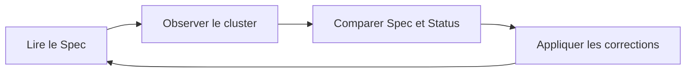
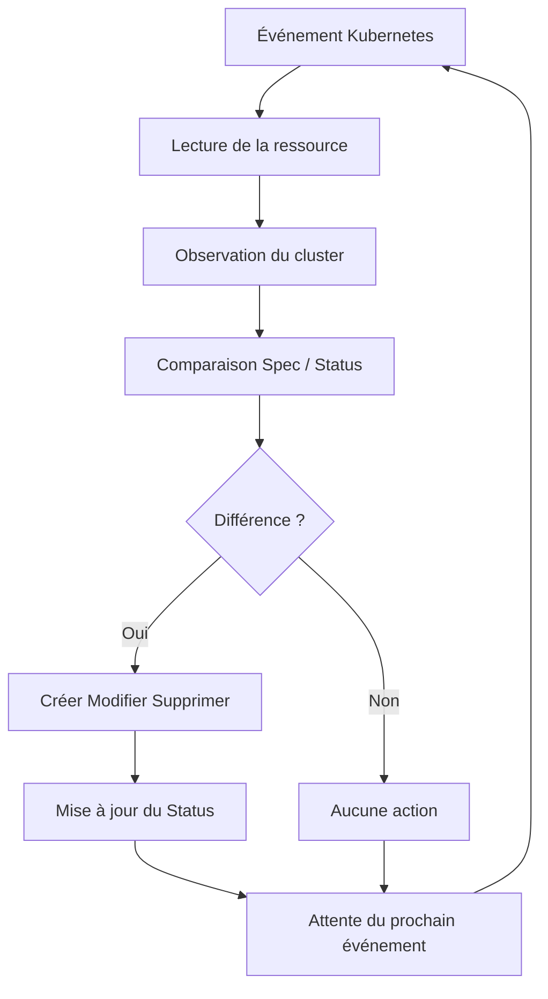
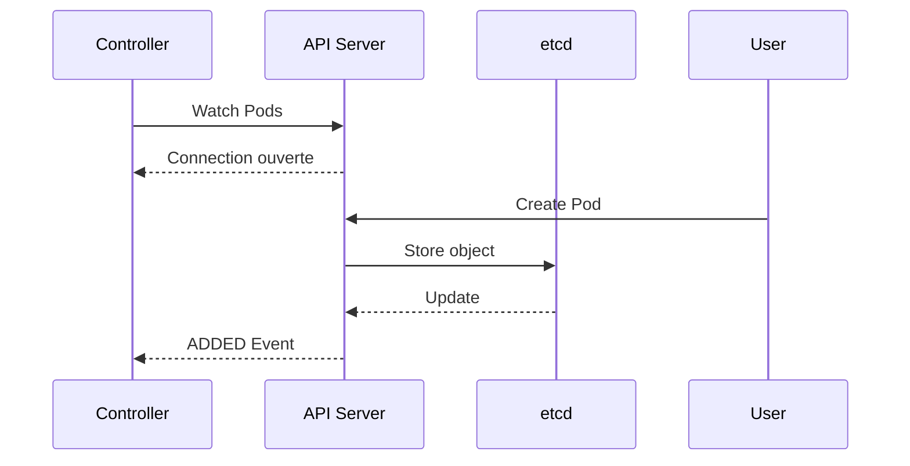
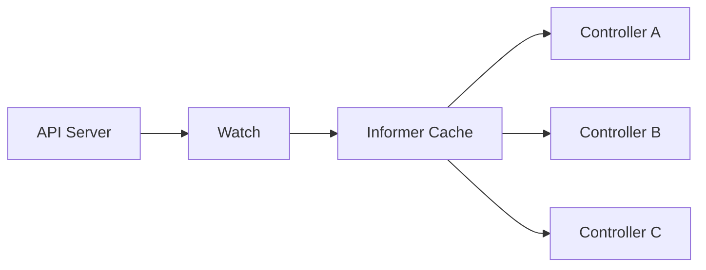
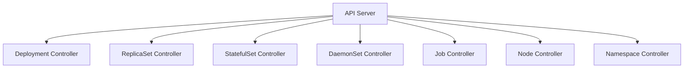
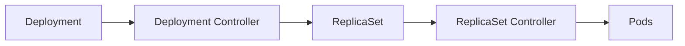
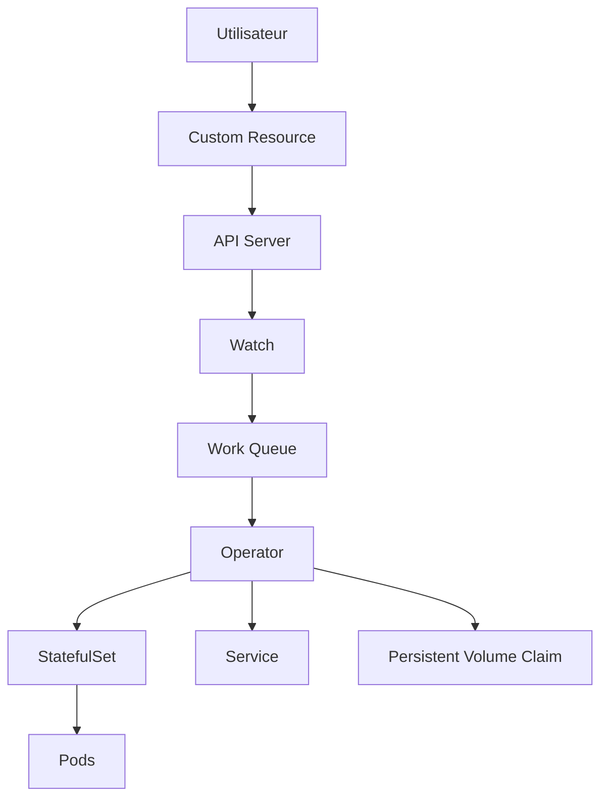

# Partie 1 : Introduction au Controller Pattern et historique

**Navigation :** [Présentation du module](../README.md) | [Leçon précédente : API Machinery ←](02-api-machinery.md) | [Partie suivante : La boucle de réconciliation →](03-reconciliation-loop.md)

---

# Introduction

Jusqu'à présent, nous avons étudié deux piliers fondamentaux de Kubernetes : le **Control Plane** et l'**API Machinery**. Nous savons désormais comment les ressources sont stockées dans **etcd**, comment elles sont exposées via l'API Server et comment les utilisateurs décrivent l'état souhaité du cluster grâce à des manifestes YAML.

Une question essentielle demeure cependant.

Une fois qu'une ressource est enregistrée dans l'API Server, **qui transforme cette simple déclaration en réalité ?**

Lorsque vous créez un Deployment demandant trois réplicas, pourquoi trois Pods apparaissent-ils automatiquement ?

Lorsque l'un de ces Pods est supprimé accidentellement, pourquoi Kubernetes en recrée-t-il immédiatement un nouveau ?

Pourquoi un StatefulSet conserve-t-il toujours l'identité de ses Pods ?

Comment un Job sait-il qu'il doit relancer un conteneur ayant échoué ?

Toutes ces actions semblent presque magiques lorsque l'on découvre Kubernetes.

En réalité, elles reposent toutes sur un même mécanisme : **le Controller Pattern**.

Le Controller Pattern constitue probablement **le concept le plus important de toute l'architecture Kubernetes**. Sans lui, Kubernetes ne serait qu'une simple base de données capable de stocker des objets YAML.

Ce sont les contrôleurs qui donnent vie au cluster.

Ils observent en permanence les ressources, détectent les différences entre l'état attendu et l'état réel, puis exécutent automatiquement les actions nécessaires afin de maintenir le système dans l'état décrit par les utilisateurs.

Cette philosophie est tellement importante qu'elle est devenue la base de tous les projets de l'écosystème Kubernetes.

Les Operators que nous développerons avec Kubebuilder ne sont finalement rien d'autre que des contrôleurs spécialisés.

Avant d'apprendre à écrire notre propre contrôleur, nous devons donc comprendre en profondeur ce modèle de conception.

---

# Pourquoi Kubernetes a-t-il besoin de contrôleurs ?

Dans de nombreux systèmes traditionnels, les administrateurs exécutent eux-mêmes chaque action.

Ils créent un serveur.

Ils installent les logiciels.

Ils vérifient leur fonctionnement.

En cas de panne, ils interviennent manuellement.

Cette approche fonctionne sur quelques serveurs.

Elle devient rapidement impossible lorsqu'il faut administrer plusieurs centaines ou plusieurs milliers de machines.

Kubernetes adopte une philosophie radicalement différente.

L'administrateur ne décrit jamais les étapes nécessaires.

Il décrit uniquement le résultat attendu.

Par exemple :

> "Je souhaite disposer de trois instances de mon application."

Une fois cette déclaration enregistrée dans l'API Server, l'utilisateur n'a plus rien à faire.

Kubernetes prend entièrement en charge la réalisation de cet objectif.

Mais cette automatisation nécessite une intelligence capable d'observer le cluster et de prendre des décisions.

C'est précisément le rôle des contrôleurs.

Chaque contrôleur est responsable d'un domaine particulier.

Il surveille un ensemble de ressources, compare continuellement leur état actuel avec leur état souhaité, puis agit lorsqu'une différence apparaît.

Sans contrôleur, aucune ressource Kubernetes ne pourrait évoluer automatiquement.

---

# Une philosophie héritée des systèmes autonomes

Le Controller Pattern ne constitue pas une invention isolée.

Il s'inscrit dans une évolution plus large des infrastructures informatiques vers des systèmes capables de s'administrer eux-mêmes.

Pendant de nombreuses années, les infrastructures reposaient principalement sur des scripts.

Les administrateurs exécutaient des commandes dans un ordre précis afin d'obtenir le résultat souhaité.

Cette approche, appelée **programmation impérative**, présente plusieurs limites.

Elle suppose notamment que toutes les étapes se déroulent correctement.

Si une commande échoue ou si un élément est modifié manuellement après l'exécution du script, l'ensemble du processus doit être relancé.

Avec l'arrivée du Cloud Computing, cette manière de gérer les infrastructures est rapidement devenue insuffisante.

Les plateformes modernes nécessitent des mécanismes capables de détecter automatiquement les écarts entre la réalité et la configuration attendue.

C'est dans ce contexte que sont apparues les architectures déclaratives.

Plutôt que d'exécuter une suite d'instructions, l'utilisateur décrit simplement l'état désiré.

Le système devient ensuite responsable de maintenir cet état dans le temps.

Le Controller Pattern est l'implémentation concrète de cette philosophie dans Kubernetes.

---

# L'évolution historique des contrôleurs

Lorsque Google a conçu les premiers systèmes qui inspireront Kubernetes, l'objectif était de gérer plusieurs millions de conteneurs répartis sur des milliers de serveurs.

Une administration entièrement manuelle était évidemment impossible.

Les ingénieurs ont donc imaginé un modèle dans lequel chaque composant de l'infrastructure serait supervisé par un processus autonome.

Chaque processus posséderait une responsabilité unique.

Il observerait constamment l'état du système.

En cas de divergence, il appliquerait automatiquement les corrections nécessaires.

Cette approche a ensuite été reprise dans **Borg**, puis dans **Omega**, deux plateformes internes de Google ayant largement inspiré Kubernetes.

Lorsque Kubernetes a été publié en open source en 2014, cette architecture est devenue l'un de ses principes fondateurs.

Aujourd'hui encore, pratiquement toutes les fonctionnalités natives de Kubernetes reposent sur ce modèle.

---

# Qu'est-ce qu'un contrôleur ?

Un contrôleur est un programme exécuté en permanence dans le Control Plane.

Son objectif est simple.

Il surveille un ou plusieurs types de ressources Kubernetes.

À chaque modification, il compare l'état observé avec l'état souhaité.

Si ces deux états sont identiques, il n'effectue aucune action.

En revanche, s'il détecte une différence, il entreprend automatiquement les opérations nécessaires afin de corriger la situation.

Cette boucle fonctionne continuellement.

Elle ne s'arrête jamais tant que le cluster est en fonctionnement.

On peut considérer un contrôleur comme un gestionnaire spécialisé chargé d'une seule mission.

Le Deployment Controller gère uniquement les Deployments.

Le StatefulSet Controller gère uniquement les StatefulSets.

Le Job Controller gère uniquement les Jobs.

Chaque contrôleur possède un périmètre clairement défini.

Cette spécialisation simplifie considérablement l'architecture globale de Kubernetes.

---

# Une analogie : le thermostat d'une maison

Pour mieux comprendre le fonctionnement d'un contrôleur, imaginons un thermostat pilotant le chauffage d'une maison.

L'utilisateur indique une température souhaitée.

Par exemple :

> 21 °C.

Le thermostat mesure ensuite régulièrement la température réelle de la pièce.

Deux situations peuvent alors se présenter.

Si la température est déjà de 21 °C, aucune action n'est nécessaire.

En revanche, si la température descend à 18 °C, le thermostat détecte un écart.

Il active automatiquement le chauffage.

Quelques minutes plus tard, lorsque la température atteint de nouveau 21 °C, le chauffage est arrêté.

Ce cycle recommence indéfiniment.

Le thermostat ne chauffe pas une seule fois.

Il surveille constamment son environnement.

Un contrôleur Kubernetes fonctionne exactement de la même manière.

Le **Spec** correspond à la température souhaitée.

Le **Status** correspond à la température réellement observée.

Le contrôleur compare les deux valeurs.

S'il détecte une différence, il agit.

---

# Une architecture composée de nombreux contrôleurs

Contrairement à ce que l'on pourrait imaginer, Kubernetes ne possède pas un unique contrôleur chargé de tout gérer.

Le système est composé de plusieurs dizaines de contrôleurs spécialisés.

Chacun est indépendant des autres.

Par exemple :

- le Deployment Controller crée des ReplicaSets ;
- le ReplicaSet Controller crée des Pods ;
- le Scheduler assigne les Pods aux nœuds ;
- le Kubelet démarre les conteneurs ;
- le Node Controller surveille les Workers ;
- le Job Controller suit l'exécution des traitements batch ;
- le StatefulSet Controller garantit l'identité des Pods persistants.

Cette architecture modulaire présente de nombreux avantages.

Chaque contrôleur est relativement simple.

Il possède une responsabilité clairement définie.

Il peut évoluer indépendamment des autres composants.

Cette approche facilite également les tests, la maintenance et les évolutions futures.

---

# Les Operators : des contrôleurs personnalisés

C'est précisément cette architecture qui rend Kubernetes extensible.

Les développeurs peuvent créer leurs propres contrôleurs afin de gérer des ressources qui n'existent pas nativement.

C'est exactement ce que nous ferons avec **Kubebuilder**.

Nous définirons tout d'abord une nouvelle ressource grâce à une **Custom Resource Definition (CRD)**.

Ensuite, nous développerons un contrôleur chargé de surveiller cette nouvelle ressource.

À partir de ce moment, notre Operator fonctionnera exactement comme les contrôleurs intégrés à Kubernetes.

Pour le cluster, il n'existera aucune différence entre un contrôleur officiel et celui que nous aurons développé.

Notre application deviendra ainsi un citoyen de première classe de l'écosystème Kubernetes.

---

# Ce que vous devez retenir

Avant d'aborder la boucle de réconciliation, plusieurs idées essentielles doivent être parfaitement comprises.

- Kubernetes est une plateforme déclarative : l'utilisateur décrit uniquement le résultat attendu.
- Les contrôleurs sont responsables de transformer cette déclaration en réalité.
- Chaque contrôleur possède une responsabilité unique et surveille un type précis de ressources.
- Les contrôleurs fonctionnent en permanence et réagissent automatiquement aux changements observés.
- Le Controller Pattern est le fondement de tous les Operators développés avec Kubebuilder.

Dans la prochaine partie, nous étudierons le cœur du Controller Pattern : **la boucle de réconciliation (*Reconciliation Loop*)**, véritable moteur de tous les contrôleurs Kubernetes.


# Partie 2 : La boucle de réconciliation (Reconciliation Loop)

Après avoir découvert le rôle des contrôleurs Kubernetes, nous pouvons maintenant étudier le mécanisme qui leur permet de fonctionner au quotidien : **la boucle de réconciliation**, ou *Reconciliation Loop*.

S'il fallait résumer Kubernetes en une seule idée, ce serait probablement celle-ci.

Toute l'intelligence de Kubernetes repose sur une boucle qui ne s'arrête jamais. Cette boucle observe en permanence l'état du cluster, le compare à l'état souhaité puis applique automatiquement les corrections nécessaires.

Qu'il s'agisse d'un Deployment, d'un StatefulSet, d'un DaemonSet ou d'un Operator développé avec Kubebuilder, tous reposent exactement sur ce même principe.

Autrement dit, apprendre à écrire un Operator revient essentiellement à apprendre à écrire une bonne boucle de réconciliation.

C'est pourquoi cette notion constitue le cœur de toute cette formation.

---

# Le principe de la réconciliation

Le mot **réconciliation** signifie littéralement :

> remettre deux éléments en accord.

Dans Kubernetes, ces deux éléments sont :

- l'état souhaité (*Desired State*), défini dans le champ **Spec** ;
- l'état réel (*Actual State*), observé dans le cluster.

Le rôle du contrôleur consiste à comparer continuellement ces deux états.

Tant qu'ils sont identiques, aucune action n'est nécessaire.

En revanche, dès qu'une différence apparaît, le contrôleur intervient automatiquement.

Cette différence est appelée **Drift**, ou dérive de configuration.

L'objectif permanent de Kubernetes est donc de supprimer cette dérive.

---

# Pourquoi une boucle permanente ?

Une question revient souvent lorsque l'on découvre Kubernetes.

Pourquoi les contrôleurs fonctionnent-ils en boucle ?

Pourquoi ne pas simplement créer les ressources une seule fois ?

La réponse est simple.

Un cluster Kubernetes est un environnement vivant.

Les Pods peuvent être supprimés.

Les nœuds peuvent tomber en panne.

Des utilisateurs peuvent modifier des ressources.

Les applications peuvent planter.

Les ressources CPU peuvent évoluer.

Les volumes peuvent disparaître.

Autrement dit, l'état réel du cluster évolue constamment.

Si Kubernetes ne surveillait pas continuellement cet état, il serait incapable de garantir que le cluster reste conforme à la configuration demandée.

La réconciliation est donc un processus permanent.

Elle ne s'exécute pas une seule fois lors de la création d'une ressource.

Elle accompagne toute sa durée de vie.

---

# Le modèle déclaratif prend vie

Dans les chapitres précédents, nous avons appris qu'un manifeste Kubernetes décrit uniquement le résultat attendu.

Par exemple :

```yaml
spec:
  replicas: 3
```

Cette simple ligne ne crée aucun Pod.

Elle indique uniquement que l'utilisateur souhaite disposer de trois réplicas.

C'est le contrôleur qui transforme cette intention en réalité.

Pour cela, il suit toujours la même démarche :

1. lire la configuration demandée ;
2. observer la situation actuelle ;
3. comparer les deux états ;
4. effectuer les actions nécessaires ;
5. recommencer quelques instants plus tard.

Cette logique extrêmement simple est reproduite des milliers de fois par seconde dans un cluster Kubernetes.

---

# Les quatre étapes de la réconciliation

Chaque boucle de réconciliation suit toujours le même enchaînement.



Ce diagramme représente probablement le fonctionnement le plus important de Kubernetes.

Chaque étape mérite d'être comprise en détail.

---

# Étape 1 : Lire l'état souhaité

La première mission du contrôleur consiste à récupérer la ressource concernée.

Il lit principalement son champ **Spec**.

C'est cette partie qui décrit les intentions de l'utilisateur.

Par exemple :

```yaml
spec:
  replicas: 5
```

Le contrôleur comprend alors que cinq Pods doivent exister.

À ce stade, il ne sait absolument pas combien de Pods sont réellement présents.

Il connaît uniquement l'objectif à atteindre.

---

# Étape 2 : Observer l'état réel

Une fois l'objectif connu, le contrôleur examine le cluster.

Il interroge l'API Server afin d'obtenir les ressources actuellement existantes.

Il peut par exemple découvrir :

- trois Pods actifs ;
- un Pod en erreur ;
- un Pod en cours de suppression.

Ces informations constituent l'état réel du système.

Contrairement au Spec, cet état évolue constamment.

Chaque seconde, de nouveaux événements peuvent modifier la situation.

Le contrôleur doit donc toujours repartir de l'état réellement observé.

Il ne suppose jamais que le cluster correspond encore à ce qu'il avait vu précédemment.

---

# Étape 3 : Comparer les deux états

C'est ici que toute la logique de Kubernetes intervient.

Le contrôleur compare les informations obtenues.

Prenons quelques exemples.

L'utilisateur souhaite :

```
Spec = 3 Pods
```

Le contrôleur observe :

```
Status = 3 Pods
```

Les deux états sont identiques.

Aucune action n'est nécessaire.

Maintenant, imaginons une autre situation.

```
Spec = 3 Pods
```

```
Status = 2 Pods
```

Le contrôleur détecte immédiatement un écart.

Il comprend qu'un Pod manque.

Il décide alors de lancer une action corrective.

Dernier scénario.

```
Spec = 2 Pods
```

```
Status = 5 Pods
```

Cette fois, il existe trop de Pods.

Le contrôleur supprimera progressivement les Pods excédentaires.

La logique reste toujours identique.

Comparer.

Décider.

Corriger.

---

# Étape 4 : Corriger le cluster

Lorsque le contrôleur détecte une différence, il agit.

Selon la nature de la ressource, cette action peut être très différente.

Il peut :

- créer un Pod ;
- supprimer un Pod ;
- modifier un Service ;
- créer un ReplicaSet ;
- mettre à jour un StatefulSet ;
- supprimer un Volume ;
- mettre à jour le Status.

Une fois ces actions terminées, le contrôleur ne s'arrête pas.

Il recommence immédiatement une nouvelle boucle.

---

# Un exemple concret

Imaginons un Deployment.

```yaml
spec:
  replicas: 3
```

Le Deployment Controller observe le cluster.

Au départ :

```
Pods existants : 0
```

Il crée alors trois Pods.

Quelques minutes plus tard, l'un d'eux tombe en panne.

Le contrôleur observe désormais :

```
Pods existants : 2
```

Il détecte immédiatement une différence.

Sans intervention humaine, il crée un quatrième Pod afin de retrouver les trois réplicas demandés.

Quelques secondes plus tard :

```
Pods existants : 3
```

La boucle de réconciliation est terminée.

Jusqu'au prochain événement.

---

# La réconciliation est idempotente

L'une des propriétés les plus importantes d'un contrôleur Kubernetes est son **idempotence**.

Ce terme peut sembler complexe, mais son principe est très simple.

Une opération est dite idempotente lorsqu'elle peut être exécutée plusieurs fois sans modifier le résultat final.

Prenons un exemple.

Si trois Pods existent déjà et que le contrôleur reçoit une nouvelle demande de réconciliation, il ne crée pas trois Pods supplémentaires.

Il constate simplement que le cluster est déjà conforme.

Il ne fait donc rien.

Cette propriété est essentielle.

Les contrôleurs peuvent être déclenchés des centaines de fois.

Ils doivent toujours produire exactement le même résultat.

Nous appliquerons cette règle dans chacun des Operators développés avec Kubebuilder.

---

# La boucle de réconciliation dans un Operator

Les Operators utilisent exactement le même mécanisme.

La seule différence réside dans les ressources observées.

Au lieu de surveiller un Deployment, notre Operator surveillera une Custom Resource.

Par exemple :

```yaml
kind: Database
```

L'utilisateur pourra écrire :

```yaml
spec:
  replicas: 3
  version: "16"
  storage: 50Gi
```

Notre contrôleur lira cette configuration.

Il vérifiera ensuite si :

- les Pods PostgreSQL existent ;
- le stockage est créé ;
- les Services sont présents ;
- les Secrets existent.

Si une ressource manque, il la créera.

Si une ressource est incorrecte, il la modifiera.

Si tout est conforme, il quittera simplement la boucle.

Nous ne développerons donc rien de différent de Kubernetes.

Nous reproduirons exactement son fonctionnement.

---

# Cycle complet d'une réconciliation

Le diagramme suivant résume le fonctionnement complet d'un contrôleur.



Ce diagramme représente pratiquement toute la logique interne de Kubernetes.

Il représente également ce que nous implémenterons dans notre future méthode `Reconcile()`.

---

# Pourquoi cette architecture est-elle si performante ?

À première vue, il peut sembler coûteux de comparer continuellement l'état du cluster.

En réalité, Kubernetes optimise énormément ce processus.

Les contrôleurs ne parcourent pas constamment toutes les ressources.

Ils sont réveillés uniquement lorsqu'un événement intéressant survient.

Nous étudierons précisément ce mécanisme dans la prochaine partie consacrée aux **Watches**, aux **Informers** et aux **Work Queues**.

Cette architecture permet à Kubernetes de gérer plusieurs centaines de milliers de ressources avec une consommation très faible.

---

# Ce que vous devez retenir

Cette partie introduit le concept central de tout le développement d'Operators.

Avant de poursuivre, plusieurs idées doivent être parfaitement assimilées :

- La réconciliation consiste à comparer l'état souhaité avec l'état réel.
- Les contrôleurs exécutent cette comparaison en permanence.
- Toute différence déclenche automatiquement une action corrective.
- Une boucle de réconciliation ne s'arrête jamais pendant la vie d'une ressource.
- Les contrôleurs sont **idempotents** : ils peuvent être exécutés autant de fois que nécessaire sans produire d'effets secondaires.
- Les Operators développés avec Kubebuilder implémentent exactement la même logique grâce à la méthode `Reconcile()`.

Dans la prochaine partie, nous découvrirons **comment Kubernetes sait qu'une ressource a changé** grâce aux mécanismes **Watch**, **Informer** et **Work Queue**, qui permettent aux contrôleurs de réagir aux événements de manière extrêmement efficace.

# Partie 3 : Les Watches, Informers et Work Queues

Dans la partie précédente, nous avons découvert que les contrôleurs Kubernetes exécutent continuellement une boucle de réconciliation. Cette approche pourrait cependant soulever une interrogation légitime.

Comment un contrôleur sait-il qu'une ressource a changé ?

Doit-il interroger l'API Server toutes les secondes ?

Doit-il relire en permanence tous les Pods, tous les Deployments et toutes les Custom Resources du cluster ?

À première vue, cette solution semblerait logique.

Pourtant, elle serait catastrophique.

Sur un cluster de production contenant plusieurs centaines de milliers de ressources, un tel fonctionnement générerait une quantité gigantesque de requêtes vers l'API Server.

Le Control Plane passerait son temps à répondre à des demandes inutiles.

Les performances du cluster s'effondreraient rapidement.

Les ingénieurs de Kubernetes ont donc adopté une approche beaucoup plus intelligente.

Plutôt que de demander continuellement :

> « Est-ce que quelque chose a changé ? »

les contrôleurs disent simplement :

> « Prévenez-moi lorsqu'un changement survient. »

Cette différence paraît minime.

En réalité, elle constitue l'un des fondements de toute l'architecture Kubernetes.

Pour mettre en œuvre ce modèle orienté événements, Kubernetes s'appuie sur trois mécanismes essentiels :

- les **Watches** ;
- les **Informers** ;
- les **Work Queues**.

Ces trois composants travaillent ensemble afin d'offrir aux contrôleurs une vision constamment à jour du cluster, tout en limitant au maximum la charge imposée à l'API Server.

Ils sont également au cœur de **controller-runtime**, la bibliothèque utilisée par Kubebuilder.

Comprendre leur fonctionnement est indispensable avant d'écrire notre premier Operator.

---

# Une architecture orientée événements

Contrairement à de nombreuses applications traditionnelles, Kubernetes ne repose pas sur un modèle de consultation permanente (*polling*).

Il adopte une architecture **orientée événements** (*Event-Driven Architecture*).

Dans ce modèle, les composants ne cherchent pas eux-mêmes à détecter les changements.

Ils attendent simplement que ceux-ci leur soient signalés.

Chaque modification importante produit un événement.

Cet événement est ensuite transmis aux composants concernés.

Cette approche présente plusieurs avantages majeurs.

Elle réduit considérablement le nombre de requêtes.

Elle améliore la réactivité des contrôleurs.

Elle limite la consommation des ressources système.

Enfin, elle permet à Kubernetes de gérer des clusters de très grande taille sans surcharge excessive.

---

# Les Watches : écouter les changements

Le premier mécanisme est appelé **Watch**.

Un Watch est une connexion ouverte entre un client et l'API Server.

Au lieu d'effectuer une requête classique qui se termine immédiatement, le client demande à l'API Server de rester connecté.

Cette connexion reste ouverte aussi longtemps que possible.

Chaque fois qu'une ressource est créée, modifiée ou supprimée, l'API Server envoie immédiatement un nouvel événement.

Le client reçoit alors cette information en temps réel.

Autrement dit, le contrôleur n'a plus besoin de demander régulièrement si quelque chose a changé.

Il est directement informé.

Cette approche est beaucoup plus efficace que le polling.

---

# Les événements transmis par un Watch

Un Watch peut signaler plusieurs types d'événements.

Les plus courants sont :

- **ADDED**
- **MODIFIED**
- **DELETED**

Lorsqu'un utilisateur crée un Pod, l'événement **ADDED** est envoyé.

Lorsqu'un Deployment est modifié, le contrôleur reçoit un événement **MODIFIED**.

Lorsqu'une ressource est supprimée, un événement **DELETED** est généré.

Chaque événement contient les informations nécessaires pour identifier précisément la ressource concernée.

Le contrôleur peut alors décider de lancer une nouvelle boucle de réconciliation.

---

# Fonctionnement général d'un Watch

Le schéma suivant illustre le principe général d'un Watch.



Le contrôleur n'interroge jamais directement etcd.

Toutes les informations transitent par l'API Server.

Celui-ci agit comme un intermédiaire chargé de diffuser les événements vers les clients intéressés.

---

# Les limites des Watches

À ce stade, une nouvelle question apparaît.

Pourquoi Kubernetes ne donne-t-il pas simplement un Watch à chaque contrôleur ?

En réalité, cela fonctionnerait sur un petit cluster.

Mais imaginons une plateforme hébergeant plusieurs centaines de contrôleurs.

Si chacun ouvrait sa propre connexion vers l'API Server pour surveiller exactement les mêmes Pods, l'API Server devrait envoyer le même événement des centaines de fois.

Cela représenterait une charge considérable.

Les développeurs de Kubernetes ont donc imaginé un second mécanisme destiné à mutualiser ces connexions.

Ce mécanisme est appelé **Informer**.

---

# Les Informers

Un Informer est un composant chargé de recevoir les événements provenant d'un Watch, puis de les partager avec plusieurs contrôleurs.

Plutôt que d'ouvrir plusieurs connexions identiques vers l'API Server, Kubernetes ouvre un seul Watch.

Les événements sont ensuite redistribués localement à tous les composants intéressés.

Cette approche réduit énormément le trafic réseau.

Elle diminue également la charge de calcul imposée à l'API Server.

C'est l'une des raisons pour lesquelles Kubernetes reste performant même lorsque plusieurs centaines de contrôleurs sont actifs simultanément.

---

# Le cache local des Informers

L'un des rôles les plus importants d'un Informer est de maintenir un **cache local**.

À chaque événement reçu, ce cache est immédiatement mis à jour.

Les contrôleurs consultent ensuite ce cache plutôt que d'interroger directement l'API Server.

Cette optimisation présente plusieurs avantages.

Les lectures deviennent extrêmement rapides.

Le nombre de requêtes adressées au Control Plane diminue fortement.

Enfin, plusieurs contrôleurs peuvent partager exactement les mêmes données sans duplication.

Cette stratégie est utilisée partout dans Kubernetes.

Lorsque nous utiliserons **controller-runtime**, nous profiterons automatiquement de ces optimisations sans avoir à les développer nous-mêmes.

---

# Architecture d'un Informer

Le fonctionnement d'un Informer peut être représenté de la manière suivante.



Ce schéma montre clairement qu'un seul Watch suffit à alimenter plusieurs contrôleurs.

Le cache joue ici un rôle central.

Il devient la source de données privilégiée de tous les contrôleurs.

---

# Les Work Queues

Recevoir un événement est une chose.

Le traiter immédiatement en est une autre.

Imaginons qu'un utilisateur crée simultanément plusieurs centaines de Pods.

Le contrôleur recevra alors plusieurs centaines d'événements en quelques millisecondes.

S'il tentait de tous les traiter immédiatement, il risquerait de saturer le processeur ou de provoquer des conflits.

Pour résoudre ce problème, Kubernetes utilise une **Work Queue**.

Une Work Queue est une file d'attente.

Chaque événement reçu est placé dans cette file.

Le contrôleur traite ensuite les éléments un par un.

Cette approche garantit un traitement ordonné et évite les surcharges.

---

# Pourquoi utiliser une file d'attente ?

Les Work Queues offrent plusieurs avantages.

Tout d'abord, elles permettent d'absorber des pics d'activité importants.

Ensuite, elles évitent qu'une même ressource soit traitée plusieurs fois inutilement.

Enfin, elles permettent de réessayer automatiquement certaines opérations en cas d'erreur.

Par exemple, si un Operator ne parvient pas à créer un Pod parce que l'API Server est momentanément indisponible, la ressource peut être replacée dans la file afin d'être retraitée quelques instants plus tard.

Cette stratégie améliore considérablement la robustesse du système.

---

# Le traitement d'une Work Queue

Le fonctionnement global est relativement simple.

```mermaid
flowchart LR

EVENT[Événement]

EVENT --> QUEUE[Work Queue]

QUEUE --> RECONCILE[Reconcile()]

RECONCILE --> DONE[Fin]

RECONCILE --> RETRY[Erreur]

RETRY --> QUEUE
```

Chaque événement devient une tâche.

Le contrôleur récupère une tâche.

Il exécute la méthode `Reconcile()`.

Si tout se déroule correctement, la tâche est supprimée.

En cas d'échec, elle peut être replacée dans la file afin d'être traitée ultérieurement.

---

# Le rôle de controller-runtime

Heureusement, les développeurs d'Operators n'ont pas besoin d'implémenter eux-mêmes toutes ces mécaniques.

La bibliothèque **controller-runtime**, utilisée par Kubebuilder, fournit automatiquement :

- les Watches ;
- les Informers ;
- les caches locaux ;
- les Work Queues ;
- les mécanismes de réessai ;
- la gestion des événements.

Lorsque nous écrirons notre premier contrôleur, nous nous concentrerons uniquement sur la logique métier.

Toute l'infrastructure nécessaire à la surveillance des ressources sera déjà prise en charge par le framework.

C'est l'une des principales raisons pour lesquelles Kubebuilder simplifie autant le développement d'Operators.

---

# De l'événement jusqu'à la réconciliation

Les trois mécanismes étudiés fonctionnent toujours ensemble.

Le déroulement complet est le suivant.

1. Une ressource Kubernetes est créée, modifiée ou supprimée.
2. L'API Server génère un événement.
3. Le Watch reçoit cet événement.
4. L'Informer met immédiatement son cache à jour.
5. La ressource est ajoutée dans une Work Queue.
6. Le contrôleur récupère cette tâche.
7. La méthode `Reconcile()` est exécutée.

Cette chaîne d'événements est reproduite des milliers de fois par seconde dans un cluster Kubernetes.

---

# Vue d'ensemble

Le diagramme suivant résume l'ensemble du processus.

```mermaid
graph TD

USER[Utilisateur]

API[API Server]

WATCH[Watch]

INFORMER[Informer]

CACHE[Cache]

QUEUE[Work Queue]

CTRL[Controller]

RECONCILE[Reconcile()]

USER --> API

API --> WATCH

WATCH --> INFORMER

INFORMER --> CACHE

CACHE --> QUEUE

QUEUE --> CTRL

CTRL --> RECONCILE
```

Ce schéma représente l'architecture utilisée par pratiquement tous les contrôleurs Kubernetes.

Les Operators développés avec Kubebuilder suivront exactement cette organisation.

La seule différence concernera les ressources surveillées.

---

# Ce que vous devez retenir

Avant de poursuivre vers les contrôleurs natifs de Kubernetes, plusieurs notions doivent être parfaitement comprises.

- Kubernetes repose sur une architecture orientée événements et non sur un modèle de consultation permanente (*polling*).
- Les **Watches** permettent de recevoir les modifications des ressources en temps réel.
- Les **Informers** mutualisent les connexions vers l'API Server et maintiennent un cache local partagé.
- Les **Work Queues** organisent le traitement des événements, limitent les surcharges et permettent les réessais automatiques.
- **controller-runtime** fournit automatiquement toute cette infrastructure aux développeurs d'Operators.
- La méthode `Reconcile()` n'est appelée qu'après le passage d'un événement à travers les Watches, les Informers et la Work Queue.

Dans la prochaine partie, nous étudierons les **contrôleurs natifs de Kubernetes** afin de comprendre comment ces mécanismes sont utilisés concrètement par le Deployment Controller, le ReplicaSet Controller, le StatefulSet Controller et les autres composants du Control Plane.

# Partie 4 : Les contrôleurs natifs de Kubernetes et leur fonctionnement

Après avoir étudié le fonctionnement général de la boucle de réconciliation ainsi que les mécanismes de **Watch**, **Informer** et **Work Queue**, nous pouvons désormais observer ces concepts en action au sein même de Kubernetes.

Jusqu'à présent, nous avons principalement abordé le fonctionnement d'un contrôleur de manière théorique. Nous savons qu'un contrôleur observe des ressources, détecte les écarts entre l'état souhaité et l'état réel, puis exécute les actions nécessaires pour corriger ces écarts.

Mais une question importante reste à éclaircir.

**Quels sont les contrôleurs qui composent réellement Kubernetes ?**

En réalité, un cluster Kubernetes exécute simultanément plusieurs dizaines de contrôleurs spécialisés. Chacun possède une responsabilité bien définie et intervient uniquement sur un ensemble précis de ressources.

Cette architecture modulaire constitue l'une des plus grandes forces de Kubernetes. Au lieu de développer un programme gigantesque chargé de tout administrer, les concepteurs de Kubernetes ont préféré construire un ensemble de petits contrôleurs autonomes qui coopèrent entre eux.

Cette philosophie suit parfaitement le principe informatique de la **Single Responsibility Principle (SRP)** : chaque composant possède une mission unique.

C'est également cette approche qui rend Kubernetes extrêmement extensible. Les Operators développés avec Kubebuilder ne feront qu'ajouter un nouveau contrôleur à cette architecture déjà existante.

Avant de créer nos propres contrôleurs, il est donc indispensable de comprendre comment fonctionnent ceux qui sont intégrés nativement au cluster.

---

# Une architecture distribuée

Contrairement à ce que beaucoup imaginent, Kubernetes ne possède pas un "super contrôleur" capable de tout gérer.

Le composant appelé **kube-controller-manager** est en réalité un processus qui héberge simultanément plusieurs dizaines de contrôleurs indépendants.

Chaque contrôleur fonctionne selon le même modèle.

- Il surveille un type de ressource particulier.
- Il reçoit les événements concernant cette ressource.
- Il exécute sa propre boucle de réconciliation.
- Il met à jour le cluster lorsque cela est nécessaire.

Tous ces contrôleurs travaillent en parallèle.

Ils ne communiquent généralement pas directement entre eux.

Leur seul point commun est l'API Server.

Chaque contrôleur lit des informations via l'API Server et y écrit les modifications qu'il juge nécessaires.

Cette architecture garantit un excellent découplage entre les différents composants.

---

# Vue d'ensemble des principaux contrôleurs

Le diagramme suivant illustre les principaux contrôleurs présents dans Kubernetes.



Chaque contrôleur possède sa propre logique métier.

Pourtant, ils reposent tous exactement sur les mêmes mécanismes étudiés précédemment :

- Watch
- Informer
- Cache
- Work Queue
- Reconcile()

La seule différence réside dans les ressources qu'ils surveillent.

---

# Le Deployment Controller

Le **Deployment Controller** est probablement le contrôleur le plus utilisé dans Kubernetes.

Son rôle est de maintenir les objets **Deployment** dans l'état souhaité.

Cependant, il est important de comprendre qu'il ne crée jamais directement des Pods.

Cette idée est souvent source de confusion.

Le Deployment Controller crée des **ReplicaSets**.

Ensuite, c'est le ReplicaSet Controller qui créera les Pods.

Autrement dit, un Deployment ne pilote jamais directement les conteneurs.

Il délègue cette responsabilité à un autre contrôleur spécialisé.

Cette séparation des responsabilités permet de réutiliser les ReplicaSets dans différents contextes et simplifie considérablement l'architecture interne de Kubernetes.

---

# Fonctionnement du Deployment Controller

Lorsqu'un utilisateur applique le manifeste suivant :

```yaml
spec:
  replicas: 3
```

Le Deployment Controller effectue plusieurs opérations.

Il vérifie tout d'abord si un ReplicaSet existe déjà.

Si aucun ReplicaSet n'est présent, il en crée un.

Si un ReplicaSet existe mais ne correspond plus à la configuration demandée, il le met à jour.

Enfin, il surveille l'avancement du déploiement afin de gérer les mises à jour progressives (*Rolling Updates*), les retours arrière (*Rollbacks*) ou les stratégies de remplacement.

Son travail s'arrête à ce niveau.

Il ne crée jamais lui-même les Pods.

---

# Le ReplicaSet Controller

Le **ReplicaSet Controller** prend ensuite le relais.

Son rôle consiste à maintenir exactement le nombre de Pods demandé par un ReplicaSet.

Prenons un exemple.

Le ReplicaSet demande trois Pods.

Au départ :

```
Pods existants : 0
```

Le ReplicaSet Controller crée immédiatement trois Pods.

Quelques minutes plus tard, un administrateur supprime accidentellement un Pod.

Le ReplicaSet observe alors :

```
Pods existants : 2
```

Il détecte immédiatement cette différence.

Une nouvelle boucle de réconciliation démarre.

Le ReplicaSet Controller crée automatiquement un nouveau Pod.

Quelques secondes plus tard :

```
Pods existants : 3
```

Le cluster est de nouveau conforme.

L'utilisateur n'a rien eu à faire.

---

# Une chaîne de contrôleurs

Cet exemple met en évidence une caractéristique fondamentale de Kubernetes.

Les contrôleurs travaillent souvent les uns pour les autres.

Le diagramme suivant illustre cette coopération.



Chaque contrôleur produit une ressource qui sera ensuite prise en charge par un autre contrôleur.

Cette architecture en cascade rend Kubernetes extrêmement modulaire.

---

# Le StatefulSet Controller

Certaines applications nécessitent un fonctionnement différent.

Les bases de données, par exemple, ne peuvent pas être redémarrées sur n'importe quel Pod.

Elles doivent conserver :

- leur identité ;
- leur nom ;
- leur stockage ;
- leur ordre de démarrage.

Le **StatefulSet Controller** répond précisément à ce besoin.

Contrairement au Deployment Controller, il garantit que chaque Pod possède une identité stable.

Ainsi, un Pod supprimé sera recréé avec exactement le même nom.

Les volumes persistants resteront également associés au bon Pod.

Cette logique est indispensable pour les applications distribuées comme PostgreSQL, Cassandra, Kafka ou Elasticsearch.

---

# Le DaemonSet Controller

Le **DaemonSet Controller** poursuit un objectif totalement différent.

Il ne cherche pas à maintenir un nombre fixe de Pods.

Il cherche à garantir qu'un Pod particulier s'exécute sur chaque nœud du cluster.

Cette approche est utilisée pour des composants d'infrastructure tels que :

- les agents de supervision ;
- les collecteurs de journaux ;
- les plugins réseau ;
- les solutions de sécurité.

À chaque ajout d'un nouveau Worker Node, le DaemonSet Controller détecte immédiatement ce changement.

Il crée automatiquement un nouveau Pod sur ce nœud.

Inversement, lorsqu'un nœud disparaît, les Pods associés sont supprimés.

---

# Le Job Controller

Toutes les applications ne sont pas destinées à fonctionner en permanence.

Certaines doivent simplement effectuer une tâche puis s'arrêter.

C'est le rôle des **Jobs**.

Le **Job Controller** surveille l'exécution de ces traitements.

Il vérifie notamment :

- combien d'exécutions ont réussi ;
- combien ont échoué ;
- combien doivent encore être lancées.

Si un Pod échoue avant la fin du traitement, le Job Controller peut automatiquement en créer un nouveau.

Une fois le nombre de traitements demandé atteint, le Job est considéré comme terminé.

---

# Le Node Controller

Le **Node Controller** surveille en permanence l'état des nœuds Kubernetes.

Chaque Worker envoie régulièrement un signal de vie (*Heartbeat*).

Si un nœud cesse de répondre pendant une certaine durée, le Node Controller considère qu'il est indisponible.

Il peut alors :

- le marquer comme **NotReady** ;
- empêcher la planification de nouveaux Pods ;
- déclencher l'évacuation progressive des Pods concernés.

Cette surveillance continue améliore considérablement la résilience du cluster.

---

# Le Namespace Controller

Le **Namespace Controller** intervient principalement lors de la suppression d'un Namespace.

Lorsqu'un utilisateur exécute :

```bash
kubectl delete namespace demo
```

la suppression n'est pas immédiate.

Le Namespace Controller commence par rechercher toutes les ressources présentes dans ce Namespace.

Il supprime progressivement :

- les Pods ;
- les Services ;
- les Secrets ;
- les ConfigMaps ;
- les Deployments ;
- les ReplicaSets ;
- les StatefulSets ;
- toutes les autres ressources namespacées.

Ce n'est qu'une fois le Namespace complètement vidé qu'il est définitivement supprimé.

Cette approche garantit qu'aucune ressource orpheline ne subsiste dans le cluster.

---

# Tous les contrôleurs utilisent le même modèle

Malgré leurs responsabilités très différentes, tous les contrôleurs Kubernetes suivent exactement la même architecture.

```mermaid
flowchart LR

WATCH[Watch]

WATCH --> CACHE[Informer Cache]

CACHE --> QUEUE[Work Queue]

QUEUE --> RECONCILE[Reconcile()]

RECONCILE --> API[API Server]
```

Qu'il s'agisse d'un Deployment Controller ou d'un StatefulSet Controller, le fonctionnement reste identique.

Seule la logique métier exécutée dans la fonction de réconciliation change.

C'est précisément ce modèle que Kubebuilder reproduira lorsque nous développerons nos propres Operators.

---

# Pourquoi cette architecture est-elle si évolutive ?

L'un des principaux avantages de cette architecture est son extensibilité.

Ajouter une nouvelle fonctionnalité à Kubernetes ne nécessite pas de modifier tous les contrôleurs existants.

Il suffit généralement d'en développer un nouveau.

C'est exactement ce que font les projets tels que :

- cert-manager ;
- Crossplane ;
- Argo CD ;
- Prometheus Operator ;
- External Secrets Operator.

Tous ajoutent simplement un ou plusieurs contrôleurs spécialisés au cluster.

Ils utilisent exactement les mêmes mécanismes que les contrôleurs natifs.

Ainsi, Kubernetes reste cohérent, quelle que soit la complexité des applications qu'il héberge.

---

# Les Operators : des contrôleurs comme les autres

À ce stade de la formation, vous pouvez déjà comprendre ce qu'est réellement un Operator.

Contrairement à une idée répandue, un Operator n'est pas un composant spécial intégré à Kubernetes.

Il s'agit simplement :

- d'une ou plusieurs **Custom Resource Definitions (CRD)** ;
- d'un contrôleur chargé de surveiller ces ressources personnalisées.

Autrement dit, lorsque nous développerons notre premier Operator avec Kubebuilder, nous reproduirons exactement le fonctionnement du Deployment Controller ou du StatefulSet Controller.

La seule différence sera le type de ressource observé.

Le mécanisme de réconciliation restera rigoureusement identique.

---

# Ce que vous devez retenir

Avant de passer aux laboratoires et à la conclusion de cette leçon, plusieurs idées essentielles doivent être parfaitement maîtrisées.

- Kubernetes est composé de nombreux contrôleurs spécialisés, chacun responsable d'un type précis de ressource.
- Le **Deployment Controller** gère les Deployments mais délègue la création des Pods au **ReplicaSet Controller**.
- Le **ReplicaSet Controller** garantit en permanence le nombre de Pods demandé.
- Le **StatefulSet Controller** assure la stabilité de l'identité et du stockage des applications avec état.
- Le **DaemonSet Controller** maintient un Pod sur chaque nœud du cluster.
- Le **Job Controller** supervise les traitements ponctuels jusqu'à leur achèvement.
- Le **Node Controller** surveille l'état des Workers et réagit aux défaillances.
- Tous ces contrôleurs utilisent les mêmes mécanismes de Watch, Informer, Cache, Work Queue et boucle de réconciliation.
- Les Operators développés avec Kubebuilder s'intègrent naturellement dans cette architecture en devenant simplement de nouveaux contrôleurs Kubernetes.

Dans la dernière partie de cette leçon, nous mettrons ces concepts en pratique à travers plusieurs laboratoires, avant de conclure sur les points essentiels à retenir pour la suite de la formation.

# Partie 5 : Application aux Operators, laboratoires, résumé et transition

Après avoir étudié le fonctionnement interne des contrôleurs Kubernetes, il est désormais temps de faire le lien entre toute cette théorie et l'objectif principal de cette formation : **le développement d'Operators avec Kubebuilder**.

Depuis le début de ce module, nous avons progressivement découvert les différents composants qui permettent à Kubernetes de fonctionner de manière autonome.

Nous avons commencé par analyser le **Control Plane**, véritable cerveau du cluster. Nous avons ensuite exploré l'API Machinery afin de comprendre comment les ressources sont représentées, stockées et manipulées. Enfin, nous avons étudié le **Controller Pattern**, la boucle de réconciliation ainsi que les mécanismes de Watch, Informer et Work Queue.

À première vue, ces notions peuvent sembler très théoriques.

Pourtant, elles constituent exactement les briques que nous utiliserons dans les prochains modules.

En réalité, Kubebuilder ne fait pas apparaître de nouveaux concepts.

Il fournit simplement un ensemble d'outils permettant de créer facilement des contrôleurs qui respectent les conventions déjà utilisées par Kubernetes.

Autrement dit, lorsque nous développerons notre premier Operator, nous ne construirons pas un composant indépendant de Kubernetes.

Nous développerons un contrôleur qui s'intégrera naturellement au fonctionnement du cluster et qui adoptera exactement les mêmes mécanismes que les contrôleurs natifs.

C'est cette homogénéité qui fait toute la puissance de l'écosystème Kubernetes.

---

# Comment un Operator s'intègre dans Kubernetes

Un Operator peut être vu comme l'association de deux composants complémentaires.

Le premier est une **Custom Resource Definition (CRD)**.

Cette CRD permet d'étendre l'API Kubernetes en ajoutant un nouveau type de ressource.

Le second est un contrôleur.

Ce contrôleur observe les ressources créées à partir de cette CRD et exécute une boucle de réconciliation afin de maintenir l'infrastructure dans l'état attendu.

Le fonctionnement est donc exactement le même que celui des contrôleurs natifs.

La seule différence réside dans le fait que les ressources manipulées sont désormais définies par le développeur.

Prenons l'exemple d'un Operator chargé de gérer des bases de données PostgreSQL.

L'administrateur pourra créer une ressource semblable à celle-ci.

```yaml
apiVersion: database.example.com/v1
kind: PostgreSQL
metadata:
  name: production-db
spec:
  version: "16"
  replicas: 3
  storage: 100Gi
```

Cette ressource ne créera absolument rien par elle-même.

Elle exprimera uniquement l'état souhaité.

Le contrôleur développé avec Kubebuilder sera chargé de lire cette ressource, d'observer le cluster, puis de créer automatiquement :

- les StatefulSets ;
- les Services ;
- les PersistentVolumeClaims ;
- les Secrets ;
- les ConfigMaps ;
- les politiques réseau éventuelles.

Le développeur décrit donc un objectif.

L'Operator se charge de le concrétiser.

---

# Le cycle complet d'un Operator

Le fonctionnement complet d'un Operator peut être résumé par le diagramme suivant.



Ce schéma montre clairement que l'Operator ne fait finalement qu'ajouter un nouveau contrôleur dans l'architecture Kubernetes.

Toutes les interactions passent par l'API Server.

Toutes les modifications reposent sur la même boucle de réconciliation.

Aucun mécanisme particulier n'est ajouté au cluster.

Cette cohérence explique pourquoi les Operators s'intègrent aussi naturellement dans Kubernetes.

---

# Les bonnes pratiques pour développer un Operator

Développer un Operator ne consiste pas uniquement à écrire du code Go.

Il s'agit avant tout de respecter les principes de conception utilisés par Kubernetes.

Un bon Operator doit notamment :

- toujours être idempotent ;
- ne jamais supposer que l'état du cluster est stable ;
- observer les ressources plutôt que les créer aveuglément ;
- utiliser les mécanismes de réconciliation plutôt que des scripts impératifs ;
- mettre à jour correctement le champ `status` ;
- gérer les erreurs sans interrompre définitivement la boucle de réconciliation ;
- exploiter les événements Kubernetes afin de faciliter le diagnostic.

Ces bonnes pratiques seront présentes dans chacun des projets réalisés au cours de cette formation.

Elles permettront de développer des Operators robustes, fiables et capables de fonctionner dans des environnements de production.

---

# Laboratoire 1 — Observer la réconciliation d'un Deployment

Dans ce premier laboratoire, nous allons observer le fonctionnement concret d'un contrôleur Kubernetes.

Commencez par créer un Deployment.

```bash
kubectl create deployment nginx --image=nginx:latest
```

Surveillez ensuite son évolution.

```bash
kubectl get deployment nginx -w
```

Ouvrez un second terminal.

Affichez maintenant les ReplicaSets.

```bash
kubectl get replicasets -w
```

Enfin, ouvrez un troisième terminal afin d'observer les Pods.

```bash
kubectl get pods -w
```

Vous pourrez constater qu'une simple création de Deployment entraîne automatiquement la création d'un ReplicaSet, puis de plusieurs Pods.

Aucune de ces opérations n'est réalisée directement par `kubectl`.

Elles résultent du travail coordonné de plusieurs contrôleurs.

---

# Laboratoire 2 — Observer une nouvelle réconciliation

Supprimez maintenant l'un des Pods.

```bash
kubectl delete pod <nom-du-pod>
```

Continuez à observer les Pods.

Quelques secondes plus tard, un nouveau Pod apparaît automatiquement.

Aucune commande supplémentaire n'a été exécutée.

Le ReplicaSet Controller a simplement détecté un écart entre le nombre de Pods souhaité et le nombre réellement présent.

Une nouvelle boucle de réconciliation a alors été déclenchée.

Cet exercice illustre parfaitement le comportement autonome de Kubernetes.

---

# Laboratoire 3 — Observer les événements du cluster

Les événements constituent une excellente source d'information pour comprendre le travail des contrôleurs.

Affichez-les à l'aide de la commande suivante.

```bash
kubectl get events --sort-by='.lastTimestamp'
```

Prenez le temps d'observer les différentes étapes.

Vous pourrez généralement identifier :

- la création du Deployment ;
- la création du ReplicaSet ;
- la création des Pods ;
- leur planification par le Scheduler ;
- le téléchargement des images ;
- le démarrage des conteneurs.

Chaque événement correspond à une décision prise automatiquement par un composant du Control Plane.

---

# Laboratoire 4 — Observer les ressources créées automatiquement

Affichez les ressources créées.

```bash
kubectl get deployment
```

```bash
kubectl get replicasets
```

```bash
kubectl get pods
```

Essayez ensuite d'établir les relations entre ces différentes ressources.

Vous remarquerez qu'un Deployment possède un ReplicaSet.

Ce ReplicaSet possède lui-même plusieurs Pods.

Cette hiérarchie sera reproduite dans les Operators que nous développerons plus tard.

---

# Ce qu'il faut retenir de cette leçon

Cette troisième leçon constitue une étape fondamentale dans la compréhension de Kubernetes.

Nous avons découvert que les contrôleurs sont les véritables moteurs du cluster.

Ils observent continuellement les ressources Kubernetes, détectent les écarts entre l'état souhaité et l'état réel, puis exécutent automatiquement les actions nécessaires afin de supprimer ces écarts.

Nous avons également étudié le fonctionnement de la **boucle de réconciliation**, qui constitue le cœur de tous les contrôleurs Kubernetes.

Cette boucle repose sur une architecture orientée événements utilisant les mécanismes de **Watch**, **Informer** et **Work Queue**, permettant au cluster de réagir rapidement tout en limitant les interactions avec l'API Server.

Enfin, nous avons analysé plusieurs contrôleurs natifs tels que le Deployment Controller, le ReplicaSet Controller, le StatefulSet Controller ou encore le Job Controller.

Tous suivent exactement le même modèle architectural.

Cette homogénéité explique pourquoi les Operators développés avec Kubebuilder s'intègrent aussi naturellement dans Kubernetes.

---

# Les connaissances acquises

À l'issue de cette leçon, vous devez être capable de :

- expliquer le rôle du Controller Pattern dans Kubernetes ;
- décrire précisément le fonctionnement d'une boucle de réconciliation ;
- comprendre la différence entre l'état souhaité et l'état réel ;
- expliquer le rôle des Watches, des Informers et des Work Queues ;
- identifier les principaux contrôleurs natifs du cluster ;
- comprendre comment plusieurs contrôleurs coopèrent pour gérer une même ressource ;
- expliquer pourquoi un Operator est simplement un contrôleur spécialisé utilisant les mêmes mécanismes que Kubernetes.

Ces compétences constituent le socle indispensable pour développer des Operators fiables et conformes aux bonnes pratiques de l'écosystème Kubernetes.

---

# Transition vers le prochain chapitre

Nous savons désormais comment Kubernetes transforme un manifeste YAML en actions concrètes grâce à ses contrôleurs.

La prochaine étape consiste à découvrir **les Custom Resources (CR)** et les **Custom Resource Definitions (CRD)**.

Ces mécanismes permettent d'étendre l'API Kubernetes avec de nouveaux types de ressources entièrement personnalisés.

Nous verrons comment créer notre propre API Kubernetes, comment définir son schéma, comment valider les objets créés par les utilisateurs et comment préparer le terrain pour le développement de notre premier Operator avec Kubebuilder.

À partir de ce moment, nous quitterons progressivement l'univers des ressources natives de Kubernetes pour commencer à construire les nôtres.

---

# Navigation

**Navigation :** [← Leçon 1.3 : Controller Pattern](03-controller-pattern.md) | [Présentation du module](../README.md) | **Leçon suivante : Custom Resources →** `(04-custom-resources.md)`
