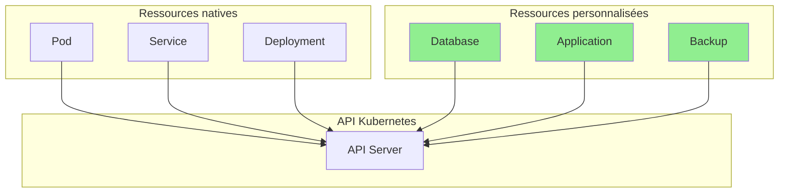
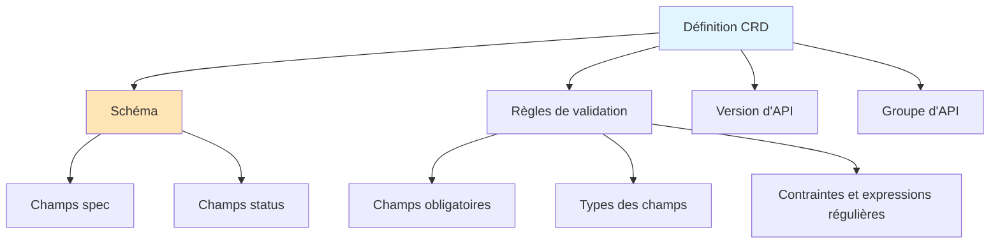
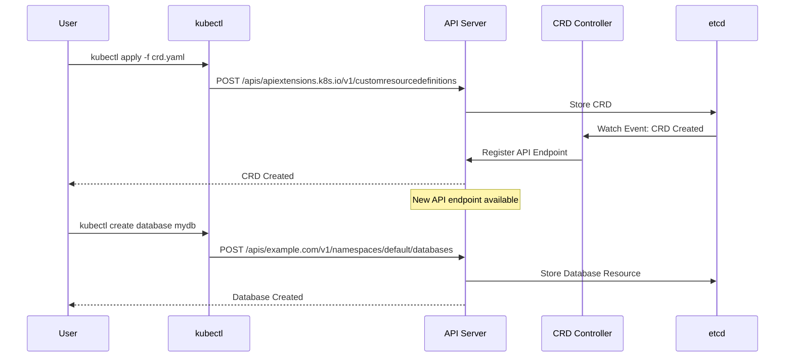
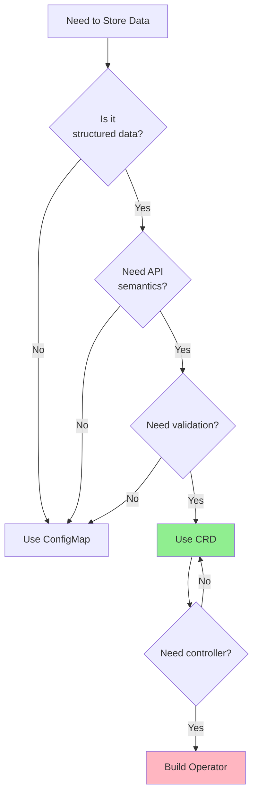
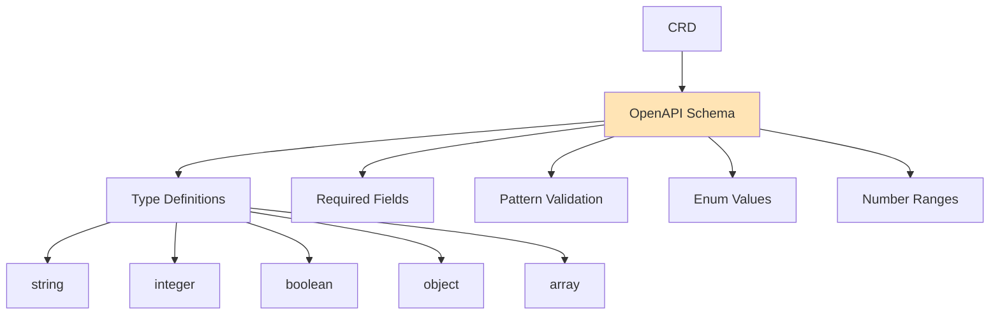
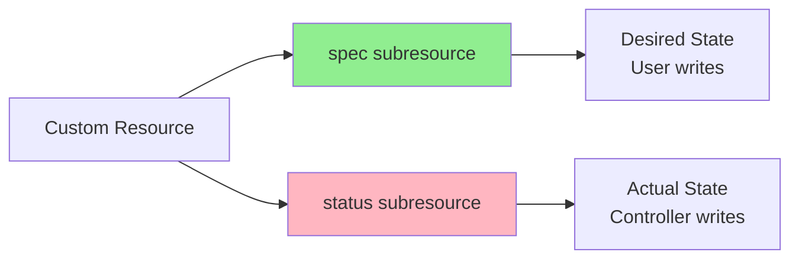
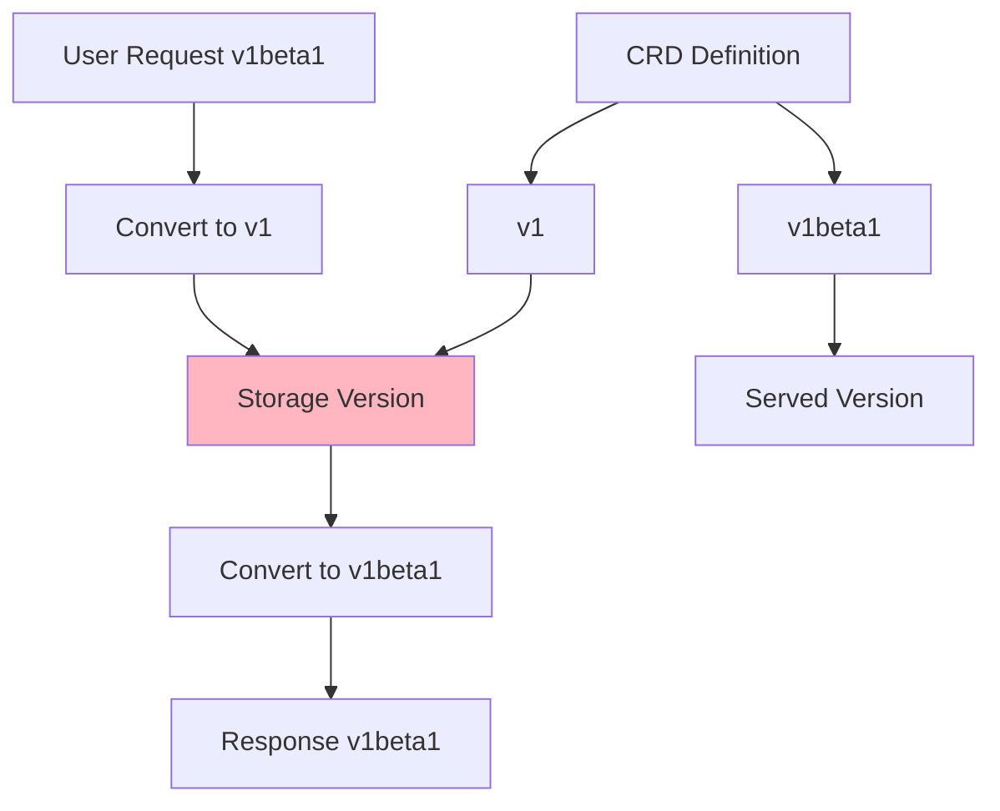

# Leçon 1.4 : Les Custom Resources

**Navigation :** [← Précédent : Controller Pattern](03-controller-pattern.md) | [Vue d'ensemble du module](../README.md)

# Introduction

Depuis le début de cette formation, nous avons étudié les principaux objets fournis nativement par Kubernetes, tels que les **Pods**, **Deployments**, **Services**, **ConfigMaps**, **Secrets** ou encore les **Namespaces**. Ces ressources constituent le socle de Kubernetes et permettent de déployer, d'exposer et d'administrer la grande majorité des applications cloud natives.

Cependant, Kubernetes a été conçu dès l'origine avec un objectif ambitieux : **être une plateforme extensible**. Les concepteurs du projet savaient qu'il serait impossible d'intégrer nativement tous les besoins métiers de toutes les entreprises. Chaque domaine possède ses propres objets : une base de données, un cluster Kafka, un certificat, une sauvegarde, une file de messages, un environnement de développement, un cluster Elasticsearch, etc.

Plutôt que d'ajouter des centaines de nouveaux objets au cœur de Kubernetes, les développeurs ont conçu un mécanisme permettant à chacun de créer ses propres ressources Kubernetes.

Ce mécanisme repose sur deux concepts fondamentaux :

- les **Custom Resource Definitions (CRD)** ;
- les **Custom Resources (CR)**.

Une **Custom Resource Definition (CRD)** permet de créer un nouveau type de ressource directement dans l'API Kubernetes.

Une **Custom Resource (CR)** est simplement une instance de cette nouvelle ressource.

Autrement dit, une CRD apprend à Kubernetes à reconnaître un nouvel objet métier.

Une fois enregistrée dans le cluster :

- Kubernetes connaît cette nouvelle ressource ;
- elle est stockée dans **etcd** comme n'importe quel autre objet ;
- elle peut être manipulée avec `kubectl` ;
- elle bénéficie du contrôle d'accès RBAC ;
- elle apparaît dans l'API Discovery ;
- elle peut être observée (`Watch`) par un contrôleur ;
- elle peut être validée grâce à un schéma OpenAPI.

Ainsi, une ressource créée par un utilisateur devient pratiquement indiscernable d'une ressource native de Kubernetes.

Par exemple, après avoir créé une CRD nommée **Database**, il devient possible d'utiliser naturellement des commandes telles que :

```bash
kubectl get databases

kubectl describe database production-db

kubectl delete database production-db
```

Sans modifier `kubectl`, sans recompiler Kubernetes et sans développer un nouveau serveur API, cette ressource devient immédiatement disponible dans tout le cluster.

C'est précisément cette extensibilité qui a permis l'émergence des **Operators**, aujourd'hui largement utilisés pour automatiser l'administration des applications complexes.

Parmi les projets les plus connus reposant sur les CRD, on retrouve notamment :

- Cert-Manager ;
- Prometheus Operator ;
- Crossplane ;
- Argo CD ;
- Elastic Cloud on Kubernetes (ECK) ;
- Strimzi (Kafka Operator) ;
- Zalando Postgres Operator.

Dans tous ces projets, les utilisateurs manipulent des objets métiers tels que :

- `Certificate`
- `Issuer`
- `Kafka`
- `PostgresCluster`
- `Application`
- `CompositeResource`
- `Elasticsearch`

Ces objets n'existent pas dans Kubernetes d'origine. Ils ont été ajoutés grâce aux **Custom Resource Definitions**.

> **À retenir**
>
> Les Operators ne manipulent généralement pas directement des Pods ou des Deployments. Ils surveillent des **Custom Resources**, interprètent leur état souhaité et créent automatiquement les ressources Kubernetes nécessaires pour atteindre cet état.


# Théorie : Les Custom Resources et l'extensibilité de Kubernetes

## Pourquoi Kubernetes est-il extensible ?

L'un des principes fondamentaux de Kubernetes est que **tout passe par son API**.

Chaque action effectuée dans un cluster consiste à créer, modifier, supprimer ou consulter une ressource via le serveur API.

Par exemple :

- lorsqu'un Pod est créé, une requête est envoyée au serveur API ;
- lorsqu'un Deployment est modifié, une nouvelle requête est envoyée ;
- lorsqu'un Service est supprimé, le serveur API traite également cette opération.

Cette architecture orientée API présente un avantage considérable : il est possible d'étendre Kubernetes sans modifier son fonctionnement interne.

Les **Custom Resource Definitions** permettent précisément d'ajouter de nouveaux types de ressources directement dans cette API.

Une fois la CRD enregistrée, Kubernetes fournit automatiquement toutes les fonctionnalités habituelles :

- stockage dans **etcd** ;
- validation des objets ;
- contrôle d'accès RBAC ;
- opérations CRUD (Create, Read, Update, Delete) ;
- mécanisme Watch ;
- gestion des versions ;
- découverte automatique de l'API ;
- intégration avec les clients Kubernetes.

Ainsi, pour les utilisateurs comme pour les outils, une Custom Resource se comporte exactement comme une ressource native.

Par exemple, après avoir enregistré une ressource `Database`, les commandes suivantes deviennent immédiatement possibles :

```bash
kubectl get databases

kubectl describe database my-db

kubectl delete database my-db
```

Aucune modification de `kubectl` n'est nécessaire.

C'est le serveur API qui expose automatiquement les nouveaux endpoints correspondant à la CRD.


## Les concepts fondamentaux

Avant d'aller plus loin, il est important de distinguer deux notions souvent confondues : la **Custom Resource Definition** et la **Custom Resource**.

Bien qu'étroitement liées, elles jouent des rôles très différents.


### La Custom Resource Definition (CRD)

Une **Custom Resource Definition** est une ressource Kubernetes particulière dont le rôle est de définir un nouveau type d'objet.

On peut la comparer à une **classe** dans un langage orienté objet ou au **schéma d'une table** dans une base de données relationnelle.

Elle décrit notamment :

- le nom de la ressource ;
- le groupe d'API (`group`) ;
- la ou les versions disponibles ;
- les champs autorisés ;
- le type de chaque champ ;
- les contraintes de validation ;
- les sous-ressources (`status`, `scale`, etc.) ;
- la portée (`Namespaced` ou `Cluster`).

Une fois cette définition enregistrée, Kubernetes crée automatiquement les endpoints REST associés.

Par exemple :

```
/apis/example.com/v1/databases
```

L'API est immédiatement disponible pour tous les clients Kubernetes.


### La Custom Resource (CR)

Une **Custom Resource** est une instance concrète créée à partir d'une CRD.

On peut établir l'analogie suivante :


Par exemple :

La CRD définit un nouveau type nommé :

```
Database
```

Ensuite, plusieurs ressources peuvent être créées :

```
production-db

staging-db

development-db
```

Toutes ces ressources sont indépendantes mais respectent exactement le même schéma.

Comme les objets natifs de Kubernetes, elles sont stockées dans **etcd**.


### Les sections `spec` et `status`

La majorité des Custom Resources suivent le modèle déclaratif de Kubernetes et possèdent deux sections principales :

- `spec`
- `status`

La section **spec** décrit ce que souhaite l'utilisateur.

Par exemple :

- le nombre de réplicas ;
- la version de PostgreSQL ;
- la taille du stockage ;
- la politique de sauvegarde.

La section **status**, quant à elle, décrit ce que le contrôleur observe réellement dans le cluster.

Par exemple :

- le nombre de Pods réellement disponibles ;
- l'état actuel de la base ;
- la progression d'une sauvegarde ;
- les erreurs éventuelles.

Cette séparation constitue l'un des fondements du fonctionnement des Operators.


## Pourquoi les CRD sont-elles si importantes ?

Les CRD représentent aujourd'hui l'un des mécanismes les plus puissants de Kubernetes.

Sans elles, chaque éditeur devrait développer son propre serveur API ou modifier directement le code source de Kubernetes pour intégrer ses objets métiers.

Une telle approche serait pratiquement impossible à maintenir.

Les CRD permettent au contraire de créer de nouvelles API tout en profitant de toutes les fonctionnalités offertes par Kubernetes.

### 1. Modéliser le métier

Les CRD permettent de représenter directement les concepts métiers.

Par exemple, un Operator PostgreSQL pourra définir les ressources suivantes :

- `PostgresCluster`
- `Database`
- `Backup`
- `Restore`
- `DatabaseUser`
- `Replication`

Ces ressources sont beaucoup plus compréhensibles que de simples StatefulSets ou Pods.

Le cluster devient alors capable de manipuler directement des concepts métier.


### 2. Conserver une API cohérente

Toutes les nouvelles ressources utilisent les mêmes conventions que les objets natifs.

Par exemple :

```bash
kubectl get postgresclusters

kubectl describe postgrescluster production-db

kubectl delete postgrescluster production-db
```

L'utilisateur retrouve exactement la même expérience que pour un Deployment ou un Service.

Cette cohérence réduit fortement la courbe d'apprentissage.


### 3. Profiter de tout l'écosystème Kubernetes

Une fois enregistrées, les Custom Resources deviennent compatibles avec pratiquement tous les outils Kubernetes.

Elles fonctionnent notamment avec :

- `kubectl`
- les dashboards Kubernetes
- RBAC
- les Admission Controllers
- les Webhooks
- les solutions GitOps
- les outils de sauvegarde
- les mécanismes d'audit
- les API Watches

Aucun développement supplémentaire n'est nécessaire.


### 4. Servir de fondation aux Operators

Les Operators reposent presque toujours sur les CRD.

Le fonctionnement est le suivant :

1. un utilisateur crée une Custom Resource ;
2. cette création est détectée par un contrôleur ;
3. le contrôleur compare l'état souhaité (`spec`) avec l'état réel du cluster ;
4. il crée, modifie ou supprime automatiquement les ressources Kubernetes nécessaires ;
5. il met à jour le champ `status` afin de refléter l'état réel.

Ce processus est appelé **boucle de réconciliation** (*Reconciliation Loop*).

C'est le cœur même de tous les Operators Kubernetes modernes.


# Quand utiliser les CRD ?

Les CRD sont extrêmement puissantes, mais elles ne doivent pas être utilisées pour tout.

Créer une CRD revient à concevoir une nouvelle API Kubernetes. Cela implique une maintenance, un schéma, une documentation et souvent un contrôleur.

Il est donc important de réserver cette approche aux véritables objets métier.

## Utilisez une CRD lorsque :

- vous souhaitez modéliser un concept métier spécifique ;
- vous avez besoin d'une validation stricte des données ;
- vous développez un Operator ;
- vous souhaitez bénéficier du modèle déclaratif de Kubernetes ;
- vous souhaitez gérer le cycle de vie complet d'une ressource ;
- plusieurs utilisateurs ou applications devront manipuler cette ressource.

Exemples :

- un cluster PostgreSQL ;
- un cluster Kafka ;
- un certificat TLS ;
- une sauvegarde ;
- une politique réseau ;
- une machine virtuelle ;
- une base MongoDB ;
- une infrastructure Cloud (Crossplane).


## N'utilisez pas une CRD lorsque :

Une CRD n'est pas destinée à remplacer toutes les ressources Kubernetes existantes.

Privilégiez une autre solution lorsque :

- vous stockez simplement une configuration (utilisez une `ConfigMap`) ;
- vous ajoutez quelques métadonnées (utilisez des labels ou des annotations) ;
- les données sont temporaires ;
- aucun cycle de vie particulier n'est nécessaire ;
- aucune validation complexe n'est requise.

Dans ces situations, créer une nouvelle API Kubernetes serait inutilement complexe.


> ## À retenir
>
> Les **Custom Resource Definitions (CRD)** constituent le principal mécanisme d'extension de Kubernetes. Elles permettent d'ajouter de nouveaux objets métier directement dans le serveur API, tout en bénéficiant de l'ensemble des fonctionnalités natives de la plateforme : validation, stockage dans `etcd`, contrôle d'accès, versionnement, surveillance (`Watch`) et intégration avec les outils Kubernetes. Les CRD sont le socle sur lequel reposent les Operators modernes et jouent un rôle essentiel dans la gestion déclarative des applications cloud natives.


# Que sont les Custom Resources ?

Les **Custom Resources** constituent l'un des mécanismes les plus puissants de Kubernetes. Ils permettent d'étendre les capacités de la plateforme sans avoir à modifier son code source. Grâce à eux, Kubernetes peut manipuler des objets qui n'existaient pas lors de sa conception, tout en les traitant exactement comme des ressources natives.

En d'autres termes, un **Custom Resource (CR)** est un nouvel objet Kubernetes que vous définissez vous-même afin de représenter un concept métier spécifique.

Contrairement aux ressources natives telles que les Pods, Deployments ou Services, les Custom Resources ne sont pas intégrées par défaut dans Kubernetes. Elles sont créées par les administrateurs ou les développeurs afin d'adapter Kubernetes aux besoins d'une application ou d'une organisation.

Une fois créées, elles bénéficient exactement des mêmes fonctionnalités que les ressources natives :

- elles sont accessibles via le serveur API ;
- elles sont stockées dans **etcd** ;
- elles peuvent être manipulées avec `kubectl` ;
- elles peuvent être observées (`Watch`) par des contrôleurs ;
- elles sont soumises aux règles RBAC ;
- elles peuvent être validées grâce à un schéma OpenAPI ;
- elles participent pleinement au modèle déclaratif de Kubernetes.

L'idée fondamentale est que Kubernetes ne connaît pas uniquement des Pods ou des Services. Grâce aux CRD, il peut apprendre à manipuler pratiquement n'importe quel objet métier.

Par exemple, une entreprise spécialisée dans l'hébergement de bases de données pourrait créer les ressources suivantes :

- `Database`
- `Backup`
- `Replication`
- `DatabaseUser`

Une plateforme de Machine Learning pourrait définir :

- `Model`
- `TrainingJob`
- `Dataset`

Une équipe DevOps pourrait ajouter :

- `Application`
- `Environment`
- `Release`

Toutes ces ressources deviennent alors des objets Kubernetes à part entière.


## Ressources natives contre ressources personnalisées

Avant l'apparition des CRD, les utilisateurs étaient limités aux ressources fournies par Kubernetes.

Aujourd'hui, cette frontière a pratiquement disparu.

Les ressources natives et les ressources personnalisées sont manipulées exactement de la même manière.



Ce schéma illustre parfaitement le rôle des CRD.

Le serveur API ne fait pratiquement aucune différence entre une ressource native et une ressource personnalisée.

Une fois la CRD enregistrée :

- le serveur API expose automatiquement les nouveaux endpoints REST ;
- `kubectl` découvre automatiquement la nouvelle ressource ;
- les clients Kubernetes peuvent immédiatement l'utiliser.

Autrement dit, Kubernetes devient capable de manipuler de nouveaux objets sans qu'il soit nécessaire de modifier son code.


# Les Custom Resource Definitions (CRD)

Les **Custom Resource Definitions (CRD)** constituent le mécanisme permettant de déclarer un nouveau type de ressource.

Une CRD peut être vue comme le **contrat** ou le **schéma** d'un nouvel objet Kubernetes.

Avant qu'un utilisateur puisse créer une ressource `Database`, Kubernetes doit connaître :

- son nom ;
- son groupe d'API ;
- sa version ;
- les champs autorisés ;
- les règles de validation ;
- les éventuelles sous-ressources.

Toutes ces informations sont décrites dans la CRD.

Une fois enregistrée, cette définition est conservée dans **etcd** et le serveur API met automatiquement à disposition une nouvelle API REST correspondant à cette ressource.


## Que définit une CRD ?

Une CRD décrit plusieurs éléments essentiels.

- Le **nom** de la ressource.
- Le **groupe d'API** auquel elle appartient.
- Les différentes **versions** disponibles.
- Le **schéma OpenAPI** servant à la validation.
- Les règles imposant certains champs obligatoires.
- Les sous-ressources telles que `status` ou `scale`.
- La portée de la ressource (`Namespaced` ou `Cluster`).

On peut considérer une CRD comme la carte d'identité complète d'une nouvelle ressource Kubernetes.

Le schéma suivant résume ces différents composants.



Ce diagramme met en évidence les différentes responsabilités d'une CRD.

Une CRD ne sert pas uniquement à créer une nouvelle ressource.

Elle définit également toutes les règles que Kubernetes devra appliquer lorsqu'un utilisateur créera un objet de ce type.


# Structure générale d'une CRD

Toutes les CRD possèdent une structure similaire.

Le manifeste suivant est un exemple classique de définition d'une ressource `Database`.

Le contenu du manifeste est laissé strictement identique afin de respecter la syntaxe officielle de Kubernetes.

```yaml
apiVersion: apiextensions.k8s.io/v1
kind: CustomResourceDefinition
metadata:
  name: databases.example.com
spec:
  group: example.com
  versions:
  - name: v1
    served: true
    storage: true
    schema:
      openAPIV3Schema:
        type: object
        properties:
          spec:
            type: object
            properties:
              image:
                type: string
              replicas:
                type: integer
          status:
            type: object
  scope: Namespaced
  names:
    plural: databases
    singular: database
    kind: Database
```


# Analyse détaillée du manifeste

Comprendre une CRD consiste avant tout à comprendre chacun de ses champs.

## apiVersion

```yaml
apiVersion: apiextensions.k8s.io/v1
```

Cette ligne indique que l'on utilise l'API officielle permettant de créer des **Custom Resource Definitions**.

Il ne s'agit pas de la version de votre future ressource, mais de la version de l'API Kubernetes utilisée pour déclarer une CRD.


## kind

```yaml
kind: CustomResourceDefinition
```

Cette ligne précise que le manifeste décrit une nouvelle définition de ressource.

Le serveur API sait immédiatement qu'il devra enregistrer un nouveau type d'objet.


## metadata

```yaml
metadata:
  name: databases.example.com
```

Le champ `metadata.name` doit être unique dans le cluster.

Par convention, il suit le format :

```
<plural>.<group>
```

Ici :

```
databases.example.com
```

Cette convention garantit qu'aucun conflit ne pourra apparaître entre plusieurs fournisseurs de CRD.


## spec.group

```yaml
group: example.com
```

Le groupe d'API permet d'organiser les ressources.

Il joue un rôle comparable au nom de domaine d'une entreprise.

Par exemple :

```
database.company.com

storage.company.com

security.company.com
```

Cette organisation évite les collisions entre différentes API.


## spec.versions

```yaml
versions:
- name: v1
```

Une CRD peut proposer plusieurs versions simultanément.

Cela permet de faire évoluer une API sans casser les applications existantes.

Dans cet exemple, seule la version `v1` est disponible.

Nous étudierons plus loin le versionnement des CRD et les mécanismes de conversion.


## served

```yaml
served: true
```

Lorsque ce champ vaut `true`, cette version de l'API est exposée par le serveur API.

Les utilisateurs peuvent donc créer des ressources utilisant cette version.


## storage

```yaml
storage: true
```

Une seule version est utilisée comme format de stockage dans **etcd**.

Toutes les autres versions sont automatiquement converties vers cette version avant d'être enregistrées.

Cette notion est particulièrement importante lors des migrations entre versions d'une API.


## openAPIV3Schema

```yaml
schema:
  openAPIV3Schema:
```

Le schéma OpenAPI décrit précisément la structure des ressources.

Il définit :

- les champs autorisés ;
- leurs types ;
- les contraintes ;
- les champs obligatoires ;
- les expressions régulières ;
- les valeurs minimales et maximales.

Kubernetes utilisera automatiquement ce schéma pour rejeter toute ressource invalide avant son enregistrement.


## spec

```yaml
spec:
```

La section `spec` représente l'état souhaité par l'utilisateur.

C'est ici que seront placés les paramètres de configuration de la ressource.

Dans notre exemple :

- l'image Docker ;
- le nombre de réplicas.

Dans un Operator PostgreSQL, on pourrait également retrouver :

- la version de PostgreSQL ;
- la taille du volume ;
- la politique de sauvegarde ;
- les ressources CPU et mémoire.


## status

```yaml
status:
```

La section `status` représente l'état observé.

Elle n'est généralement pas modifiée par les utilisateurs.

Elle est mise à jour automatiquement par un contrôleur.

On y retrouve par exemple :

- l'état courant ;
- le nombre de Pods disponibles ;
- la dernière erreur ;
- la date de la dernière sauvegarde.

Cette séparation entre **spec** et **status** constitue l'un des principes fondamentaux du modèle déclaratif de Kubernetes.


## scope

```yaml
scope: Namespaced
```

Une ressource peut être :

- **Namespaced** : chaque Namespace possède ses propres ressources ;
- **Cluster** : une seule ressource existe pour tout le cluster.

Le choix dépend du besoin métier.

Par exemple :

- une base de données applicative est souvent `Namespaced` ;
- un objet représentant un cluster entier sera généralement `Cluster`.


## names

```yaml
names:
```

Cette section définit les différents noms utilisés par Kubernetes.

- `plural`
- `singular`
- `kind`

Ces informations sont utilisées par :

- `kubectl`
- l'API REST
- l'API Discovery
- les clients Kubernetes.

Grâce à elles, Kubernetes sait comment générer automatiquement les commandes telles que :

```bash
kubectl get databases

kubectl describe database production-db
```


> ## À retenir
>
> Une **Custom Resource Definition** décrit entièrement un nouveau type de ressource Kubernetes. Elle définit son nom, son groupe d'API, ses versions, son schéma de validation, sa portée et ses sous-ressources. Une fois enregistrée, Kubernetes génère automatiquement l'API REST correspondante, permettant aux utilisateurs et aux contrôleurs de manipuler cette nouvelle ressource exactement comme un objet natif.


# Flux d'enregistrement d'une CRD

Lorsque vous appliquez un manifeste contenant une **Custom Resource Definition**, Kubernetes ne se contente pas d'enregistrer un fichier YAML dans etcd. Un ensemble de composants du plan de contrôle collaborent afin d'intégrer cette nouvelle ressource dans l'API Kubernetes.

Comprendre ce processus est fondamental pour bien saisir le fonctionnement des Operators.

En effet, un Operator ne peut surveiller une ressource que si celle-ci a été préalablement enregistrée auprès du serveur API grâce à une CRD.

Le processus complet peut être résumé par le schéma suivant.




# Décomposition détaillée du processus

Voyons maintenant chaque étape de ce diagramme afin de comprendre précisément ce qui se passe à l'intérieur du cluster.


## Étape 1 — L'utilisateur applique la CRD

Tout commence lorsqu'un administrateur exécute la commande suivante :

```bash
kubectl apply -f crd.yaml
```

À ce stade, `kubectl` ne fait aucune magie.

Il lit simplement le fichier YAML puis envoie son contenu au serveur API.

Il ne connaît absolument pas la ressource qui sera créée.

Son rôle est uniquement celui d'un client HTTP.


## Étape 2 — Envoi de la requête au serveur API

Le client construit une requête HTTP similaire à :

```
POST /apis/apiextensions.k8s.io/v1/customresourcedefinitions
```

Le serveur API reconnaît immédiatement que la requête concerne une **CustomResourceDefinition**.

Contrairement aux Deployments ou aux Pods, cette ressource appartient au groupe :

```
apiextensions.k8s.io
```

Ce groupe est responsable de toutes les extensions de l'API Kubernetes.


## Étape 3 — Validation de la CRD

Avant de stocker la définition, le serveur API effectue plusieurs contrôles.

Il vérifie notamment :

- la validité du manifeste YAML ;
- la présence des champs obligatoires ;
- la cohérence des versions déclarées ;
- la validité du schéma OpenAPI ;
- l'absence de conflits avec une CRD existante.

Si une erreur est détectée, la création est immédiatement refusée.

Par exemple :

- groupe d'API invalide ;
- nom déjà utilisé ;
- schéma OpenAPI incorrect ;
- champ obligatoire absent.

Cette validation protège le cluster contre des API incohérentes.


## Étape 4 — Stockage dans etcd

Lorsque la validation est terminée avec succès, la CRD est enregistrée dans **etcd**.

À ce stade, Kubernetes connaît officiellement la définition de cette nouvelle ressource.

Il est important de noter qu'aucune ressource `Database` n'existe encore.

Seule sa définition est présente.

On peut comparer cette étape à la création d'une nouvelle table dans une base de données relationnelle.

La table existe désormais, mais elle ne contient encore aucune ligne.


## Étape 5 — Notification du CRD Controller

Comme de nombreux composants Kubernetes, le **CRD Controller** surveille (`Watch`) les modifications réalisées dans etcd.

Lorsqu'une nouvelle CRD apparaît :

- il reçoit immédiatement un événement ;
- il analyse la définition ;
- il prépare son enregistrement auprès du serveur API.

Cette surveillance repose exactement sur le même mécanisme que celui utilisé par les Operators.


## Étape 6 — Enregistrement du nouvel endpoint

Le CRD Controller demande ensuite au serveur API d'ajouter une nouvelle route REST.

Par exemple :

```
/apis/example.com/v1/databases
```

À partir de cet instant, Kubernetes sait répondre aux requêtes concernant cette nouvelle ressource.

Autrement dit, l'API Kubernetes vient d'être enrichie.

Sans redémarrer le cluster.

Sans recompiler Kubernetes.

Sans modifier son code source.

C'est précisément ce qui fait toute la puissance des CRD.


## Étape 7 — La ressource devient disponible

Une fois l'enregistrement terminé, les utilisateurs peuvent immédiatement créer des ressources utilisant cette nouvelle définition.

Par exemple :

```bash
kubectl create database mydb
```

Cette commande envoie désormais une requête vers :

```
POST /apis/example.com/v1/namespaces/default/databases
```

Le serveur API traite cette ressource exactement comme il traiterait un Pod ou un Deployment.


## Étape 8 — Stockage des Custom Resources

Chaque nouvelle ressource créée est ensuite enregistrée dans **etcd**.

Par exemple :

```
Database
└── production-db

Database
└── staging-db

Database
└── development-db
```

Toutes ces ressources sont persistées comme n'importe quel autre objet Kubernetes.


# Pourquoi l'API Discovery est-elle importante ?

L'un des mécanismes les plus élégants de Kubernetes est appelé **API Discovery**.

Lorsqu'un client comme `kubectl` se connecte au cluster, il ne possède pas une liste codée en dur des ressources disponibles.

Au contraire, il interroge le serveur API afin de découvrir dynamiquement les ressources existantes.

C'est pourquoi, après avoir créé une CRD, la commande suivante fonctionne immédiatement :

```bash
kubectl api-resources
```

La nouvelle ressource apparaît automatiquement dans la liste.

Aucune mise à jour de `kubectl` n'est nécessaire.


# CRD ou ConfigMap ?

Une question revient très souvent chez les débutants :

> Pourquoi créer une CRD alors qu'une ConfigMap peut déjà stocker des données ?

La réponse est simple.

Une ConfigMap est uniquement destinée à stocker de la configuration.

Elle ne possède aucune sémantique métier.

Une CRD, au contraire, représente un véritable objet Kubernetes.

Le diagramme suivant illustre cette réflexion.




# Quand choisir une ConfigMap ?

Utilisez une **ConfigMap** lorsque vous souhaitez uniquement stocker de la configuration.

Exemples :

- paramètres d'une application ;
- variables d'environnement ;
- fichiers de configuration ;
- options de démarrage.

Une ConfigMap ne possède :

- ni validation avancée ;
- ni cycle de vie métier ;
- ni contrôleur dédié.

Elle est simplement un conteneur de données.


# Quand choisir une CRD ?

Choisissez une **Custom Resource Definition** lorsque votre objet représente un véritable concept métier.

Par exemple :

- une base PostgreSQL ;
- un cluster Kafka ;
- un certificat TLS ;
- une sauvegarde ;
- un environnement ;
- une machine virtuelle.

Une CRD permet notamment :

- de valider les données grâce à OpenAPI ;
- de bénéficier d'une API REST complète ;
- d'être surveillée par un Operator ;
- de disposer d'un état (`status`) ;
- d'être intégrée à l'ensemble des outils Kubernetes.


# Pourquoi les Operators utilisent-ils des CRD ?

Les Operators reposent entièrement sur le modèle déclaratif de Kubernetes.

Au lieu d'écrire des scripts impératifs, l'utilisateur décrit simplement ce qu'il souhaite.

Par exemple :

```yaml
apiVersion: database.company.com/v1
kind: PostgreSQL
metadata:
  name: production-db
spec:
  version: "16"
  replicas: 3
  storage: 500Gi
```

L'Operator observe ensuite cette ressource.

Il compare :

- l'état souhaité (`spec`) ;
- l'état réel du cluster.

Puis il effectue automatiquement les actions nécessaires :

- création des StatefulSets ;
- création des Services ;
- création des PVC ;
- configuration de la réplication ;
- mise à jour du champ `status`.

Cette approche permet d'automatiser entièrement l'administration d'applications complexes tout en restant fidèle au modèle déclaratif de Kubernetes.


> ## À retenir
>
> La création d'une **Custom Resource Definition** déclenche un processus complet impliquant le serveur API, le stockage dans **etcd**, le **CRD Controller** et le mécanisme d'API Discovery. Une fois enregistrée, la nouvelle ressource devient immédiatement disponible dans tout le cluster et peut être manipulée comme n'importe quel objet Kubernetes natif. Cette capacité d'extension constitue le fondement des Operators modernes et explique pourquoi les CRD sont aujourd'hui omniprésentes dans l'écosystème Kubernetes.

# Le schéma OpenAPI et la validation des CRD

L'un des principaux avantages des **Custom Resource Definitions (CRD)** est qu'elles permettent de définir précisément la structure des ressources qui pourront être créées dans le cluster.

Contrairement à une simple ConfigMap, où pratiquement n'importe quelle donnée peut être enregistrée, une CRD impose un **contrôle strict** sur les objets qu'elle autorise.

Cette validation est réalisée grâce au standard **OpenAPI v3**.

Avant qu'une ressource ne soit enregistrée dans **etcd**, le serveur API vérifie automatiquement qu'elle respecte le schéma défini dans la CRD.

Si une seule règle est violée, la création ou la modification de la ressource est immédiatement rejetée.

Ce mécanisme garantit que seules des ressources valides pourront exister dans le cluster.


# Pourquoi utiliser un schéma OpenAPI ?

Imaginez un Operator chargé d'administrer des bases PostgreSQL.

Sans validation, un utilisateur pourrait créer la ressource suivante :

```yaml
spec:
  replicas: "trois"
```

Ou encore :

```yaml
spec:
  replicas: -25
```

Ou même :

```yaml
spec:
  image: 12345
```

Ces ressources seraient incohérentes et provoqueraient très probablement des erreurs dans l'Operator.

Grâce au schéma OpenAPI, ces erreurs sont détectées avant même que l'Operator ne voie la ressource.

Autrement dit :

> **Le serveur API protège l'Operator contre les ressources invalides.**

C'est un point extrêmement important.

Un Operator n'a pas besoin de revérifier l'ensemble des données si celles-ci sont déjà validées par la CRD.


# Les différents types de validation

Le schéma OpenAPI permet de définir de nombreuses contraintes.

Parmi les plus courantes, on retrouve :

- le type des données ;
- les champs obligatoires ;
- les valeurs minimales et maximales ;
- les expressions régulières ;
- les listes de valeurs autorisées ;
- la taille des tableaux ;
- les objets imbriqués.

Le diagramme suivant résume les principaux mécanismes proposés.



Chaque règle est appliquée automatiquement par le serveur API.

Aucun développement supplémentaire n'est nécessaire.


# Les types de données

Comme dans un langage de programmation, chaque champ possède un type.

Les types les plus utilisés sont :

| Type | Description |
|-|-|
| `string` | Chaîne de caractères |
| `integer` | Nombre entier |
| `number` | Nombre décimal |
| `boolean` | Vrai ou faux |
| `object` | Objet contenant d'autres champs |
| `array` | Liste d'éléments |

Par exemple :

```yaml
properties:
  replicas:
    type: integer

  image:
    type: string

  enabled:
    type: boolean
```

Dans cet exemple :

- `replicas` devra toujours être un entier ;
- `image` devra toujours être une chaîne de caractères ;
- `enabled` devra être un booléen.

Toute valeur ne respectant pas ces contraintes sera rejetée.


# Les champs obligatoires

Il est souvent nécessaire d'imposer certains champs.

Par exemple, une base PostgreSQL ne peut pas être créée sans préciser son image.

OpenAPI permet donc de déclarer des champs obligatoires.

```yaml
required:
- image
- replicas
```

Si l'utilisateur oublie un de ces champs :

```yaml
spec:
  image: postgres:16
```

La création sera refusée.

Cette validation évite de nombreuses erreurs de configuration.


# Les expressions régulières

Il est également possible d'imposer un format précis.

Par exemple :

```yaml
pattern: '^https?://'
```

Cette expression signifie que le champ doit commencer par :

- `http://`
- ou `https://`

Une valeur comme :

```
example.com
```

sera rejetée.

En revanche :

```
https://example.com
```

sera acceptée.

Les expressions régulières sont très utilisées pour valider :

- les URLs ;
- les adresses e-mail ;
- les versions ;
- les noms d'hôtes ;
- les identifiants.


# Les valeurs minimales et maximales

OpenAPI permet également d'imposer des limites numériques.

Par exemple :

```yaml
minimum: 1

maximum: 10
```

Le serveur API refusera automatiquement :

```yaml
replicas: 0
```

ou

```yaml
replicas: 25
```

Cette fonctionnalité est très utile pour empêcher des configurations dangereuses.


# Les valeurs autorisées (Enum)

Il est parfois souhaitable de limiter un champ à une liste précise de valeurs.

Par exemple :

```yaml
enum:
- Pending
- Running
- Failed
```

Dans ce cas :

```
Running
```

sera accepté.

En revanche :

```
Paused
```

sera rejeté.

Cette fonctionnalité est particulièrement utile pour les états (`status`) ou les politiques de configuration.


# La sous-ressource Status

L'une des caractéristiques les plus importantes des ressources Kubernetes est la séparation entre :

- l'état souhaité ;
- l'état réel.

Les CRD reprennent exactement ce modèle.

Le diagramme suivant l'illustre parfaitement.




# Le rôle de `spec`

La section `spec` représente les intentions de l'utilisateur.

C'est lui qui décide :

- du nombre de réplicas ;
- de la version de PostgreSQL ;
- de la quantité de stockage ;
- de la stratégie de sauvegarde.

Cette partie constitue l'objectif à atteindre.

Elle ne décrit pas ce qui existe actuellement.


# Le rôle de `status`

La section `status` décrit la réalité observée par le contrôleur.

Elle contient généralement des informations telles que :

- le nombre de Pods disponibles ;
- l'adresse IP du service ;
- l'état de santé ;
- les erreurs rencontrées ;
- la dernière sauvegarde ;
- la progression d'une mise à jour.

Autrement dit :

**spec représente le souhait.**

**status représente la réalité.**

Toute la logique d'un Operator consiste précisément à faire converger la réalité vers le souhait.


# Pourquoi séparer `spec` et `status` ?

Cette séparation apporte plusieurs avantages.

## 1. Éviter les modifications accidentelles

Les utilisateurs ne doivent généralement pas modifier directement l'état réel.

Ils décrivent uniquement ce qu'ils souhaitent.

Le contrôleur est le seul responsable de la mise à jour du `status`.


## 2. Simplifier les mises à jour

Les mises à jour du `status` sont extrêmement fréquentes.

Par exemple :

- un Pod démarre ;
- un Pod tombe en panne ;
- une sauvegarde progresse ;
- une restauration est terminée.

Ces modifications ne doivent pas impacter la configuration (`spec`).


## 3. Respecter le modèle déclaratif

Kubernetes fonctionne selon le principe suivant :

```
L'utilisateur déclare.

Le contrôleur observe.

Le contrôleur agit.

Le contrôleur met à jour le status.
```

Cette philosophie est commune à pratiquement toutes les ressources Kubernetes.


# Le versionnement des CRD

Comme toute API, une CRD peut évoluer.

De nouveaux champs peuvent apparaître.

D'anciens champs peuvent être supprimés.

Pour assurer la compatibilité, Kubernetes permet de gérer plusieurs versions d'une même ressource.

Le schéma suivant présente ce fonctionnement.




# Comprendre les versions

Une CRD peut exposer plusieurs versions simultanément.

Par exemple :

- `v1alpha1`
- `v1beta1`
- `v1`

Les utilisateurs peuvent continuer à utiliser une ancienne version tandis que les nouveaux développements utilisent la plus récente.

Cela facilite énormément les migrations.


# La version de stockage

Parmi toutes les versions disponibles, une seule possède :

```yaml
storage: true
```

Cette version est utilisée pour enregistrer les ressources dans **etcd**.

Toutes les autres versions sont automatiquement converties avant le stockage.

Cette stratégie évite d'avoir plusieurs représentations différentes d'une même ressource dans la base de données.


# Les Webhooks de conversion

Lorsque plusieurs versions présentent des structures différentes, Kubernetes peut utiliser un **Conversion Webhook**.

Son rôle est de traduire automatiquement une ressource d'une version vers une autre.

Par exemple :

```
v1alpha1

↓

v1beta1

↓

v1
```

L'utilisateur continue à utiliser la version qu'il connaît, tandis que Kubernetes assure la conversion de manière transparente.

Les Conversion Webhooks sont particulièrement utiles lors des évolutions importantes d'une API.


# Bonnes pratiques

Lors de la conception d'une CRD, il est recommandé de :

- définir un schéma OpenAPI aussi précis que possible ;
- valider tous les champs importants ;
- limiter les valeurs grâce aux `enum` lorsque cela est pertinent ;
- utiliser `minimum` et `maximum` pour éviter les erreurs ;
- séparer clairement `spec` et `status` ;
- prévoir le versionnement dès les premières versions de l'API ;
- documenter chaque champ de la CRD.

Une CRD bien conçue facilite énormément le développement des Operators et améliore l'expérience des utilisateurs.


> ## À retenir
>
> Les **Custom Resource Definitions** utilisent un **schéma OpenAPI v3** pour valider automatiquement les ressources avant leur enregistrement dans **etcd**. Elles reprennent également le modèle déclaratif de Kubernetes en séparant l'état souhaité (`spec`) de l'état observé (`status`). Enfin, elles prennent en charge le **versionnement des API**, permettant de faire évoluer les ressources au fil du temps tout en garantissant la compatibilité avec les versions existantes. Ces mécanismes font des CRD des composants robustes et parfaitement intégrés à l'écosystème Kubernetes.

# Travaux pratiques : Créer votre première Custom Resource Definition (CRD)

Maintenant que nous avons étudié les concepts fondamentaux des **Custom Resources** et des **Custom Resource Definitions (CRD)**, il est temps de passer à la pratique.

Dans ce laboratoire, nous allons créer notre première CRD, puis instancier plusieurs **Custom Resources** afin de comprendre concrètement comment Kubernetes étend son API.

À l'issue de ce laboratoire, vous serez capable de :

- créer une nouvelle ressource Kubernetes ;
- comprendre comment une CRD est enregistrée dans le cluster ;
- créer des instances de cette ressource ;
- observer le fonctionnement de la validation OpenAPI ;
- explorer les nouvelles API créées par Kubernetes ;
- comprendre le rôle du champ `status`.

L'objectif n'est pas encore de développer un Operator. Nous nous concentrons uniquement sur l'ajout d'un nouveau type de ressource dans Kubernetes.


# Étape 1 : Créer une CRD simple

Nous allons créer une nouvelle ressource appelée **Website**.

Cette ressource représentera un site Web et contiendra quelques informations simples :

- son URL ;
- le nombre de réplicas ;
- son état d'exécution.

Le manifeste suivant crée directement cette CRD dans le cluster.

> **Remarque**
>
> Le contenu YAML est conservé strictement identique afin de respecter la syntaxe officielle de Kubernetes.

```bash
# Create a CRD for a simple "Website" resource
cat <<EOF | kubectl apply -f -
apiVersion: apiextensions.k8s.io/v1
kind: CustomResourceDefinition
metadata:
  name: websites.example.com
spec:
  group: example.com
  versions:
  - name: v1
    served: true
    storage: true
    schema:
      openAPIV3Schema:
        type: object
        properties:
          spec:
            type: object
            properties:
              url:
                type: string
                pattern: '^https?://'
              replicas:
                type: integer
                minimum: 1
                maximum: 10
            required:
            - url
            - replicas
          status:
            type: object
            properties:
              phase:
                type: string
                enum: [Pending, Running, Failed]
              readyReplicas:
                type: integer
  scope: Namespaced
  names:
    plural: websites
    singular: website
    kind: Website
    shortNames:
    - ws
EOF

# Verify the CRD was created
kubectl get crd websites.example.com

# Check the API endpoint is available
kubectl api-resources | grep websites
```


## Comprendre ce que fait cette commande

Lorsque cette commande est exécutée :

1. `kubectl` envoie le manifeste au serveur API.
2. Le serveur API valide la définition.
3. La CRD est enregistrée dans **etcd**.
4. Le **CRD Controller** détecte la nouvelle définition.
5. Un nouvel endpoint REST est créé.
6. Kubernetes ajoute automatiquement la ressource `Website` à son API.

Vous pouvez immédiatement vérifier que la nouvelle ressource est disponible avec :

```bash
kubectl api-resources | grep websites
```

Vous devriez obtenir une sortie similaire à :

```text
websites      ws      example.com/v1      true      Website
```

Cela confirme que Kubernetes connaît désormais cette nouvelle ressource.


# Analyse de la CRD

Prenons quelques instants pour comprendre les contraintes définies dans cette CRD.

## Validation de l'URL

```yaml
pattern: '^https?://'
```

Cette règle impose que l'URL commence par :

- `http://`
- ou `https://`

Une valeur comme :

```
example.com
```

sera automatiquement rejetée.


## Validation du nombre de réplicas

```yaml
minimum: 1
maximum: 10
```

Cette contrainte empêche l'utilisateur de demander :

- zéro réplica ;
- un nombre négatif ;
- plus de dix réplicas.

Le serveur API vérifiera automatiquement cette règle.


## Valeurs autorisées pour le statut

```yaml
enum:
- Pending
- Running
- Failed
```

Le champ `phase` ne pourra contenir que ces trois valeurs.

Toute autre valeur sera refusée.


# Étape 2 : Créer une Custom Resource

Maintenant que la CRD existe, nous pouvons créer notre premier objet `Website`.

```bash
# Create a Website resource
cat <<EOF | kubectl apply -f -
apiVersion: example.com/v1
kind: Website
metadata:
  name: my-website
spec:
  url: https://example.com
  replicas: 3
EOF

# Verify it was created
kubectl get websites
kubectl get website my-website
kubectl get ws my-website  # Using short name

# View the full resource
kubectl get website my-website -o yaml
```


## Ce qui se passe en arrière-plan

Cette fois, le serveur API connaît déjà la ressource `Website`.

Il vérifie immédiatement que :

- le champ `url` est présent ;
- `replicas` est bien un entier ;
- la valeur est comprise entre 1 et 10 ;
- l'URL respecte le format imposé.

Si tout est correct :

- la ressource est enregistrée dans **etcd** ;
- elle devient accessible via l'API ;
- un futur Operator pourra l'observer.

À ce stade, aucun Pod n'est créé.

La ressource n'est qu'une déclaration.

Ce sera le rôle de l'Operator de transformer cette déclaration en ressources Kubernetes.


# Étape 3 : Tester la validation

L'un des principaux avantages des CRD est la validation automatique.

Nous allons volontairement créer plusieurs ressources invalides.


## Cas n°1 : Champ obligatoire manquant

```bash
# Try to create an invalid resource (missing required field)
cat <<EOF | kubectl apply -f -
apiVersion: example.com/v1
kind: Website
metadata:
  name: invalid-website
spec:
  url: https://example.com
  # Missing replicas field
EOF

# You should see a validation error
```

Le serveur API renverra une erreur similaire à :

```text
spec.replicas: Required value
```

La ressource ne sera jamais enregistrée.


## Cas n°2 : URL invalide

```bash
# Try invalid URL pattern
cat <<EOF | kubectl apply -f -
apiVersion: example.com/v1
kind: Website
metadata:
  name: invalid-url
spec:
  url: not-a-url
  replicas: 2
EOF

# You should see a validation error about the URL pattern
```

Le champ `url` ne respecte pas l'expression régulière définie dans la CRD.

Le serveur API refuse donc immédiatement la création.


## Cas n°3 : Nombre de réplicas invalide

```bash
# Try invalid replica count
cat <<EOF | kubectl apply -f -
apiVersion: example.com/v1
kind: Website
metadata:
  name: invalid-replicas
spec:
  url: https://example.com
  replicas: 20  # Exceeds maximum
EOF

# You should see a validation error
```

La valeur dépasse la limite maximale définie dans le schéma OpenAPI.

Encore une fois, la ressource est rejetée avant même d'être enregistrée dans **etcd**.


# Pourquoi ces validations sont-elles importantes ?

Imaginez un Operator chargé de créer des clusters PostgreSQL.

Sans validation :

- une version invalide pourrait être fournie ;
- un stockage négatif pourrait être demandé ;
- une URL incorrecte pourrait être utilisée ;
- des champs essentiels pourraient être oubliés.

Toutes ces erreurs devraient être gérées par l'Operator.

Grâce aux CRD, ces vérifications sont effectuées directement par Kubernetes.

L'Operator peut donc se concentrer uniquement sur sa logique métier.


# Étape 4 : Observer le champ `status`

Notre CRD définit également une section `status`.

Exécutons la commande suivante :

```bash
# Update the status (if status subresource is enabled)
# Note: This requires a controller, but we can see the structure
kubectl get website my-website -o yaml

# The status field exists but is empty
# In a real operator, the controller would update this
```

Vous constaterez que le champ `status` est présent mais vide.

C'est parfaitement normal.

Aucun Operator n'est actuellement chargé de gérer cette ressource.

Plus tard, lorsque nous développerons notre premier Operator avec **Kubebuilder**, celui-ci remplira automatiquement :

- l'état courant ;
- les erreurs ;
- le nombre de réplicas disponibles ;
- toutes les informations d'observation.


# Étape 5 : Explorer la CRD

Nous pouvons maintenant examiner plus en détail la définition enregistrée dans le cluster.

```bash
# Get detailed CRD information
kubectl get crd websites.example.com -o yaml

# See the schema
kubectl get crd websites.example.com -o jsonpath='{.spec.versions[0].schema}'

# Check API discovery
kubectl get --raw /apis/example.com/v1
```

Ces commandes permettent notamment de :

- consulter la définition complète ;
- afficher le schéma OpenAPI ;
- vérifier les endpoints exposés par le serveur API.

La dernière commande est particulièrement intéressante.

Elle interroge directement le serveur API sans passer par les abstractions de `kubectl`.

Vous pouvez ainsi constater que Kubernetes a réellement ajouté une nouvelle API.


# Étape 6 : Nettoyer le laboratoire

Une fois les expérimentations terminées, il est recommandé de supprimer les ressources créées.

```bash
# Delete the custom resources
kubectl delete website my-website

# Delete the CRD (this will also delete all resources of this type)
kubectl delete crd websites.example.com
```

> **Attention**
>
> La suppression d'une CRD entraîne automatiquement la suppression de toutes les **Custom Resources** qui en dépendent.
>
> En environnement de production, cette opération doit donc être réalisée avec beaucoup de précaution.


# Ce qu'il faut retenir de ce laboratoire

Au cours de cet exercice, vous avez découvert l'ensemble du cycle de vie d'une **Custom Resource Definition** :

1. création de la CRD ;
2. enregistrement auprès du serveur API ;
3. génération automatique d'une nouvelle API REST ;
4. création de Custom Resources ;
5. validation grâce au schéma OpenAPI ;
6. exploration de la nouvelle API ;
7. suppression de la CRD et des ressources associées.

Vous comprenez désormais qu'une CRD ne crée pas directement des Pods, des Services ou des Deployments.

Elle ajoute simplement un **nouveau type de ressource** à Kubernetes.

Dans les prochains chapitres, nous utiliserons **Kubebuilder** pour développer un **Operator** capable de surveiller ces nouvelles ressources et de créer automatiquement les objets Kubernetes nécessaires afin de concrétiser l'état souhaité décrit dans leur champ `spec`.

# Points clés à retenir

Au cours de cette leçon, nous avons découvert l'un des mécanismes les plus puissants et les plus importants de Kubernetes : **les Custom Resource Definitions (CRD)**. Elles constituent le principal moyen d'étendre les fonctionnalités de Kubernetes sans modifier son code source.

Les CRD permettent d'ajouter de nouveaux types de ressources directement au serveur API, offrant ainsi la possibilité de représenter des concepts métier spécifiques tout en profitant de toute l'infrastructure Kubernetes : stockage dans **etcd**, validation, contrôle d'accès, découverte automatique de l'API, surveillance (`Watch`) et intégration avec les contrôleurs.

Avant l'apparition des CRD, toute extension de l'API Kubernetes nécessitait le développement d'un **API Server personnalisé (API Aggregation)**, une approche beaucoup plus complexe à mettre en œuvre et à maintenir. Les CRD ont profondément simplifié ce processus et sont aujourd'hui devenues la solution privilégiée pour développer des plateformes cloud natives.

Au cours de cette leçon, nous avons étudié plusieurs concepts essentiels :

- le rôle des **Custom Resources** ;
- le fonctionnement des **Custom Resource Definitions** ;
- le processus d'enregistrement d'une CRD dans Kubernetes ;
- le schéma **OpenAPI v3** et les mécanismes de validation ;
- la séparation entre les champs `spec` et `status` ;
- le versionnement des CRD ;
- la création et la manipulation de ressources personnalisées.

Vous avez également réalisé votre premier laboratoire pratique, durant lequel vous avez créé votre propre ressource Kubernetes.


# Ce que vous devez absolument retenir

À ce stade de votre apprentissage, plusieurs idées doivent être parfaitement assimilées.

## Une CRD crée un nouveau type de ressource

Une CRD ne crée pas directement des Pods, des Services ou des Deployments.

Son unique objectif est d'ajouter un **nouveau type d'objet** au serveur API Kubernetes.

Par exemple :

```
Pod

Deployment

Service

Database

Website

Backup

Kafka

Certificate
```

Les quatre dernières ressources n'existent pas dans Kubernetes par défaut.

Elles deviennent disponibles uniquement après l'installation d'une CRD.


## Une Custom Resource est une instance de cette définition

La relation entre une CRD et une Custom Resource est comparable à celle existant entre une classe et un objet dans un langage orienté objet.

Par exemple :

```
CRD
│
└── Database
     ├── production-db
     ├── staging-db
     └── development-db
```

La CRD définit le modèle.

Chaque ressource créée constitue une instance de ce modèle.


## Les CRD utilisent les mêmes mécanismes que les ressources natives

Une fois enregistrée, une Custom Resource bénéficie automatiquement de tous les mécanismes proposés par Kubernetes.

Elle peut notamment :

- être créée avec `kubectl apply` ;
- être consultée avec `kubectl get` ;
- être modifiée avec `kubectl edit` ;
- être supprimée avec `kubectl delete` ;
- être surveillée (`Watch`) ;
- être protégée par des règles RBAC ;
- être sauvegardée par des outils compatibles Kubernetes ;
- être utilisée par les solutions GitOps.

Cette homogénéité est l'une des principales forces de Kubernetes.


## Le schéma OpenAPI protège votre API

Grâce au schéma **OpenAPI v3**, Kubernetes refuse automatiquement les ressources invalides.

Les erreurs sont détectées avant même qu'un Operator n'intervienne.

Cela présente plusieurs avantages :

- réduction du nombre d'erreurs de configuration ;
- simplification du code des contrôleurs ;
- amélioration de la fiabilité de l'écosystème ;
- expérience utilisateur plus cohérente.

En pratique, il est recommandé de définir un schéma OpenAPI aussi précis que possible.


## `spec` et `status` jouent des rôles différents

Toutes les ressources Kubernetes modernes distinguent clairement deux notions :

- **l'état souhaité** ;
- **l'état observé**.

Le champ `spec` représente ce que l'utilisateur désire obtenir.

Le champ `status` décrit ce que le contrôleur constate réellement dans le cluster.

Cette séparation est au cœur du modèle déclaratif de Kubernetes.

L'utilisateur exprime son intention.

Le contrôleur agit.

Le contrôleur met ensuite à jour le champ `status`.


# Comprendre le lien avec les Operators

Si les CRD sont si importantes, c'est parce qu'elles constituent le point d'entrée de tous les Operators modernes.

Sans CRD, un Operator ne disposerait d'aucun objet métier à surveiller.

Prenons un exemple simple.

Un administrateur crée la ressource suivante :

```yaml
apiVersion: database.company.com/v1
kind: PostgreSQL
metadata:
  name: production-db
spec:
  version: "16"
  replicas: 3
  storage: 500Gi
```

À ce moment-là :

- aucune base PostgreSQL n'existe encore ;
- aucun Pod n'a été créé ;
- aucun StatefulSet n'est présent.

Le seul élément existant est une déclaration enregistrée dans le serveur API.

L'Operator détecte alors cette nouvelle ressource grâce au mécanisme **Watch**.

Il analyse le contenu du champ `spec`, puis crée progressivement toutes les ressources Kubernetes nécessaires :

- un StatefulSet ;
- un Service ;
- des PersistentVolumeClaims ;
- des Secrets ;
- des ConfigMaps ;
- éventuellement d'autres ressources spécifiques.

Enfin, il met à jour le champ `status` afin d'indiquer que la base de données est désormais opérationnelle.

Ce fonctionnement illustre parfaitement le modèle déclaratif de Kubernetes :

```
Utilisateur

↓

Déclare un état souhaité

↓

API Server

↓

Operator

↓

Création des ressources Kubernetes

↓

Mise à jour du status
```

Les CRD représentent donc le point de départ de toute cette chaîne d'automatisation.


# Pourquoi cette leçon est-elle importante ?

Il est fréquent que les débutants considèrent les CRD comme une simple fonctionnalité avancée de Kubernetes.

En réalité, elles sont omniprésentes dans les environnements de production.

La majorité des plateformes cloud natives modernes s'appuient sur elles.

Quelques exemples bien connus :

=## Exemples de projets utilisant des CRD

De nombreux projets de l'écosystème Kubernetes étendent l'API grâce aux **Custom Resource Definitions (CRD)**. Lors de leur installation, ils ajoutent de nouvelles ressources Kubernetes représentant leurs propres concepts métier.

| Projet | Ressources créées | Description |
|---------|-------------------|-------------|
| **Cert-Manager** | `Certificate`, `Issuer`, `ClusterIssuer` | Automatise la gestion et le renouvellement des certificats TLS dans Kubernetes. |
| **Prometheus Operator** | `Prometheus`, `Alertmanager`, `ServiceMonitor`, `PodMonitor`, `PrometheusRule` | Simplifie le déploiement, la configuration et la supervision de Prometheus et d'Alertmanager. |
| **Argo CD** | `Application`, `ApplicationSet` | Permet de gérer les déploiements GitOps de manière déclarative. |
| **Crossplane** | `CompositeResource`, `CompositeResourceDefinition`, `ProviderConfig`, `Claim` | Permet de gérer des ressources cloud (AWS, Azure, GCP, etc.) directement depuis Kubernetes. |
| **Strimzi** | `Kafka`, `KafkaTopic`, `KafkaUser`, `KafkaConnect` | Automatise le déploiement et l'administration des clusters Apache Kafka. |
| **Elastic Cloud on Kubernetes (ECK)** | `Elasticsearch`, `Kibana`, `Beat`, `Agent`, `EnterpriseSearch` | Déploie et administre la suite Elastic directement dans Kubernetes. |

> **À retenir**
>
> Tous ces projets utilisent exactement le même mécanisme : ils installent une ou plusieurs **Custom Resource Definitions (CRD)** qui enrichissent l'API Kubernetes avec de nouveaux objets métier. Leurs **Operators** surveillent ensuite ces ressources et créent automatiquement les Pods, Services, StatefulSets, PersistentVolumeClaims et autres ressources Kubernetes nécessaires afin de concrétiser l'état souhaité décrit par l'utilisateur.

Lorsque vous installez l'un de ces projets, vous enrichissez automatiquement l'API Kubernetes avec de nouvelles ressources spécialisées.

C'est précisément ce mécanisme qui rend Kubernetes si adaptable à des domaines aussi variés que les bases de données, l'observabilité, la sécurité, le GitOps ou encore la gestion d'infrastructures cloud.


# Bonnes pratiques

Lorsque vous concevrez vos propres CRD, gardez toujours à l'esprit les recommandations suivantes :

- concevoir un schéma OpenAPI le plus strict possible ;
- documenter chaque champ de la ressource ;
- séparer clairement `spec` et `status` ;
- anticiper le versionnement de votre API ;
- choisir des noms cohérents et explicites ;
- éviter les changements incompatibles entre versions ;
- limiter les responsabilités d'une même ressource ;
- privilégier des CRD représentant de véritables concepts métier.

Une CRD bien conçue facilitera grandement le développement et la maintenance de vos Operators.


# Et maintenant ?

Félicitations !

Vous venez de terminer le premier module consacré aux fondements des Operators Kubernetes.

Vous comprenez désormais :

- l'architecture du plan de contrôle Kubernetes ;
- le fonctionnement du serveur API ;
- le modèle de réconciliation (*Reconciliation Loop*) ;
- le rôle des contrôleurs Kubernetes ;
- les **Custom Resources** ;
- les **Custom Resource Definitions (CRD)** ;
- le fonctionnement de la validation OpenAPI ;
- les bases nécessaires pour créer vos propres API Kubernetes.

Ces connaissances constituent les fondations indispensables avant de commencer le développement d'un Operator.


# Dans le prochain module

Dans le **Module 2**, nous quitterons progressivement la théorie pour entrer dans la pratique.

Vous découvrirez **Kubebuilder**, l'outil de référence utilisé par la communauté Kubernetes pour développer des Operators.

Vous apprendrez notamment à :

- installer Kubebuilder ;
- créer un nouveau projet d'Operator ;
- générer automatiquement une CRD ;
- comprendre la structure d'un projet Kubebuilder ;
- développer votre premier contrôleur ;
- exécuter localement votre Operator ;
- observer la boucle de réconciliation en action.

À partir de ce module, nous construirons progressivement un véritable Operator Kubernetes capable d'administrer des ressources personnalisées de manière entièrement déclarative.

Vous êtes désormais prêt à franchir cette nouvelle étape.
