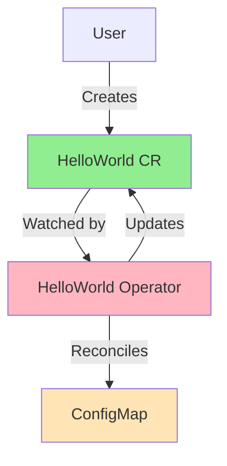

# Leçon 2.4 : Votre premier Operator

**Navigation :** [← Précédent : Environnement de développement](03-dev-environment.md) | [Vue d'ensemble du module](../README.md)

# Introduction

Vous êtes maintenant prêt à construire votre **premier Operator Kubernetes** !

Dans cette leçon, nous allons développer un Operator **Hello World** simple, mais suffisamment complet pour mettre en pratique tous les concepts étudiés dans le **Module 1** :

- les **Custom Resource Definitions (CRD)** ;
- les **contrôleurs Kubernetes** ;
- la **boucle de réconciliation** (*Reconciliation Loop*) ;
- les **Owner References** ;
- la gestion du **status**.

Ce premier projet représente une étape essentielle de votre apprentissage. Jusqu'à présent, nous avons étudié les mécanismes internes de Kubernetes de manière théorique. Désormais, nous allons construire un véritable Operator capable d'observer des ressources personnalisées et d'agir automatiquement en fonction de leur état.

À la fin de cette leçon, vous aurez créé un Operator entièrement fonctionnel qui démontrera les principes fondamentaux utilisés par les Operators professionnels tels que **Cert-Manager**, **Prometheus Operator**, **Strimzi** ou encore **Crossplane**.

---

# Théorie : votre premier Operator

Construire un premier Operator permet de comprendre le cycle de vie complet d'un Operator Kubernetes, depuis la création d'une **Custom Resource** jusqu'à sa réconciliation par le contrôleur.

Un Operator n'est pas simplement un programme qui exécute des actions.

Il s'agit d'un contrôleur Kubernetes spécialisé qui observe en permanence le serveur API afin de maintenir l'état réel du cluster conforme à l'état souhaité défini par l'utilisateur.

Même un Operator très simple met déjà en œuvre plusieurs composants essentiels.

## Les composants principaux

Un Operator développé avec **Kubebuilder** est généralement constitué des éléments suivants :

- **Une CRD (Custom Resource Definition)** qui définit un nouveau type de ressource Kubernetes.
- **Un contrôleur (Controller)** qui implémente la logique de réconciliation.
- **Un Manager** chargé de coordonner les contrôleurs, le client Kubernetes, les caches et les mécanismes de surveillance.
- **Des règles RBAC** qui définissent précisément les permissions dont l'Operator a besoin.

Chaque composant joue un rôle précis dans le fonctionnement global de l'Operator.

---

## La CRD

La **Custom Resource Definition** définit un nouveau type de ressource.

Dans cette leçon, nous créerons une ressource nommée :

```
HelloWorld
```

Une fois la CRD installée dans le cluster, les utilisateurs pourront créer des ressources telles que :

```yaml
apiVersion: hello.example.com/v1
kind: HelloWorld
metadata:
  name: hello-example
```

Cette ressource deviendra alors un objet Kubernetes à part entière.

---

## Le contrôleur

Le contrôleur représente le cerveau de l'Operator.

Il est responsable de la fonction **Reconcile()**, qui compare :

- l'état souhaité ;
- l'état actuel du cluster.

Lorsqu'une différence est détectée, le contrôleur prend automatiquement les mesures nécessaires pour corriger la situation.

Dans notre exemple, il créera une **ConfigMap** correspondant à chaque ressource **HelloWorld**.

---

## Le Manager

Le **Manager** est un composant fourni par **controller-runtime**.

Il simplifie considérablement le développement des Operators en prenant en charge de nombreux services communs, notamment :

- le client Kubernetes ;
- les mécanismes **Watch** ;
- les caches ;
- les métriques ;
- les sondes de santé ;
- le démarrage et l'arrêt des contrôleurs.

Grâce au Manager, le développeur peut se concentrer uniquement sur la logique métier de son Operator.

---

## Les permissions RBAC

Comme tout composant Kubernetes, un Operator ne peut effectuer que les actions explicitement autorisées.

Les règles **RBAC** permettent notamment de lui donner les droits nécessaires pour :

- lire les ressources **HelloWorld** ;
- créer des **ConfigMaps** ;
- modifier le champ **status** ;
- supprimer des ressources lorsqu'elles ne sont plus nécessaires.

Cette approche respecte le principe du **moindre privilège**, essentiel à la sécurité des clusters Kubernetes.

---

# Le cycle de vie d'un Operator

Le fonctionnement d'un Operator peut être résumé selon les étapes suivantes :

1. L'utilisateur crée une **Custom Resource**.
2. Le contrôleur détecte cet événement grâce au mécanisme **Watch**.
3. La fonction **Reconcile()** est exécutée.
4. Le contrôleur compare l'état souhaité et l'état réel.
5. Il crée ou met à jour les ressources Kubernetes nécessaires.
6. Il met à jour le champ **status** afin de refléter l'état courant.
7. Il continue ensuite à surveiller le cluster afin de détecter toute nouvelle modification.

Ce processus est continu.

La boucle de réconciliation fonctionne pendant toute la durée de vie de l'Operator.

---

# Pourquoi commencer par un Operator simple ?

Les Operators utilisés en production sont souvent extrêmement complexes.

Ils peuvent gérer :

- des clusters PostgreSQL ;
- des clusters Kafka ;
- des systèmes de sauvegarde ;
- des infrastructures cloud ;
- des plateformes GitOps.

Avant d'aborder ces scénarios avancés, il est indispensable de maîtriser les bases.

Construire un Operator minimal présente plusieurs avantages :

- comprendre la structure générée par Kubebuilder ;
- apprendre où se situe chaque composant ;
- observer le fonctionnement réel de la boucle de réconciliation ;
- acquérir les réflexes nécessaires avant de développer des Operators beaucoup plus sophistiqués.

Ce premier projet servira donc de fondation pour l'ensemble des modules suivants.

---

# Ce que nous allons construire

Notre Operator réalisera volontairement une tâche très simple.

Il sera capable de :

- définir une ressource **HelloWorld** ;
- surveiller toutes les ressources **HelloWorld** du cluster ;
- créer automatiquement une **ConfigMap** lorsqu'une nouvelle ressource apparaît ;
- mettre à jour le champ **status** afin d'indiquer que la ressource a été correctement traitée.

Le fonctionnement général est illustré par le schéma suivant.



Dans ce schéma :

- l'utilisateur crée une ressource **HelloWorld** ;
- l'Operator la détecte automatiquement ;
- il crée une **ConfigMap** contenant les informations de la ressource ;
- il met enfin à jour son **status**.

Ce scénario est volontairement simple afin de mettre en évidence le fonctionnement général d'un Operator sans introduire de complexité inutile.

---

> ## À retenir
>
> Un Operator est composé d'une **Custom Resource Definition**, d'un **contrôleur**, d'un **Manager** et de règles **RBAC**. Son rôle consiste à observer les ressources personnalisées créées par les utilisateurs, à comparer leur état souhaité avec l'état réel du cluster, puis à effectuer automatiquement toutes les actions nécessaires pour maintenir la conformité. Même un Operator minimal comme **HelloWorld** met déjà en œuvre l'ensemble de l'architecture utilisée par les Operators Kubernetes professionnels.
