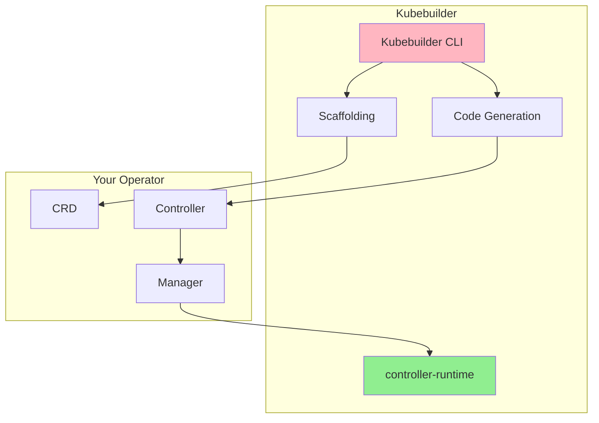

# Leçon 2.2 : Les fondamentaux de Kubebuilder

**Navigation :** [← Précédent : Le modèle Operator](01-operator-pattern.md) | [Vue d'ensemble du module](../README.md) | [Suivant : Environnement de développement →](03-dev-environment.md)

# Introduction

Maintenant que nous comprenons le fonctionnement des **Operators Kubernetes**, une question essentielle se pose :

> **Comment développer un Operator de manière efficace, conforme aux bonnes pratiques Kubernetes et sans réécrire des centaines de lignes de code répétitif ?**

La réponse est **Kubebuilder**.

Kubebuilder est aujourd'hui le framework de référence pour développer des Operators Kubernetes en **Go**. Il fournit un ensemble d'outils permettant de générer automatiquement la structure d'un projet, les définitions d'API, les manifests Kubernetes et une grande partie du code répétitif nécessaire au développement d'un Operator.

Plutôt que de partir d'un projet vide, le développeur bénéficie immédiatement d'une architecture standardisée conforme aux recommandations de la communauté Kubernetes.

Au cours de cette leçon, nous découvrirons :

- ce qu'est Kubebuilder ;
- son architecture ;
- sa relation avec **controller-runtime** ;
- la structure d'un projet généré ;
- le fonctionnement de la génération automatique de code ;
- les principales commandes de la CLI Kubebuilder.

À la fin de cette leçon, vous comprendrez pourquoi Kubebuilder est devenu le standard utilisé par la majorité des projets Kubernetes modernes.

---

# Théorie : le framework Kubebuilder

Kubebuilder est à la fois :

- un **SDK (Software Development Kit)** destiné au développement d'Operators Kubernetes ;
- un **framework** qui applique automatiquement les bonnes pratiques recommandées par la communauté Kubernetes ;
- un **générateur de code** permettant de produire automatiquement une grande partie du code nécessaire au fonctionnement d'un Operator ;
- un **outil de scaffolding** qui construit l'architecture complète d'un projet.

Autrement dit, Kubebuilder vous évite de consacrer votre temps à écrire du code répétitif afin que vous puissiez vous concentrer sur la logique métier de votre Operator.

Sans Kubebuilder, un développeur devrait créer manuellement :

- la structure du projet ;
- les types Go représentant les Custom Resources ;
- les manifests RBAC ;
- les Custom Resource Definitions (CRD) ;
- les méthodes de copie profonde (*DeepCopy*) ;
- la configuration du Manager ;
- les différents fichiers de configuration.

Kubebuilder automatise entièrement ces opérations.

---

# Les concepts fondamentaux de Kubebuilder

Kubebuilder repose sur plusieurs principes essentiels.

## Génération automatique de code

L'une des principales forces de Kubebuilder est sa capacité à produire automatiquement le code répétitif indispensable à tout Operator.

Cette génération concerne notamment :

- les **Custom Resource Definitions (CRD)** ;
- les contrôleurs ;
- les règles **RBAC** ;
- les méthodes **DeepCopy** ;
- différents manifests Kubernetes.

Cette automatisation présente plusieurs avantages :

- réduction importante du code à écrire ;
- diminution des erreurs humaines ;
- respect des conventions Kubernetes ;
- homogénéité entre les projets.

Le développeur peut ainsi consacrer son énergie à la logique métier plutôt qu'à l'infrastructure du projet.

---

## Une structure de projet standardisée

Kubebuilder génère une organisation de projet identique pour tous les Operators.

Cette structure normalisée facilite :

- la lecture du code ;
- la maintenance ;
- le travail collaboratif ;
- l'évolution du projet.

Les définitions d'API sont clairement séparées de la logique métier des contrôleurs, ce qui améliore considérablement la lisibilité du projet.

---

## Une intégration native avec controller-runtime

Kubebuilder s'appuie entièrement sur **controller-runtime**, la bibliothèque officielle utilisée pour développer les contrôleurs Kubernetes.

Cette bibliothèque fournit des abstractions de haut niveau telles que :

- le **Manager** ;
- le **Client Kubernetes** ;
- le **Reconciler** ;
- les mécanismes de cache ;
- les systèmes de surveillance (*Watch*) ;
- l'élection de leader (*Leader Election*).

Grâce à ces composants, le développeur n'a pas besoin d'interagir directement avec les couches les plus complexes de Kubernetes.

---

## Pourquoi utiliser Kubebuilder ?

Kubebuilder s'est imposé comme la solution de référence pour plusieurs raisons.

### Une productivité accrue

Kubebuilder génère automatiquement plusieurs centaines de lignes de code.

Le développeur se concentre uniquement sur ce qui apporte une réelle valeur : la logique métier de son Operator.

---

### Le respect des bonnes pratiques

Tous les projets générés suivent les recommandations officielles de Kubernetes.

Les conventions de nommage, l'organisation du projet et les mécanismes de génération de code sont déjà correctement configurés.

---

### Un outil largement adopté

Kubebuilder est utilisé par de nombreux projets majeurs de l'écosystème Kubernetes.

Son adoption par la communauté garantit :

- une documentation abondante ;
- de nombreux exemples ;
- une maintenance active ;
- une excellente compatibilité avec les évolutions de Kubernetes.

---

### Une CLI très complète

Kubebuilder fournit une interface en ligne de commande permettant de réaliser rapidement les opérations courantes :

- création d'un projet ;
- génération d'API ;
- création de contrôleurs ;
- génération des manifests ;
- création de webhooks.

Cette automatisation accélère considérablement le développement.

---

# Qu'est-ce que Kubebuilder ?

Kubebuilder est simultanément :

- un **SDK** permettant de développer des Operators Kubernetes en **Go** ;
- un **outil de scaffolding** générant automatiquement la structure d'un projet ;
- un **générateur de code** produisant les CRD, les contrôleurs et les manifests Kubernetes ;
- un framework construit au-dessus de **controller-runtime**, la bibliothèque officielle utilisée par Kubernetes.

Son architecture peut être représentée de la manière suivante.

Ce schéma illustre parfaitement le rôle de Kubebuilder.

La **CLI Kubebuilder** génère la structure du projet ainsi que le code initial.

L'Operator obtenu repose ensuite sur **controller-runtime**, qui fournit toute l'infrastructure nécessaire à l'exécution des contrôleurs.

Kubebuilder n'exécute donc pas directement votre Operator.

Il génère un projet conforme aux standards Kubernetes, lequel s'appuie ensuite sur **controller-runtime** pour fonctionner.

---

# À retenir

Kubebuilder est aujourd'hui le framework de référence pour développer des Operators Kubernetes.

Il automatise la création de la structure d'un projet, génère une grande partie du code répétitif, applique les bonnes pratiques recommandées par la communauté Kubernetes et s'intègre naturellement avec **controller-runtime**.

Grâce à lui, le développeur peut consacrer l'essentiel de son temps à implémenter la logique métier de son Operator, plutôt qu'à construire l'infrastructure technique nécessaire à son fonctionnement.
